# CODEX

## Package load and plot settings.


```{r warning=FALSE}
pkgs <- c("fs", "configr", "stringr", 
          "jhtools", "glue", "patchwork", "tidyverse", "dplyr", "Seurat", "magrittr", 
          "readxl", "writexl", "ComplexHeatmap", 
          "data.table", "ggplot2", "ggbeeswarm", "ggdendro", "dendextend", "deldir",
          "sf", "corrplot", "ggpubr", "survival", "survminer", "forestmodel", "BiocParallel", "BiocNeighbors")  
for (pkg in pkgs){
  suppressPackageStartupMessages(library(pkg, character.only = T))
}

rds_dir <- "/cluster/home/lixiyue_jh/projects/stomatology/analysis/lvjiong/human/meta/manuscript/rds/codex"
fig_dir <- "/cluster/home/lixiyue_jh/projects/stomatology/analysis/lvjiong/human/meta/manuscript/figs/fig2_new"


# colors setting
config_fn = "/cluster/home/jhuang/projects/stomatology/analysis/lvjiong/human/meta/manuscript/configs/colors.yaml"
config_list <- show_me_the_colors(config_fn, "all")
colors_celltype <- config_list$cell_type

config <- read.config(config_fn)
cell_type_order <- config$cell_type_order

sampleinfo <- readRDS("/cluster/home/jhuang/projects/stomatology/docs/lvjiong/sampleinfo/sampleinfo.rds")

sampleinfo$codex <- sampleinfo$codex %>% mutate(
    Time = case_when(Time > 60 ~ 60, TRUE ~ Time),
    Status = case_when(Time > 60 ~ 0,TRUE ~ Status)
  ) %>% as.data.frame()

```

## srt, celltype define heatmap

```{r cache=FALSE}

srt <- readRDS(glue("{rds_dir}/srt_split_anno.rds"))
Idents(srt) <- factor(srt$celltype, levels=intersect(config$cell_type_order, unique(srt$celltype)))
markers_10 <- c("CD45", "CD20", "CD3e", "Granzyme B", "CD4", "CD8", "CD68", "SMA", "CD31", "Pan-Cytokeratin")
srt_sub <- subset(srt, downsample = 200, features = markers_10)
p <- DoHeatmap(srt_sub, slot = "scale.data", assay = "CODEX", features = markers_10,
              group.colors = config_list$cell_type, angle = 90, size = 4, disp.min = -2.5, disp.max = 2.5) +
              NoLegend()
ggsave(glue("{fig_dir}/heatmap_celltype_markers_10_200cell.pdf"), p, width = 8, height = 6)
ggsave(glue("{fig_dir}/heatmap_celltype_markers_10_200cell.png"), p, width = 8, height = 6)

list_markers <- list("CD4 T" = c("CD45RO", "CD44", "Granzyme B", "HLA-DR", "Ki67", "PD-1", "FOXP3"), 
                     "CD8 T" = c("CD45RO", "CD44", "Granzyme B", "HLA-DR", "Ki67", "PD-1"),
                     "Macrophage" = c("CD14", "CD44", "HLA-DR", "IDO1", "Ki67", "Vimentin", "PD-L1"), 
                     "Tumor cell" = c("CD44", "E-cadherin", "IDO1", "HLA-DR", "Vimentin", "Ki67", "PD-L1"), 
                     "Fibroblast" = c("CD44", "SMA", "IDO1", "HLA-DR", "Collagen-IV", "Ki67", "PD-L1"))

cell_type_order_sub <- config$cell_type_order[70:113]
for (cell_type in names(list_markers)){
  sub_markers <- list_markers[[cell_type]]
  Idents(srt) <- "subtype"
  srt_sub <- subset(srt, downsample = 200, features = sub_markers, subset = (celltype == cell_type & !is.na(subtype)))
  srt_sub$subtype <- factor(srt_sub$subtype, levels = intersect(cell_type_order_sub, unique(srt_sub$subtype)))
  Idents(srt_sub) <- "subtype"
  colors <- config_list$cell_type[1:length(unique(srt_sub$subtype))]
  p <- DoHeatmap(srt_sub, slot = "scale.data", assay = "CODEX", features = sub_markers, raster = TRUE,
              group.colors = colors, angle = 90, size = 4, disp.min = -2.5, disp.max = 2.5)
              NoLegend()
  name = str_replace_all(cell_type, " ", "")
  ggsave(glue("{fig_dir}/heatmap_subtype_{name}_markers_200cell.pdf"), p, dpi = 800, width = 8, height = 6)
  ggsave(glue("{fig_dir}/heatmap_subtype_{name}_markers_200cell.png"), p, dpi = 800, width = 8, height = 6)
}


```

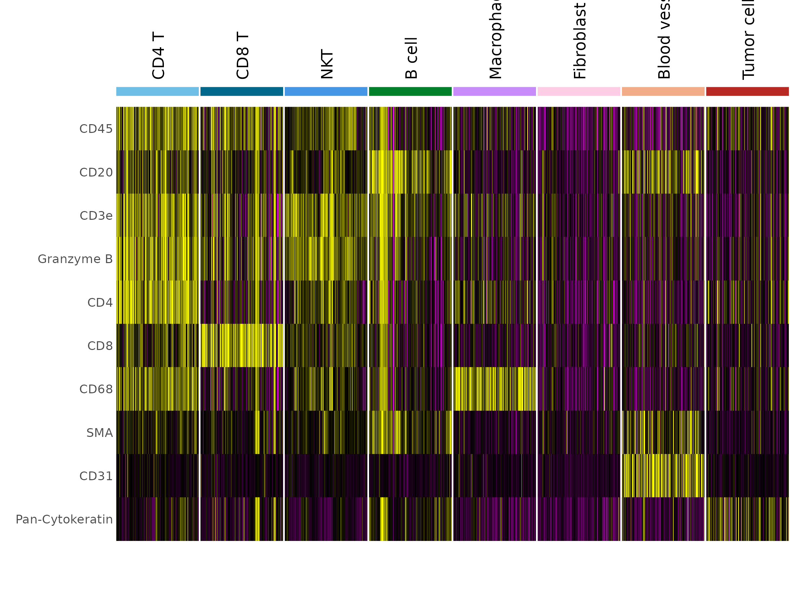{.align-center .lightbox width="900px" 
					fig_alt="codex: celltype define" 
                    fig-cap="Figure: codex: celltype define"}
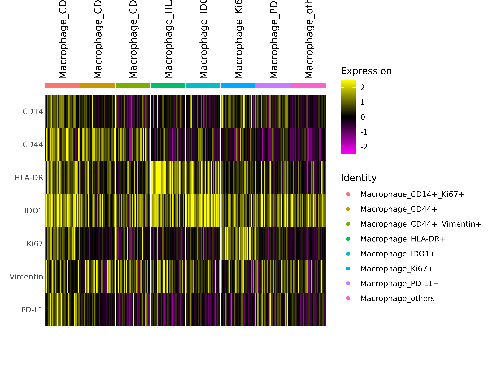{.align-center .lightbox width="900px" 
					fig_alt="codex: Macrophage subtype define" 
                    fig-cap="Figure: codex: Macrophage subtype define"}


## Barplot: stacked celltype frequency

```{r cache=FALSE}

codex_cluster <- readRDS(glue("{rds_dir}/codex_cluster_plot.rds"))

results <- codex_cluster$celltype_cluster
mat <- results$mat
df_anno <- results$df_anno
df_cluster <- results$df_cluster
dend <- results$dend
hc <- results$hc
cl <- results$cl

color_use <- config_list$cluster[unique(cl[labels(dend)])]

ha <- HeatmapAnnotation(df = df_anno %>% dplyr::select(-`Age level`),
                        col = list(
                          Age = circlize::colorRamp2(c(30, 90), config_list$Age_color),
                          Gender = config_list$Gender,
                          `Tumor site` = config_list$tumor_site,
                          `Diff. level` = config_list$diff_level,
                          `Clinical stage` = config_list$clinical_stage,
                          `T stage` = config_list$T_stage,
                          Metastasis = config_list$Metastasis))
ht <- Heatmap(t(mat), 
              name = "Percentage",
              cluster_columns = dend,
              cluster_rows = F,
              show_column_names = T,
              column_split = 4,
              column_title = unique(cl[hc$order]),
              column_gap = unit(0, "mm"),
              bottom_annotation = ha)

df <- df_cluster %>% 
  mutate(celltype = factor(celltype, levels = intersect(cell_type_order, unique(df_cluster$celltype))),
         sample_id = factor(sample_id, levels = labels(dend)))
p_bar <- ggplot(df, aes(sample_id, freq, fill = celltype)) +
  geom_col(width = 1, color = NA) +
  scale_fill_manual(values = config_list$cell_type) +
  labs(x = "", y = "Percentage", fill = "Cell type") +
  theme_minimal() +
  theme(axis.text.x = element_blank(),
        panel.grid.major.x = element_blank(),
        plot.margin = margin(0,0,0,0))


pdf(glue("{fig_dir}/heatmap_celltype_freq.pdf"), width = 10, height = 8)
ht <- draw(ht, heatmap_legend_side = "bottom", annotation_legend_side = "bottom")
dev.off()
png(glue("{fig_dir}/heatmap_celltype_freq.png"), width = 10, height = 8, units = "in", res = 300)
ht <- draw(ht, heatmap_legend_side = "bottom", annotation_legend_side = "bottom")
dev.off()


ggsave(glue("{fig_dir}/stacked_bar_celltype_freq.pdf"), p_bar, width = 10, height = 6)
ggsave(glue("{fig_dir}/stacked_bar_celltype_freq.png"), p_bar, width = 10, height = 6)


df <- df_anno %>% mutate(sample_id = rownames(.)) %>% left_join(df_cluster, by = "sample_id") %>%
    mutate(cluster = factor(paste("G", cluster, sep = ""), levels = paste("G", 1:4, sep = "")))
colorM <- list("Gender"="Gender", "Age level"="Age_level", "Tumor site"="tumor_site",
              "Diff. level"="diff_level", "Metastasis"="Metastasis", `Clinical stage`="clinical_stage", `T stage`="T_stage")
for (barname in names(colorM)){
  color_name = colorM[[barname]]
  p <- ggplot(df, aes(x = .data[["cluster"]], fill = .data[[barname]])) +
        geom_bar(position = "fill", width = 0.8) +
        scale_fill_manual(values=config_list[[color_name]]) +
        theme_classic() +
        labs(y = "Proportion", x = "", fill = barname) +
        scale_y_continuous(labels = scales::comma) +
        theme(axis.text.x = element_text(angle = 0, hjust = 0.5, vjust = 1))
  ggsave(glue("{fig_dir}/stacked_bar_celltype_cluster_clinical_{color_name}.pdf"), p, width = 4, height = 4)
  ggsave(glue("{fig_dir}/stacked_bar_celltype_cluster_clinical_{color_name}.png"), p, width = 4, height = 4)
}

spinfo <- sampleinfo$codex %>% filter(Type == "Tumor")
df_out <- tidyr::pivot_wider(df, id_cols = c(sample_id, cluster), names_from = celltype, values_from = freq, values_fill = 0) %>% arrange(sample_id)
df_surv <- df_out %>% dplyr::select(sample_id, cluster) %>% left_join(spinfo) %>% na.omit() %>% mutate(cluster = str_replace_all(cluster, "G", ""))

fit <- survfit(Surv(Time, Status) ~ cluster, data = df_surv)
names(color_use) <- paste0("cluster=",names(color_use))
p <- ggsurvplot(fit, data = df_surv, xlab = "Time (Months)", pval = TRUE, risk.table = TRUE,
        break.x.by = 12, xlim = c(0,60),
        risk.table.height = 0.35, palette = color_use, title = "")
p$plot <- p$plot + 
          theme(axis.title.x = element_blank(), axis.text.x = element_blank(), axis.ticks.x = element_blank(), 
                plot.margin  = margin(t = 5.5, r = 5.5, b = 6.5, l = 5.5))
p <- arrange_ggsurvplots(list(p), ncol = 1, print = FALSE)
ggsave(glue("{fig_dir}/survival_curve_celltype_freq_cluster.pdf"), p, width = 5, height = 6)
ggsave(glue("{fig_dir}/survival_curve_celltype_freq_cluster.png"), p, width = 5, height = 6)

``` 


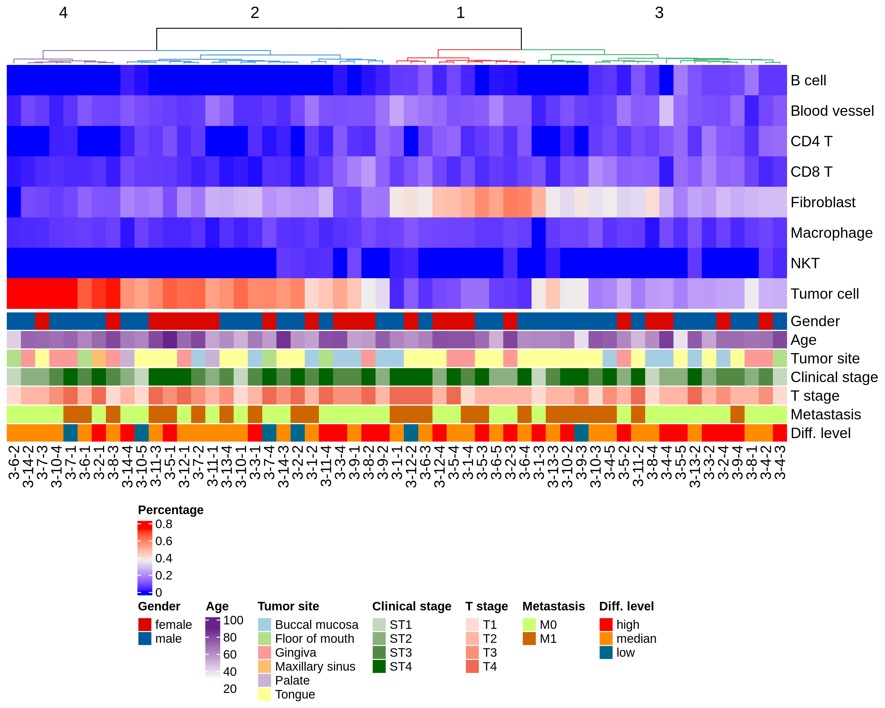{.align-center .lightbox width="900px" 
										fig_alt="codex: heatmap of celltype freq" 
                    fig-cap="Figure: heatmap of celltype freq"}
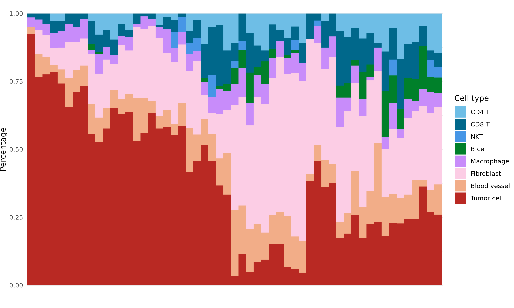{.align-center .lightbox width="900px" 
										fig_alt="codex: stacked bar of celltype freq" 
                    fig-cap="Figure: stacked bar of celltype freq"}
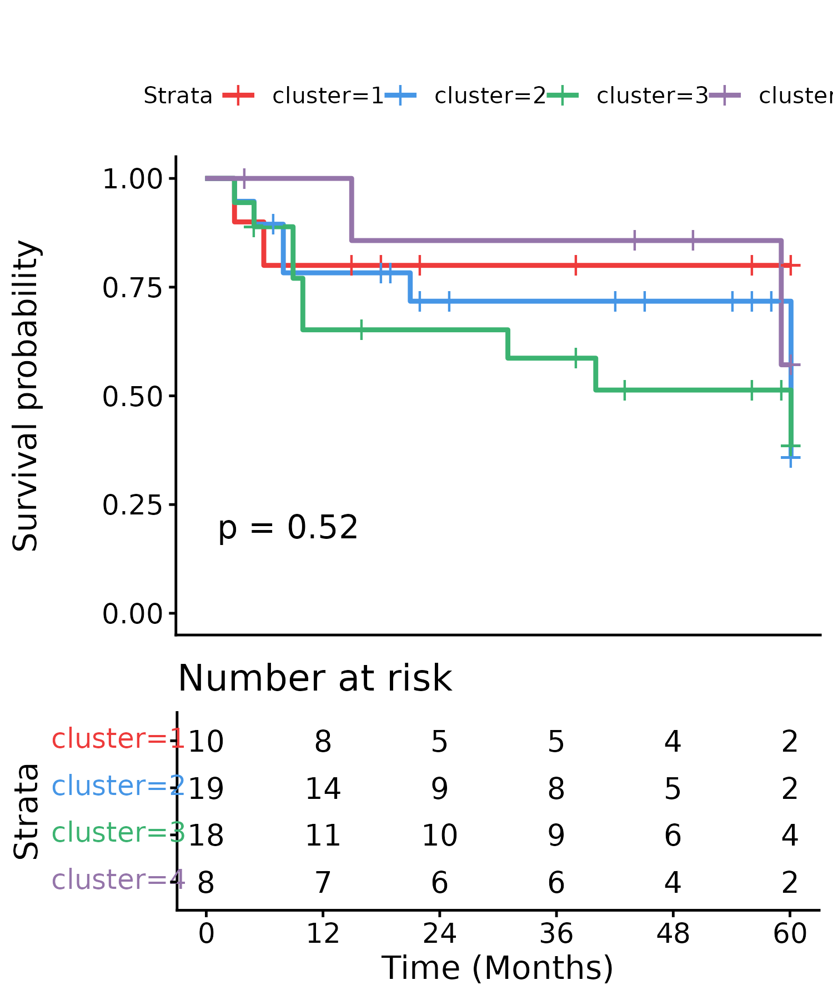{.align-center .lightbox width="900px" 
										fig_alt="codex: surv curve of celltype freq" 
                    fig-cap="Figure: surv curve of celltype freq"}


##celltype_cn, heatmap_celltype_cn_composition

```{r cache=FALSE}

codex_cluster <- readRDS(glue("{rds_dir}/codex_cluster_plot.rds"))

results <- codex_cluster$celltype_CN
mat <- results$mat
dt_anno <- results$dt_anno

bar_colors <- config_list$cell_type[colnames(mat)]

ha <- rowAnnotation(CN = anno_barplot(mat, 
                                      bar_width = 1, 
                                      gp = gpar(fill = bar_colors), 
                                      border = FALSE,
                                      axis = TRUE,
                                      axis_param = list(direction = "reverse"),
                                      width = unit(4, "cm")),
                    show_annotation_name = FALSE)
lgd_list <- list(Legend(labels = colnames(mat), title = "Cell type",  legend_gp = gpar(fill = bar_colors)))
row_labels <- structure(paste(dt_anno$cn, dt_anno$anno), names = dt_anno$cn)
ht <- Heatmap(scale(mat), name = "Relative enrichment",
              col = circlize::colorRamp2(c(-3, -2, -1, 0, 1, 2, 3), config_list$scale_7),
              right_annotation = ha,
              cluster_rows = TRUE,
              cluster_columns = TRUE,
              row_labels = row_labels[rownames(mat)])
pdf(glue("{fig_dir}/heatmap_celltype_cn_composition.pdf"), width = 10, height = 6)
draw(ht, heatmap_legend_list = lgd_list)
dev.off()
png(glue("{fig_dir}/heatmap_celltype_cn_composition.png"), width = 10, height = 6, units = "in", res = 300)
draw(ht, heatmap_legend_list = lgd_list)
dev.off()


```
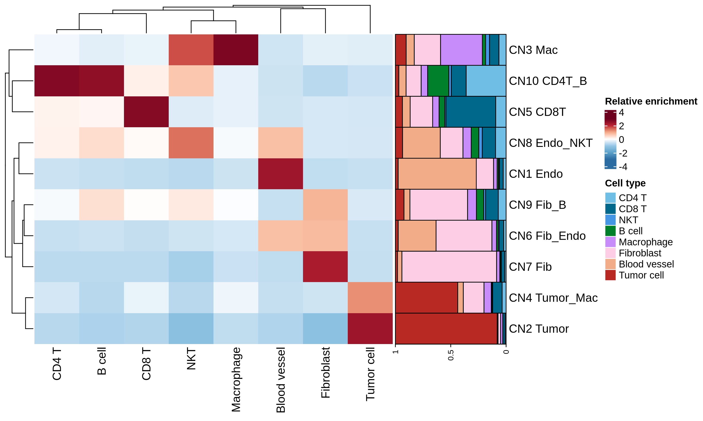{.align-center .lightbox width="900px" 
										fig_alt="codex: heatmap of celltype CN composition" 
                    fig-cap="Figure: heatmap of celltype CN composition"}


##subtype_cn, heatmap_subtype_cn_composition

```{r cache=FALSE}

codex_cluster <- readRDS(glue("{rds_dir}/codex_cluster_plot.rds"))

results <- codex_cluster$subtype_CN
mat <- results$mat
df_anno <- results$df_anno
dt_anno <- results$dt_anno

mat <- scale(mat)

celltype = c("CD4T", "CD8T", "NKT", "B cell", "Macrophage", "Fibroblast", "Blood vessel", "Tumor")
df_anno <- df_anno[, match(celltype, colnames(df_anno))]
celltype = c("CD4 T", "CD8 T", "NKT", "B cell", "Macrophage", "Fibroblast", "Blood vessel", "Tumor cell")
names(df_anno) <- celltype

bar_colors <- config_list$cell_type[celltype]
ha <- rowAnnotation(CN = anno_barplot(df_anno, 
                                      bar_width = 1, 
                                      gp = gpar(fill = bar_colors), 
                                      border = FALSE,
                                      axis = TRUE,
                                      axis_param = list(direction = "reverse"),
                                      width = unit(3, "cm")),
                    show_annotation_name = FALSE)

lgd_list <- list(Legend(labels = celltype, title = "Cell type", legend_gp = gpar(fill = bar_colors)))
row_labels <- structure(paste(dt_anno$cn, dt_anno$anno), names = dt_anno$cn)
ht <- Heatmap(mat, name = "Relative enrichment",
              col = circlize::colorRamp2(c(-2, -1, 0, 2, 4, 6), config_list$scale_6),
              right_annotation = ha,
              cluster_rows = TRUE,
              cluster_columns = TRUE,
              row_labels = row_labels[rownames(mat)])
pdf(glue("{fig_dir}/heatmap_subtype_cn_composition.pdf"), width = 15, height = 12)
draw(ht, heatmap_legend_list = lgd_list, padding = unit(c(10, 2, 2, 30), "mm"), heatmap_legend_side = "bottom")
dev.off()
png(glue("{fig_dir}/heatmap_subtype_cn_composition.png"), width = 15, height = 12, units = "in", res = 300)
draw(ht, heatmap_legend_list = lgd_list, padding = unit(c(10, 2, 2, 30), "mm"), heatmap_legend_side = "bottom")
dev.off()


```

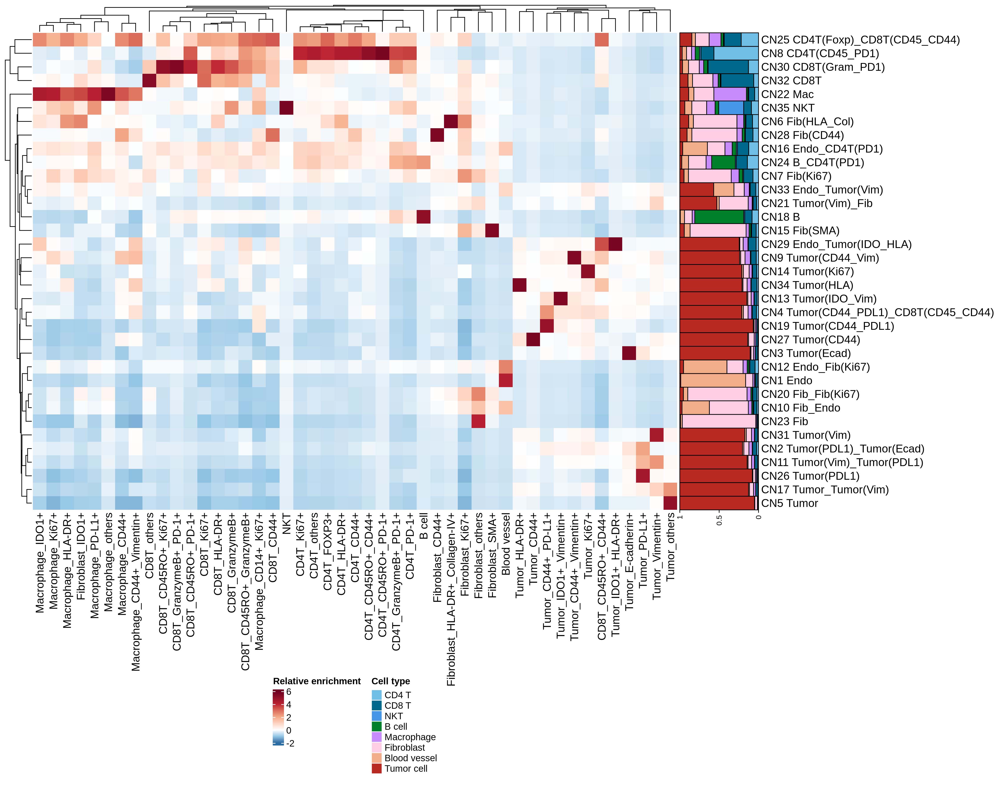{.align-center .lightbox width="900px" 
										fig_alt="codex: heatmap of subtype CN composition" 
                    fig-cap="Figure: heatmap of subtype CN composition"}


##celltype_cn, sample_cluster_heatmap_celltype_cn, surv curve

```{r cache=FALSE}

codex_cluster <- readRDS(glue("{rds_dir}/codex_cluster_plot.rds"))

results <- codex_cluster$celltype_CN_cluster
mat <- results$mat
df_anno <- results$df_anno
dt_anno <- results$dt_anno
dend <- results$dend
hc <- results$hc
cl <- results$cl

color_use <- config_list$cluster[unique(cl[labels(dend)])]

col_labels <- structure(paste(dt_anno$cn, dt_anno$anno), names = dt_anno$cn)

ha <- rowAnnotation(df = df_anno %>% dplyr::select(sample_id, cluster) %>% column_to_rownames("sample_id"), 
                    col = list(cluster = color_use))
ht <- Heatmap(mat, name = "Percentage",
              col = circlize::colorRamp2(c(0, 25, 50, 65, 80, 100), config_list$scale_6),
              cluster_rows = dend,
              cluster_columns = TRUE,
              column_labels = col_labels[colnames(mat)],
              show_row_names = FALSE,
              left_annotation = ha)
pdf(glue("{fig_dir}/sample_cluster_heatmap_celltype_cn.pdf"), width = 6, height = 8)
ht <- draw(ht, padding = unit(c(2, 2, 2, 2), "mm"))
dev.off()
png(glue("{fig_dir}/sample_cluster_heatmap_celltype_cn.png"), width = 6, height = 8, units = "in", res = 300)
ht <- draw(ht, padding = unit(c(2, 2, 2, 2), "mm"))
dev.off()

df_surv <- df_anno %>% filter(Type == "Tumor")
fit <- survfit(Surv(Time, Status) ~ cluster, data = df_surv)
names(color_use) <- paste0("cluster=",names(color_use))
p <- ggsurvplot(fit, data = df_surv, xlab = "Time (Months)", pval = TRUE, risk.table = TRUE,
                risk.table.height = 0.35, palette = color_use, break.x.by = 12, xlim = c(0,60),
                title = "RFS - Celltype CN cluster")
p$plot <- p$plot + theme(axis.title.x = element_blank(), axis.text.x = element_blank(), axis.ticks.x = element_blank(), 
                plot.margin  = margin(t = 5.5, r = 5.5, b = 6.5, l = 5.5))
p <- arrange_ggsurvplots(list(p), ncol = 1, print = FALSE)
ggsave(glue("{fig_dir}/sample_cluster_surv_curve_celltype_cn.pdf"), p, width = 5, height = 6)
ggsave(glue("{fig_dir}/sample_cluster_surv_curve_celltype_cn.png"), p, width = 5, height = 6)


```

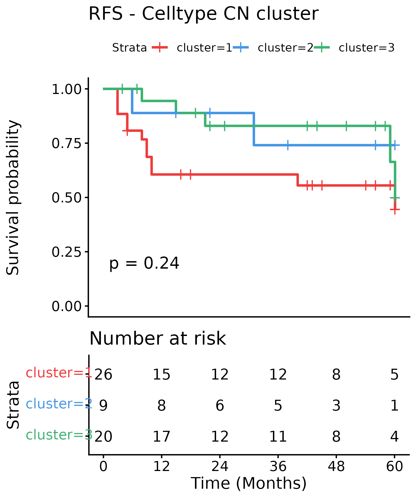{.align-center .lightbox width="900px" 
										fig_alt="codex: surv curve of celltype CN cluster" 
                    fig-cap="Figure: surv curve of celltype CN cluster"}


##subtype_cn, sample_cluster_heatmap_subtype_cn, survival_curve (k=10, cl=5)

```{r cache=FALSE}

codex_cluster <- readRDS(glue("{rds_dir}/codex_cluster_plot.rds"))

results <- codex_cluster$subtype_CN_cluster
mat <- results$mat
df_anno <- results$df_anno
dt_anno <- results$dt_anno
dend <- results$dend
hc <- results$hc
cl <- results$cl

row_labels <- structure(paste(dt_anno$cn, dt_anno$anno), names = dt_anno$cn)

color_use <- config_list$cluster[unique(cl[labels(dend)])]

ha <- HeatmapAnnotation(df = df_anno %>% dplyr::select(sample_id, cluster) %>% column_to_rownames("sample_id"), col = list(cluster = color_use[1:10]))
ht <- Heatmap(mat, name = "z-score",
                col = circlize::colorRamp2(c(0, 1, 2, 3, 4, 5), config_list$scale_6),
                cluster_rows = TRUE,
                cluster_columns = TRUE,
                row_labels = row_labels[rownames(mat)],
                show_column_names = FALSE,
                column_split = 10,
                column_title = unique(cl[hc$order]),
                top_annotation = ha
  )

pdf(glue("{fig_dir}/sample_cluster_heatmap_subtype_cn.pdf"), width = 12, height = 6)
ht <- draw(ht, padding = unit(c(2, 2, 2, 20), "mm"))
dev.off()
png(glue("{fig_dir}/sample_cluster_heatmap_subtype_cn.png"), width = 12, height = 6, units = "in", res = 300)
ht <- draw(ht, padding = unit(c(2, 2, 2, 20), "mm"))
dev.off()

i = 5
df_surv <- df_anno %>% filter(Type == "Tumor") %>% mutate(cluster = as.character(cluster))
df_surv$cluster[df_surv$cluster != i] <- "others"
fit <- survfit(Surv(Time, Status) ~ cluster, data = df_surv)
p <- ggsurvplot(fit, data = df_surv, xlab = "Time (Months)", pval = TRUE, risk.table = TRUE,
                    risk.table.height = 0.35, break.x.by = 12, xlim = c(0,60),
                    palette = config_list$split_2,
                    title = paste0("RFS - Subtype CN cluster", i))
p$plot <- p$plot + theme(axis.title.x = element_blank(), axis.text.x = element_blank(), axis.ticks.x = element_blank(), 
                plot.margin  = margin(t = 5.5, r = 5.5, b = 6.5, l = 5.5))
p <- arrange_ggsurvplots(list(p), ncol = 1, print = FALSE)
ggsave(glue("{fig_dir}/sample_cluster_surv_curve_subtype_cn_cl{i}.pdf"), p, width = 5, height = 6)
ggsave(glue("{fig_dir}/sample_cluster_surv_curve_subtype_cn_cl{i}.png"), p, width = 5, height = 6)

```
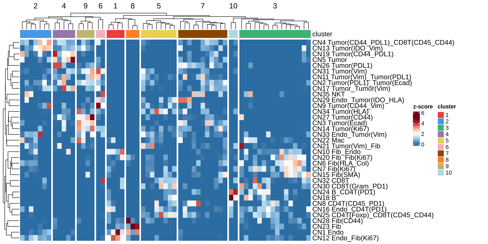{.align-center .lightbox width="900px" 
										fig_alt="codex: heatmap of subtype CN cluster" 
                    fig-cap="Figure: heatmap of subtype CN cluster"}
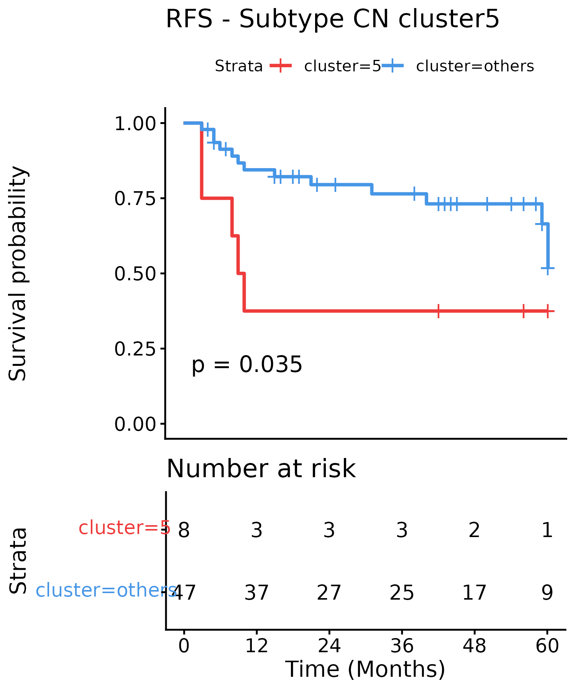{.align-center .lightbox width="900px" 
										fig_alt="codex: surv curve of subtype CN cluster5 vs others" 
                    fig-cap="Figure: surv curve of subtype CN cluster5 vs others"}


##pairwise cell interaction (subtype): Macrophage_CD44+ - Tumor_CD44+; CD4T_CD44+ - Tumor_CD44+;  CD8T_CD44+ - Tumor_CD44+;
```{r cache=FALSE}

lst_pci_message <- readRDS(glue("{rds_dir}/pci_message.rds"))
df_res2 <- lst_pci_message$df_res
df_surv2 <- lst_pci_message$df_surv

pair_fig = list()
pair2 <- c("Macrophage_CD44+-Tumor_CD44+", "CD4T_CD44+-Tumor_CD44+", "CD8T_CD44+-Tumor_CD44+")
#pair2 <- df_res2 %>% filter(pval < 0.05) %>% pull(var)
for(pair in pair2){
  cut <- surv_cutpoint(df_surv2, time = "Time", event = "Status", variables = pair)
  cp <- cut$cutpoint$cutpoint
  dt_grp <- cut$data %>% mutate(
    Time = case_when(Time > 60 ~ 60, TRUE ~ Time),
    Status = case_when(Time > 60 ~ 0,TRUE ~ Status)
  ) %>% as.data.frame()
  dt_grp$group <- ifelse(dt_grp[, pair] > cp, "High", "Low")
  form <- as.formula("Surv(Time, Status) ~ group")
  fit <- surv_fit(formula = form, data = dt_grp)
  p <- ggsurvplot(fit, data = dt_grp, xlab = "Time (Months)", pval = TRUE, risk.table = TRUE,
                  risk.table.height = 0.35, break.x.by = 12, xlim = c(0,60),
                  palette = config_list$split_2,
                  title = paste("RFS - Subtype PCI ", pair,
                  ggtheme = theme_classic()))
  p$plot <- p$plot + theme(axis.title.x = element_blank(), axis.text.x = element_blank(), axis.ticks.x = element_blank(), 
                plot.margin  = margin(t = 5.5, r = 5.5, b = 6.5, l = 5.5))
  p <- arrange_ggsurvplots(list(p), ncol = 1, print = FALSE)

  ggsave(glue("{fig_dir}/surv_curve_pci_subtype_{pair}.pdf"), p, width = 6, height = 7)
  ggsave(glue("{fig_dir}/surv_curve_pci_subtype_{pair}.png"), p, width = 6, height = 7)
  pair_fig[pair] <- p
}
```
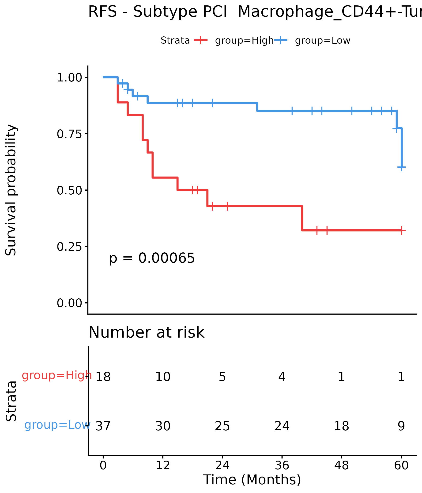{.align-center .lightbox width="900px" 
										fig_alt="codex: surv curve of pci Macrophage_CD44+-Tumor_CD44+" 
                    fig-cap="Figure: surv curve of pci Macrophage_CD44+-Tumor_CD44+"}
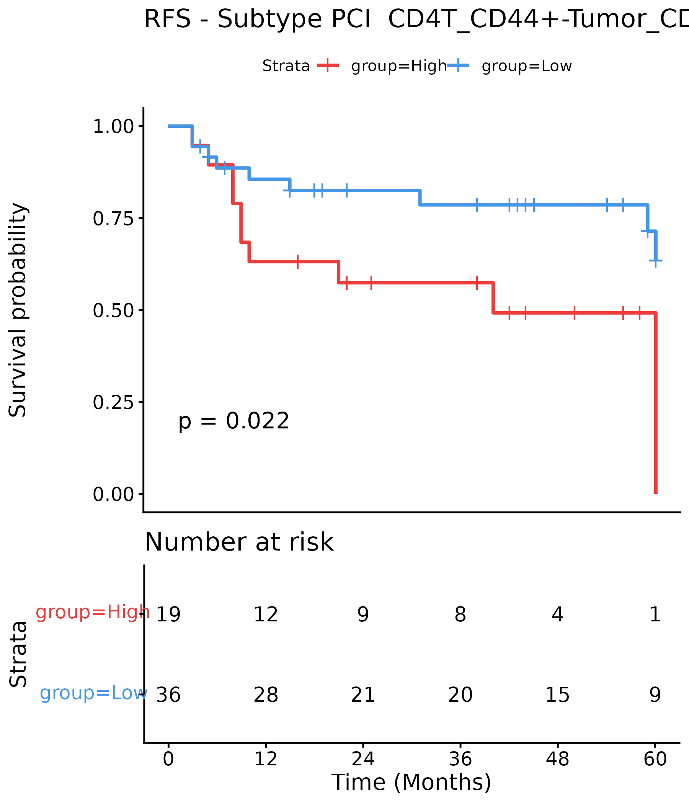{.align-center .lightbox width="900px" 
										fig_alt="codex: surv curve of pci CD4T_CD44+-Tumor_CD44+" 
                    fig-cap="Figure: surv curve of pci CD4T_CD44+-Tumor_CD44+"}
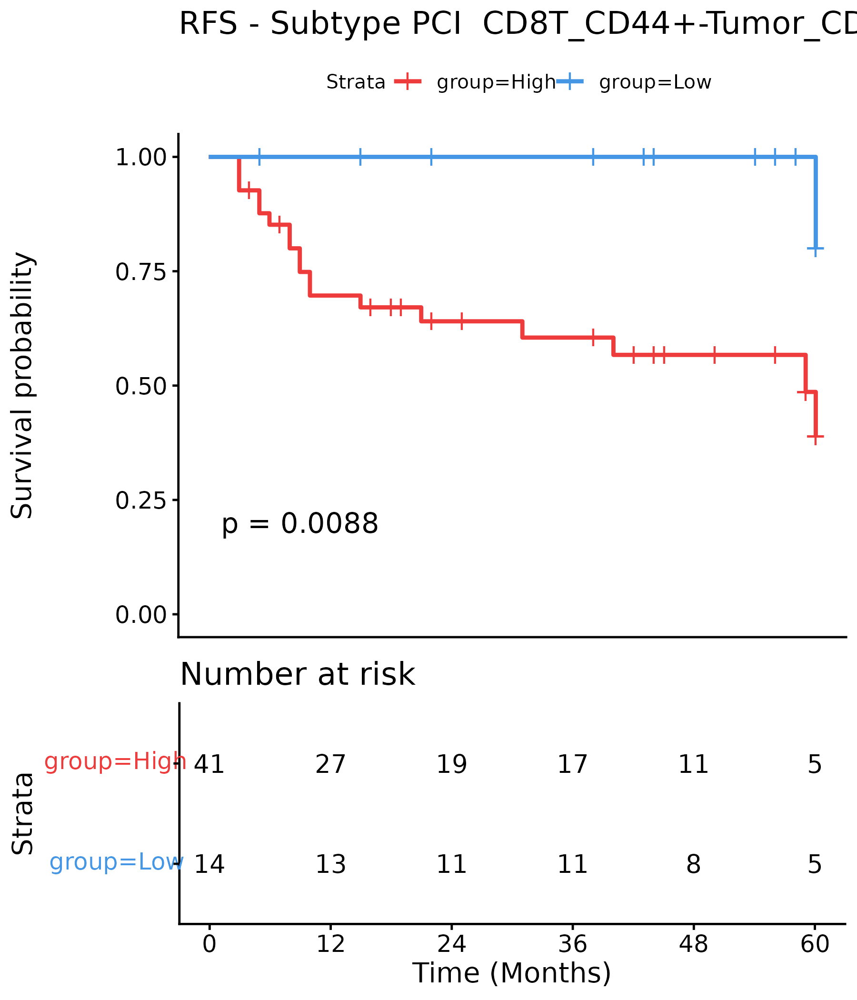{.align-center .lightbox width="900px" 
										fig_alt="codex: surv curve of pci CD8T_CD44+-Tumor_CD44+" 
                    fig-cap="Figure: surv curve of pci CD8T_CD44+-Tumor_CD44+"}


##voronoi plot in situ message: 3-2-4, 3-4-3, 3-5-4

```{r cache=FALSE}
lst_sf_invert <- readRDS(glue("{rds_dir}/sf_invert_insitu_celltype_message.rds"))
voronoi_fig <- list()
Images <- c("3-2-4", "3-4-3", "3-5-4", "3-12-4")
for(img in Images){

  sf_invert <- lst_sf_invert[[img]]

  # plot
  p <- ggplot() +
    geom_sf(data = sf_invert, aes(fill = celltype), linewidth = 0.001, color = "white") +
    scale_fill_manual(values = config_list$cell_type) +
    theme_void() 
  ggsave(glue("{fig_dir}/voronoi_{img}_spatial_celltype_map.pdf"), p, width = 6, height = 6)
  ggsave(glue("{fig_dir}/voronoi_{img}_spatial_celltype_map.png"), p, width = 6, height = 6)
 voronoi_fig[[img]] <- p
}
```
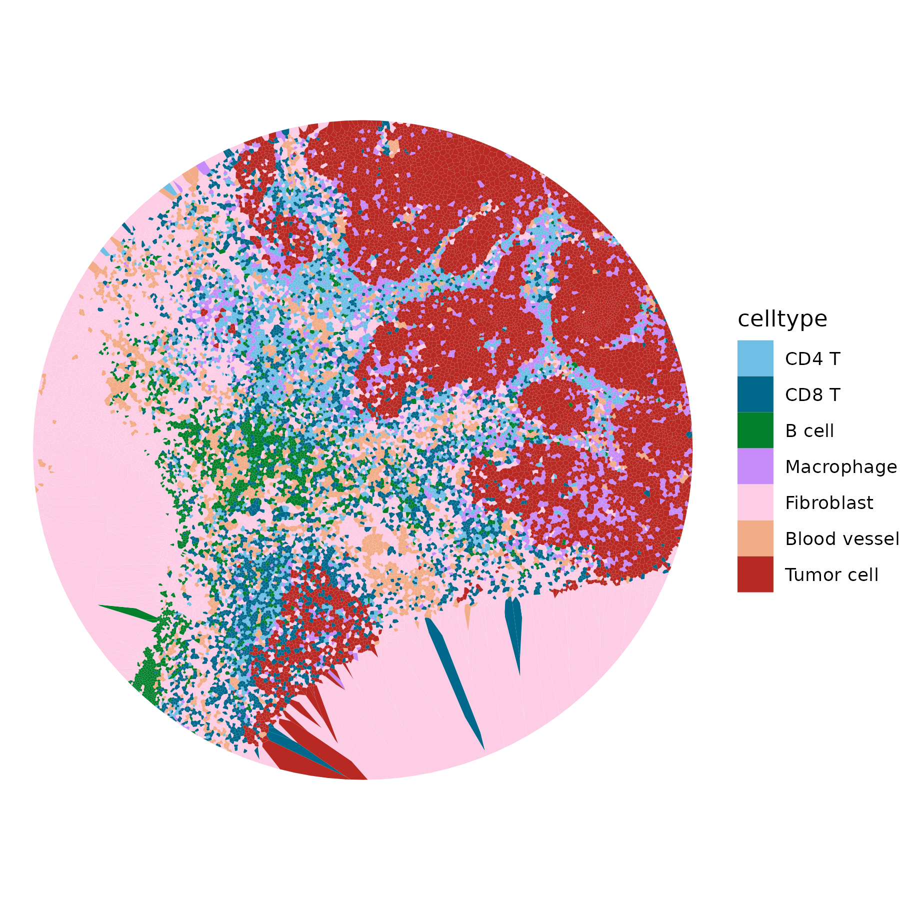{.align-center .lightbox width="900px" 
										fig_alt="codex: voronoi of celltype 3-2-4" 
                    fig-cap="Figure: voronoi of celltype 3-2-4"}
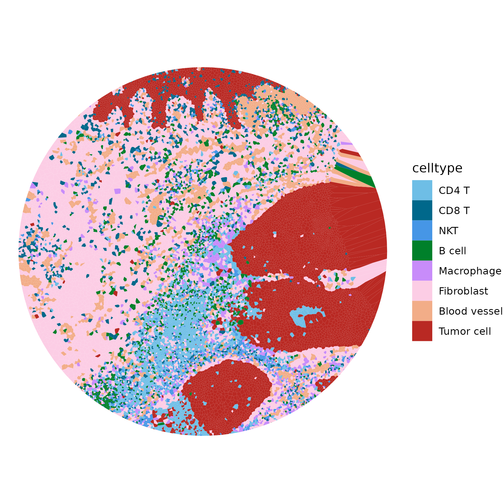{.align-center .lightbox width="900px" 
										fig_alt="codex: voronoi of celltype 3-4-3" 
                    fig-cap="Figure: voronoi of celltype 3-4-3"}
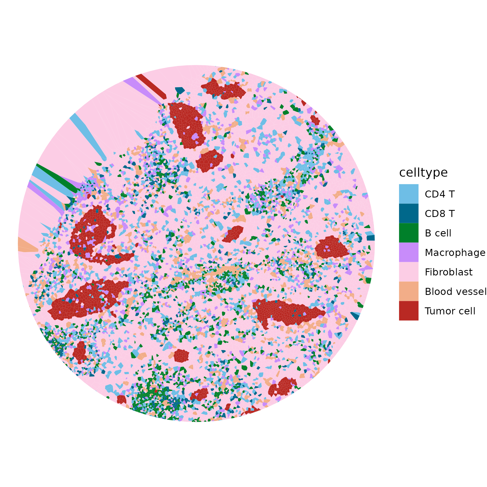{.align-center .lightbox width="900px" 
										fig_alt="codex: voronoi of celltype 3-5-4" 
                    fig-cap="Figure: voronoi of celltype 3-5-4"}


##voronoi plot in situ message: 3-2-4 subtype CN

```{r cache=FALSE}
lst_sf_invert <- readRDS(glue("{rds_dir}/sf_invert_insitu_subtype_message.rds"))

imgs = c("3-2-4")
for(img in imgs){

  sf_invert <- lst_sf_invert[[img]]
  sf_invert <- sf_invert %>% mutate(subtype_cn = factor(subtype_cn, levels = names(config_list$CN_subtype)))
  p <- ggplot() +
    geom_sf(data = sf_invert, aes(fill = subtype_cn), linewidth = 0.001, color = "white") +
    scale_fill_manual(values = config_list$CN_subtype) +
    theme_void() 
  ggsave(glue("{fig_dir}/voronoi_{img}_spatial_subtype_cn_top_map.pdf"), p, width = 6, height = 6)
  ggsave(glue("{fig_dir}/voronoi_{img}_spatial_subtype_cn_top_map.png"), p, width = 6, height = 6)
}
```
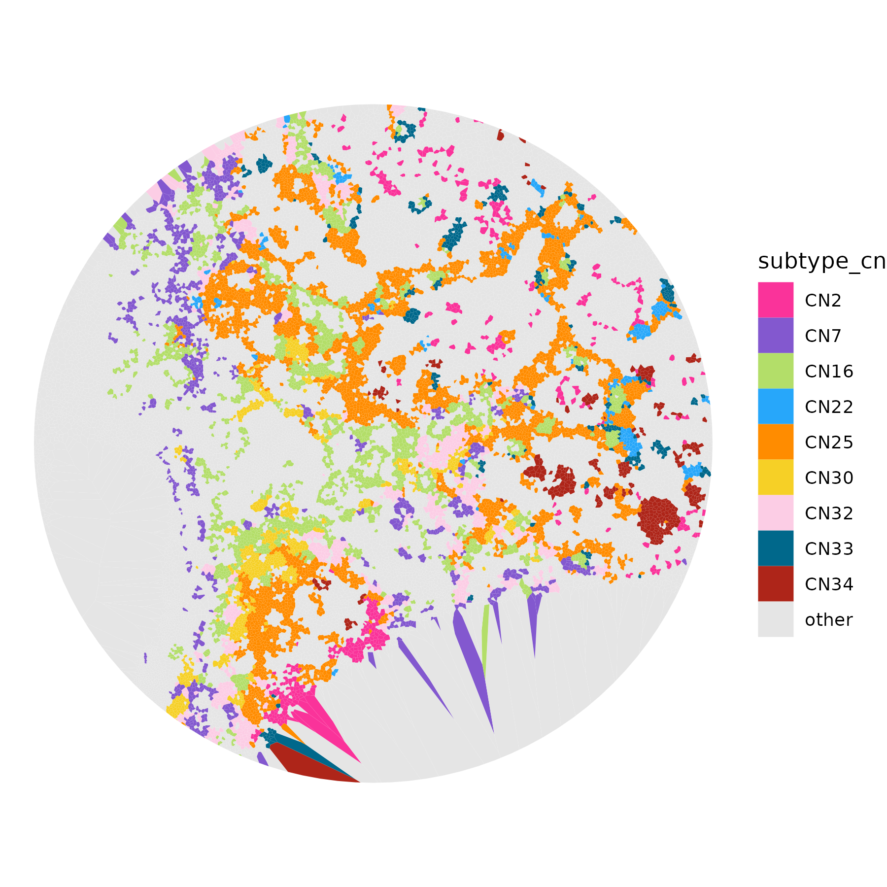{.align-center .lightbox width="900px" 
										fig_alt="codex: voronoi of subtype cn top 3-2-4" 
                    fig-cap="Figure: voronoi of subtype cn top 3-2-4"}


##barplot of immune_cell_proportion_in_erosion_zone

```{r cache=FALSE}
dt <- readRDS(glue("{rds_dir}/erosion_zone_immune_cell_count.rds"))
p <- ggplot(dt, aes(sample_id, count, fill = celltype)) +
  geom_bar(position = "fill", stat = "identity", width = 0.7) +
  scale_fill_manual(values = config_list$cell_type) +
  labs(x = "", y = "Proportion") +
  theme_classic()
ggsave(glue("{fig_dir}/immune_cell_proportion_in_erosion_zone.pdf"), p, width = 6, height = 6)
ggsave(glue("{fig_dir}/immune_cell_proportion_in_erosion_zone.png"), p, width = 6, height = 6)
```
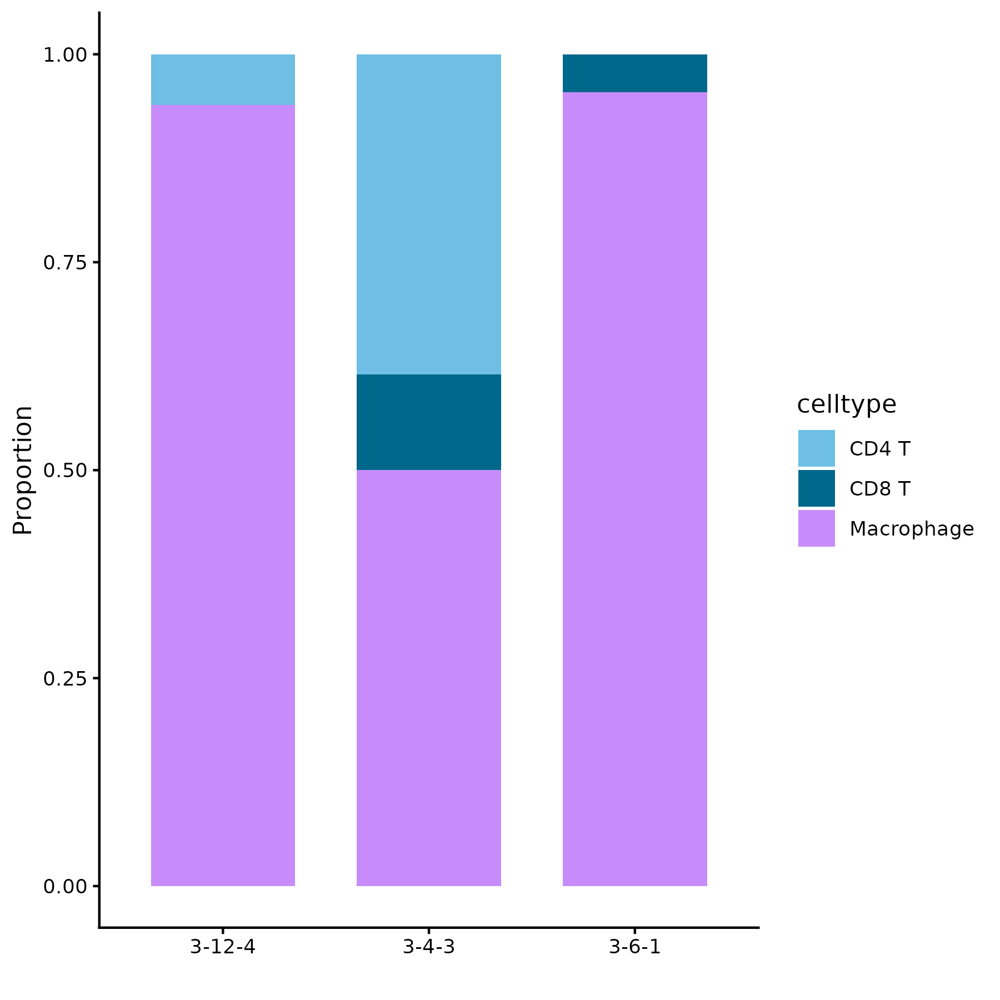{.align-center .lightbox width="900px" 
										fig_alt="codex: stacked bar of celltype composition in erosion zone" 
                    fig-cap="Figure: stacked bar of celltype composition in erosion zone"}


##pci & cor: heatmap of subtype pci and cor

```{r cache=FALSE}
subtype_cor_pci <- readRDS(glue("{rds_dir}/subtype_cor_pci_result.rds"))

df_pci <- subtype_cor_pci$df_pci_long
df_cor <- subtype_cor_pci$df_cor_long

p <- ggplot() +
  geom_tile(data = df_pci, mapping = aes(x = cluster2, y = cluster1, fill = mean_log2_lr)) +
  scale_fill_gradientn(name = "PCI", 
                       limits = c(-6, 6),
                       breaks = seq(-4, 4, 2),
                       colors = config_list$scale_7,
                       values = scales::rescale(c(-4, 0, 4))) +
  geom_point(data = df_cor, shape = 19, alpha = 1,
             mapping = aes(x = cluster2, y = cluster1,
                           color = ifelse(correlation < 0, "Negative", "Positive"),
                           size = abs(correlation))) +
  scale_color_manual(values = config_list$pci_point_map, name = "Correlation") +  # 颜色映射
  scale_size_continuous(range = c(0, 4), limits = c(0, 1), 
                        breaks = seq(0, 1, 0.25), name = "|Correlation|") +
  theme_classic() +
  theme(axis.text.x = element_text(angle = 90, hjust = 1, vjust = 1),
        plot.margin = unit(c(1, 1.5, 1, 1), "cm")) +
  guides(size = guide_legend(override.aes = list(shape = 21, fill = NA, color = "black", stroke = 0.5))) +
  xlab(NULL) +
  ylab(NULL)

ggsave(glue("{fig_dir}/heatmap_subtype_pci_cor.pdf"), p, width = 18, height = 16)
ggsave(glue("{fig_dir}/heatmap_subtype_pci_cor.png"), p, width = 18, height = 16)
```
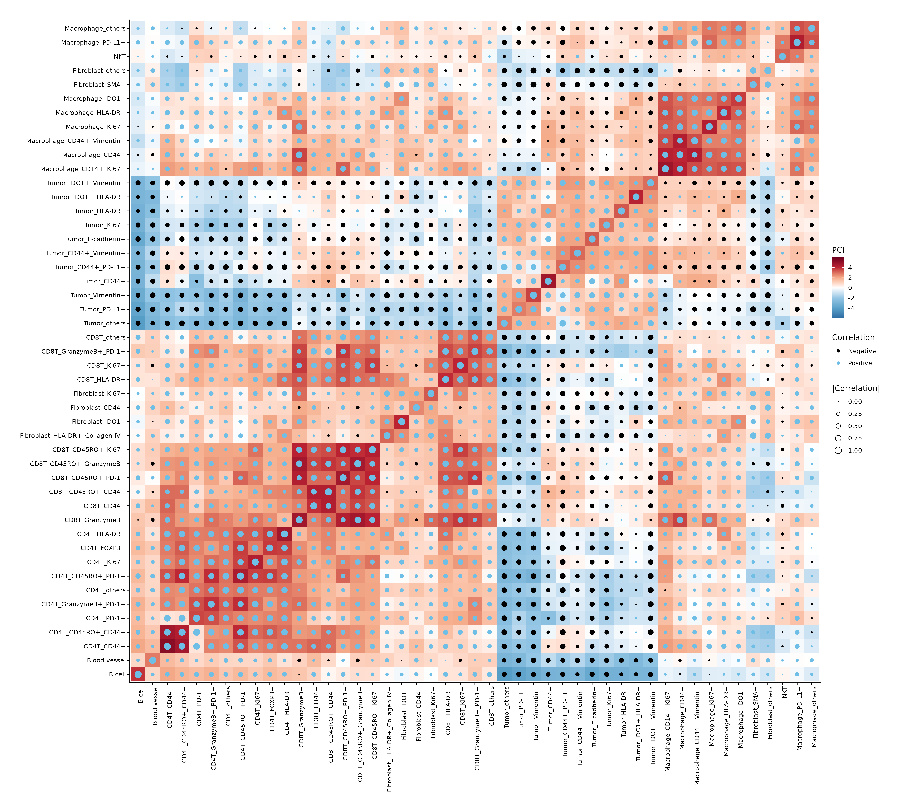{.align-center .lightbox width="900px" 
										fig_alt="codex: heatmap of pci and cor" 
                    fig-cap="Figure: heatmap of pci and cor"}
