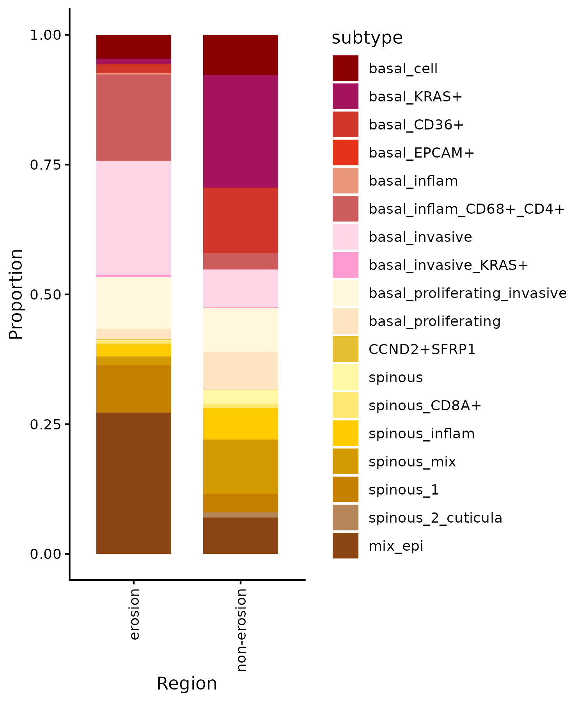

# Figure6


## Package load and plot settings.


```{r warning=FALSE}
pkgs <- c("fs", "configr", "stringr", 
          "jhtools", "glue", "patchwork", "tidyverse", "dplyr", "Seurat", "magrittr", "rstatix",
          "readxl", "writexl", "ComplexHeatmap", "SpatialExperiment", "imcRtools",
          "data.table", "ggplot2", "viridis", "ggbeeswarm", "ggdendro", "ggrepel", "dendextend", "deldir",
          "sf", "corrplot", "ggpubr", "ggrastr", "BiocParallel", "BiocNeighbors", "BPCells",
          "clusterProfiler")  
for (pkg in pkgs){
  suppressPackageStartupMessages(library(pkg, character.only = T))
}


rds_dir <- "/cluster/home/lixiyue_jh/projects/stomatology/analysis/lvjiong/human/meta/manuscript/rds/xenium"
fig_dir <- "/cluster/home/lixiyue_jh/projects/stomatology/analysis/lvjiong/human/meta/manuscript/figs/fig5_new"


# colors setting
config_fn = "/cluster/home/jhuang/projects/stomatology/analysis/lvjiong/human/meta/manuscript/configs/colors.yaml"
config_list <- show_me_the_colors(config_fn, "all")
colors_celltype <- config_list$cell_type

config <- read.config(config_fn)
cell_type_order <- config$cell_type_order

sampleinfo <- readRDS("/cluster/home/jhuang/projects/stomatology/docs/lvjiong/sampleinfo/sampleinfo.rds")

```


## B,C,F,I: xenium immune mediated tumor erosion: region

```{r echo=TRUE, eval=FALSE}

srat <- readRDS(glue("{rds_dir}/srt_erosion_region.rds"))
pt_mpg <- srat[[]] %>% filter(cell_type == "Macrophage") %>% 
  mutate(subtype = factor(subtype, levels = intersect(config$cell_type_order, unique(.$subtype))))
pt_epi <- srat[[]] %>% filter(cell_type == "Epithelial") %>% 
  mutate(subtype = factor(subtype, levels = intersect(config$cell_type_order, unique(.$subtype))))
pt_celltype <- srat[[]] %>% filter(!is.na(cell_type)) %>% 
  mutate(cell_type = factor(cell_type, levels = intersect(config$cell_type_order, unique(.$cell_type))))

p1 <- ggplot(pt_mpg, aes(x = .data[["sample_id"]], fill = .data[["subtype"]])) +
  geom_bar(position = "fill", width = 0.7) +
  facet_grid(~ .data[["Region"]], scales = "free_x", space = "free_x") +
  scale_fill_manual(values = config_list$cell_type) +
  theme_classic() +
  labs(y = "Proportion", x = "samples", fill = "Macrophage.subtype") +
  scale_y_continuous(labels = scales::label_number(accuracy = 0.01)) + 
  theme(axis.text.x = element_text(angle = 90, hjust = 1, vjust = 0.5))
ggsave(glue("{fig_dir}/xenium_in_out_zone_macrophage_subtype_stack_bar_sampleid.pdf"), p1, width = 9, height = 4)
ggsave(glue("{fig_dir}/xenium_in_out_zone_macrophage_subtype_stack_bar_sampleid.png"), p1, width = 9, height = 4)

p3 <- ggplot(pt_celltype, aes(x = .data[["sample_id"]], fill = .data[["cell_type"]])) +
  geom_bar(position = "fill", width = 0.7) +
  facet_grid(~ .data[["Region"]], scales = "free_x", space = "free_x") +
  scale_fill_manual(values = config_list$cell_type) +
  theme_classic() +
  labs(y = "Proportion", x = "samples", fill = "cell_type") +
  scale_y_continuous(labels = scales::label_number(accuracy = 0.01)) + 
  theme(axis.text.x = element_text(angle = 90, hjust = 1, vjust = 0.5))
ggsave(glue("{fig_dir}/xenium_in_out_zone_celltype_stack_bar_sampleid.pdf"), p3, width = 8, height = 4)
ggsave(glue("{fig_dir}/xenium_in_out_zone_celltype_stack_bar_sampleid.png"), p3, width = 8, height = 4)

p5 <- ggplot(pt_epi, aes(Region, fill = subtype)) +
  geom_bar(position = "fill", width = 0.7) +
  scale_fill_manual(values = config_list$cell_type) +
  theme_classic() +
  labs(y = "Proportion") +
  scale_y_continuous(labels = scales::label_number(accuracy = 0.01)) + 
  theme(axis.text.x = element_text(angle = 90, hjust = 1, vjust = 0.5))
ggsave(glue("{fig_dir}/xenium_in_out_zone_epithelial_subtype_stack_bar_region.pdf"), p5, width = 5, height = 6)
ggsave(glue("{fig_dir}/xenium_in_out_zone_epithelial_subtype_stack_bar_region.png"), p5, width = 5, height = 6)


select_pathway <- c("hsa04145","hsa04979","hsa04142","hsa04066","hsa00010","hsa04610","hsa03320","hsa04810")

results_kegg <- readRDS(glue("{rds_dir}/kegg_erosion_result_region_macrophage_up.rds"))
res <- results_kegg$region_Macrophage_res_up
result_filter <- res@result %>% filter(ID %in% select_pathway)
res_filter <- new("enrichResult", result = result_filter)
p1 <- barplot(res_filter, color = "p.adjust") + 
        scale_fill_gradientn(colors = rev(config_list$scale_7[c(1,3,4,5,6)]),
                             guide = guide_colorbar(reverse = TRUE)) +
        theme_classic()
ggsave(glue("{fig_dir}/xenium_in_out_zone_macrophage_kegg.pdf"), plot = p1,width = 6,height = 6)
ggsave(glue("{fig_dir}/xenium_in_out_zone_macrophage_kegg.png"), plot = p1,width = 6,height = 6)

```


{.align-center .lightbox width="900px" 
										fig_alt="kegg of macrophages in tumor erosion regions versus non-erosion regions" 
                    fig-cap="Figure: kegg of macrophages in tumor erosion regions versus non-erosion regions"}
{.align-center .lightbox width="900px" 
										fig_alt="Percentage of macrophages subtype in tumor erosion regions versus non-erosion regions by sampleid" 
                    fig-cap="Figure: Percentage of macrophages subtype in tumor erosion regions versus non-erosion regions by sampleid"}
(images/xenium_in_out_zone_celltype_stack_bar_sampleid.png){.align-center .lightbox width="900px" 
										fig_alt="Percentage of celltype in tumor erosion regions versus non-erosion regions by sampleid" 
                    fig-cap="Figure: Percentage of celltype in tumor erosion regions versus non-erosion regions by sampleid"}
{.align-center .lightbox width="900px" 
										fig_alt="Percentage of epithelial subtype in tumor by erosion regions versus non-erosion regions" 
										fig-cap="Figure: Percentage of epithelial subtype in tumor erosion regions versus non-erosion regions"}


## D: xenium erosion activated tfs and path: macrophage

```{r echo=TRUE, eval=FALSE}

srt_mac <- readRDS(glue("{rds_dir}/srt_decoupleR_Macrophage.rds"))
decoupleR_macro_messages <- readRDS(glue("{rds_dir}/decoupleR_message_Macrophage.rds"))


df_path_score_sample <- decoupleR_macro_messages$path_score_sam
p <- ggplot(df_path_score_sample, aes(x = pathway, y = mean, color = Region)) +
  geom_boxplot() +
  scale_color_manual(values = config_list$erosion_site) +
  theme_classic() +
  theme(plot.title = element_text(hjust = 0.5),
        axis.text.x = element_text(angle = 90, hjust = 1, vjust = 0.5)) +
  labs(title = "Pathway activity scores across regions (sample means)") +
  scale_y_continuous(labels = scales::label_number(accuracy = 0.01)) + 
  ggpubr::stat_compare_means(aes(group = Region, label = after_stat(sprintf("%.2f", p))),
                             method = "wilcox.test", size = 2)
ggsave(glue("{fig_dir}/xenium_erosion_decoupleR_boxplot_mac_pathway_region_samplemean.pdf"), p, width = 12, height = 6)
ggsave(glue("{fig_dir}/xenium_erosion_decoupleR_boxplot_mac_pathway_region_samplemean.png"), p, width = 12, height = 6)

```
{.align-center .lightbox width="900px" 
										fig_alt="boxplot of pathway samplemean of Macrophage in erosion region" 
										fig-cap="Figure: boxplot of pathway samplemean of Macrophage in erosion region"}


## E: xenium umap message

```{r echo=TRUE, eval=FALSE}

umap_message <- readRDS(glue("{rds_dir}/umap_message.rds"))
umap_message[["umap_macro"]] <- umap_message[["umap_macro"]] %>%
  filter(!(UMAP_1 > 2 & Macrophage.1.subtype %notin% c("TAM_H19", "macrophage_inflam", "IL1b_macrophage", "mo_macrophage")), 
         !(UMAP_2 < -4 & Macrophage.1.subtype %notin% c("TAM_THBS1", "TAM_H19"))) %>% as.data.frame()
subumaps <- names(umap_message)
for (subumap in subumaps){
  df <- umap_message[[subumap]]
  df <- df %>% sample_n(size = min(100000, nrow(.)))
  colnames(df) <- c("UMAP1", "UMAP2", "cell_type")
  df <- df %>% mutate(cell_type = factor(cell_type, levels = intersect(config$cell_type_order, unique(.$cell_type))))


  label_data <- df %>% group_by(cell_type) %>% summarise(x = median(UMAP1), y = median(UMAP2))

  p <- ggplot(df, aes(x=UMAP1, y=UMAP2, color=cell_type)) +
          geom_point(size = 0.8, alpha = 0.7) +
          scale_color_manual(values = config_list$cell_type, name = "Cell Type") +
          #geom_text_repel(data = label_data, aes(x=x, y=y, label=cell_type), color = "black", size = 8, fontface = "bold", show.legend = FALSE) +
          theme_classic() +
          guides(color = guide_legend(override.aes = list(size = 5))) +
          coord_fixed(ratio = 1) +
          theme(legend.position = "right",
                legend.title = element_text(size = 12, face = "bold", color = "black"), 
                legend.text = element_text(size = 10), 
                legend.key.size = unit(0.5, "cm"))
  ggsave(glue("{fig_dir}/xenium_umap_{subumap}.pdf"), p, width = 12, height = 12)
  ggsave(glue("{fig_dir}/xenium_umap_{subumap}.png"), p, width = 12, height = 12)
}

```
{.align-center .lightbox width="900px" 
										fig_alt="giotto umap of xenium macrophage subtype" 
                    fig-cap="Figure: giotto umap of xenium macrophage subtype"}

 

## G,H: xenium insitu celltype plot 
```{r echo=TRUE, eval=FALSE}
dt_anno <- readRDS(glue("{rds_dir}/celltype_anno.rds"))
dt_anno <- dt_anno %>% mutate(cell_id = sapply(strsplit(cell_id, "_"),function(X){return(X[1])}))


srat1 <- readRDS(glue("{rds_dir}/sv5_xenium_object_0066253.rds"))
sample_select1 <- unique(srat1$sample_id)
df_anno <- dt_anno %>% filter(slide == "slide1") %>% .[match(colnames(srat1), .$cell_id), ]
srat1$cell_type <- df_anno$cell_type
srat1$Macrophage.1.subtype <- df_anno$Macrophage.1.subtype
srat1$Epithelial.1.subtype <- df_anno$Epithelial.1.subtype
srat1$Macrophage.sub.supply <- df_anno$Macrophage.sub.supply
srat1$Epithelial.sub.supply <- df_anno$Epithelial.sub.supply

srat2 <- readRDS(glue("{rds_dir}/sv5_xenium_object_0066266.rds"))
sample_select2 <- unique(srat2$sample_id) %>% .[!. %in% c("F4-2", "F14")]
df_anno <- dt_anno %>% filter(slide == "slide2") %>% .[match(colnames(srat2), .$cell_id), ]
srat2$cell_type <- df_anno$cell_type
srat2$Macrophage.1.subtype <- df_anno$Macrophage.1.subtype
srat2$Epithelial.1.subtype <- df_anno$Epithelial.1.subtype
srat2$Macrophage.sub.supply <- df_anno$Macrophage.sub.supply
srat2$Epithelial.sub.supply <- df_anno$Epithelial.sub.supply

sample_srat_map <- c(
  setNames(lapply(sample_select1, function(x) srat1), sample_select1),
  setNames(lapply(sample_select2, function(x) srat2), sample_select2))
sample_select <- names(sample_srat_map)
sample_select <- c("F6", "R23R", "S48", "F15", "S67")

param <- BiocParallel::MulticoreParam(workers = 5, progressbar = TRUE)
results <- bplapply(sample_select, function(subsample){
  srat <- sample_srat_map[[subsample]]
  sub_srat <- subset(srat,subset = sample_id == subsample)
  sub_srat$cell_type <- factor(sub_srat$cell_type, levels = intersect(cell_type_order, unique(sub_srat$cell_type)))
  sub_srat$Macrophage.1.subtype <- factor(sub_srat$Macrophage.1.subtype, levels = intersect(cell_type_order, unique(sub_srat$Macrophage.1.subtype)))
  sub_srat$Epithelial.1.subtype <- factor(sub_srat$Epithelial.1.subtype, levels = intersect(cell_type_order, unique(sub_srat$Epithelial.1.subtype)))
  sub_srat$Macrophage.sub.supply <- factor(sub_srat$Macrophage.sub.supply, levels = intersect(cell_type_order, unique(sub_srat$Macrophage.sub.supply)))
  sub_srat$Epithelial.sub.supply <- factor(sub_srat$Epithelial.sub.supply, levels = intersect(cell_type_order, unique(sub_srat$Epithelial.sub.supply)))
  
  image1 <- ImageDimPlot(sub_srat,group.by = "cell_type", cols=config_list$cell_type, na.value="black",
                          boundaries = "segmentations",border.size = 0.01, dark.background = TRUE) + ggtitle(subsample) + 
            scale_y_continuous(trans = "reverse")
  image2 <- ImageDimPlot(sub_srat,group.by = "Macrophage.1.subtype", cols=config_list$cell_type, na.value="black",
                          boundaries = "segmentations",border.size = 0.01, dark.background = TRUE) + ggtitle(subsample) + 
            scale_y_continuous(trans = "reverse")
  image3 <- ImageDimPlot(sub_srat,group.by = "Epithelial.1.subtype", cols=config_list$cell_type, na.value="black",
                          boundaries = "segmentations",border.size = 0.01, dark.background = TRUE) + ggtitle(subsample) + 
            scale_y_continuous(trans = "reverse")
  image4 <- ImageDimPlot(sub_srat,group.by = "Macrophage.sub.supply", cols=config_list$cell_type, na.value="black",
                          boundaries = "segmentations",border.size = 0.01, dark.background = TRUE) + ggtitle(subsample) + 
            scale_y_continuous(trans = "reverse")
  image5 <- ImageDimPlot(sub_srat,group.by = "Epithelial.sub.supply", cols=config_list$cell_type, na.value="black",
                          boundaries = "segmentations",border.size = 0.01, dark.background = TRUE) + ggtitle(subsample) + 
            scale_y_continuous(trans = "reverse")

  img <- ImageFeaturePlot(sub_srat,fov = "fov",features = c("nCount_Xenium"), max.cutoff="q99", min.cutoff=0,
            boundaries = "segmentations", border.size = 0.01, dark.background = FALSE) +
            scale_y_continuous(trans = "reverse")

  image1[[1]]$data %<>%mutate(x = img[[1]]$data$x, y = img[[1]]$data$y)
  image2[[1]]$data %<>%mutate(x = img[[1]]$data$x, y = img[[1]]$data$y)
  image3[[1]]$data %<>%mutate(x = img[[1]]$data$x, y = img[[1]]$data$y)
  image4[[1]]$data %<>%mutate(x = img[[1]]$data$x, y = img[[1]]$data$y)
  image5[[1]]$data %<>%mutate(x = img[[1]]$data$x, y = img[[1]]$data$y)

  pdf(glue("{fig_dir}/insitu/xenium_image_insitu_{subsample}_celltype.pdf"), width = 8, height = 8)
  print(image1)
  dev.off()
  png(glue("{fig_dir}/insitu/xenium_image_insitu_{subsample}_celltype.png"), width = 8, height = 8, units = "in", res = 300)
  print(image1)
  dev.off()
  pdf(glue("{fig_dir}/insitu/xenium_image_insitu_{subsample}_epi.pdf"), width = 8, height = 8)
  print(image3)
  dev.off()
  png(glue("{fig_dir}/insitu/xenium_image_insitu_{subsample}_epi.png"), width = 8, height = 8, units = "in", res = 300)
  print(image3)
  dev.off()
  
}, BPPARAM = param)


```

{.align-center .lightbox width="900px" 
										fig_alt="in situ image plot of celltype" 
                    fig-cap="Figure: in situ image plot of celltype"}
{.align-center .lightbox width="900px" 
										fig_alt="in situ image plot of epithelial subtype" 
                    fig-cap="Figure: in situ image plot of epithelial subtype"}


