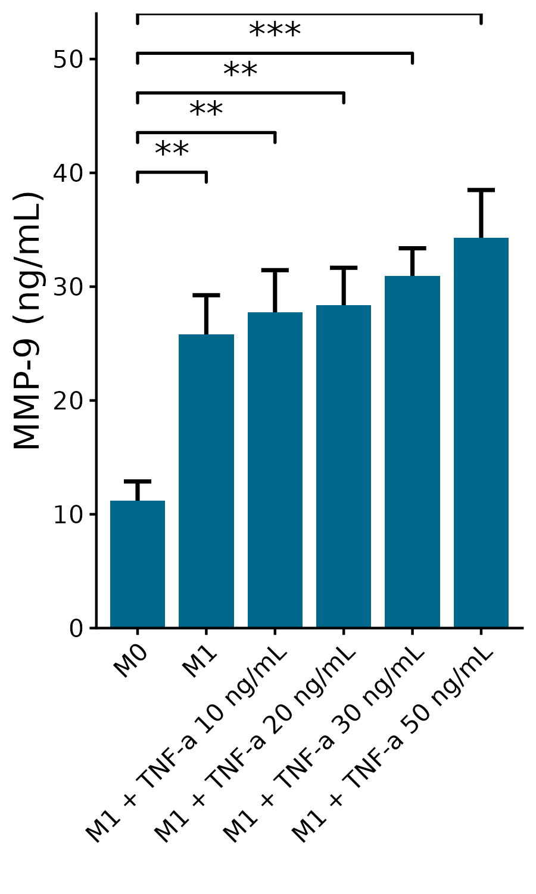
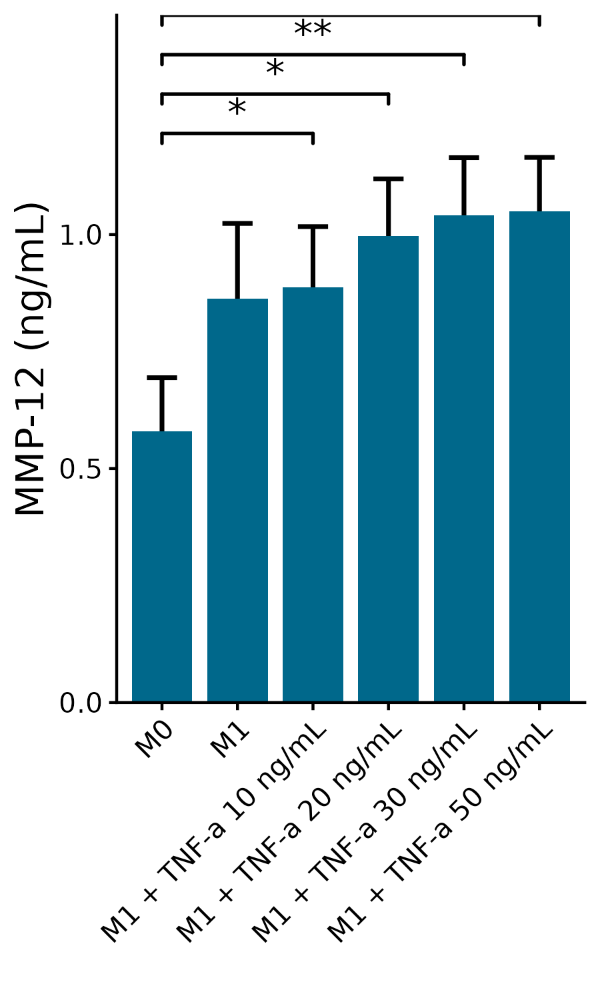
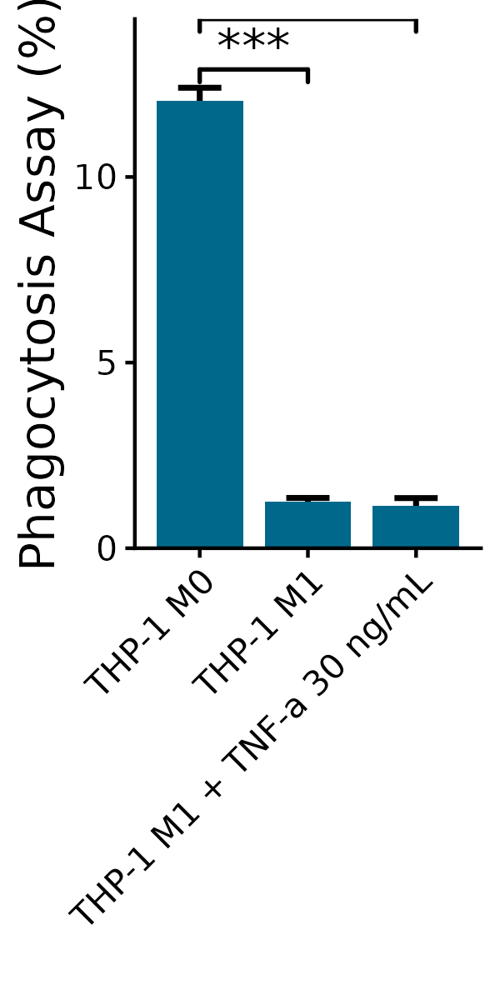
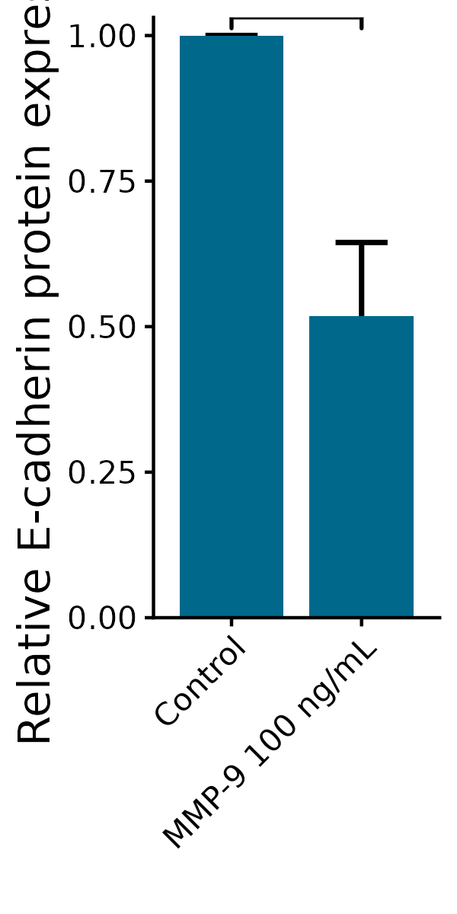
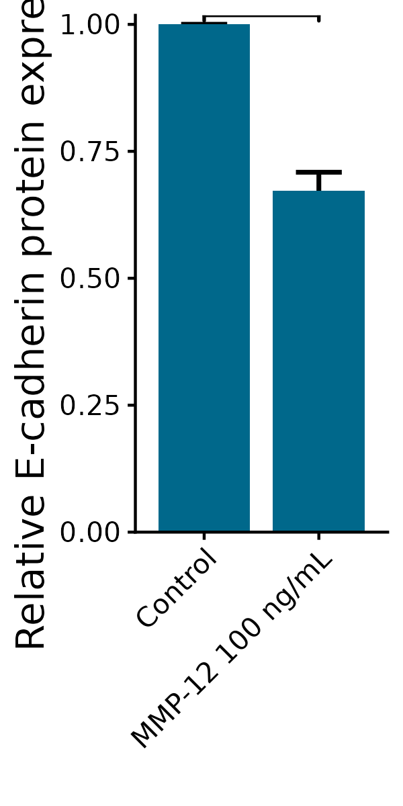
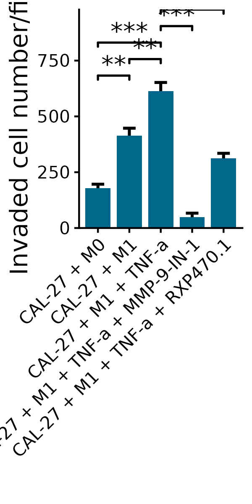

# Experiments

## Package load and plot settings.

```{r echo=TRUE, eval=FALSE}
library(ggplot2)
library(reshape)
library(ggprism)
library(ggpubr)
library(glue)
library(dplyr)
library(tidyr)
library(rstatix)
library(tidyverse)
library(jhtools)


rds_dir <- "/cluster/home/lixiyue_jh/projects/stomatology/analysis/lvjiong/human/meta/manuscript/rds/experiments"
fig_dir <- "/cluster/home/lixiyue_jh/projects/stomatology/analysis/lvjiong/human/meta/manuscript/figs/fig7"

set.seed(12387)

config_fn = "/cluster/home/jhuang/projects/stomatology/analysis/lvjiong/human/meta/manuscript/configs/colors.yaml"
config_list <- show_me_the_colors(config_fn, "all")


mean_sd <- function(x) {
  data.frame(y = mean(x, na.rm = TRUE), 
             ymin = mean(x, na.rm = TRUE) - sd(x, na.rm = TRUE),
             ymax = mean(x, na.rm = TRUE) + sd(x, na.rm = TRUE))
}

p_bar <- function(dt, ylabel){

  color_use <- config_list$diff_level[["low"]]
  p <- ggplot(dt, aes(x= Experiment, y = Value)) +
    stat_summary(fun.data = mean_sd, geom = "errorbar", width = 0.4, size = 0.8, position = position_dodge(0.9)) +
    geom_bar(stat = 'summary', fun = "mean", position = position_dodge(0.9), width = 0.8, fill = color_use) +
    stat_compare_means(comparisons = comparisons, method = "t.test",
                       label = "p.signif", tip_length = 0.01, step_increase = 0.2, 
                       size = 5, bracket.size = 0.6) +
    labs(x = "", y = ylabel) +
    theme_classic() +
    theme(axis.title.y = element_text(size = 14),
          axis.text.x = element_text(size = 10, angle = 45, hjust = 1, vjust = 1),
          axis.text.y = element_text(size = 10)) +
    scale_y_continuous(expand = c(0, 0))
  return(p)
}

```

```{r echo=TRUE, eval=FALSE}
#### MMP9
dt <- read.csv(glue("{rds_dir}/ELISA_mmp9.csv"), stringsAsFactors = FALSE, check.names = FALSE)
colnames_set <- c("M0", "M1", "M1 + TNF-a 10 ng/mL", "M1 + TNF-a 20 ng/mL", "M1 + TNF-a 30 ng/mL", "M1 + TNF-a 50 ng/mL")
colnames(dt) <- colnames_set
dt$replicates <- c("rep1", "rep2", "rep3")
dt1 <- dt %>% pivot_longer(cols = colnames_set, names_to = "Experiment", values_to = "Value") %>%
  mutate(Experiment = factor(Experiment, levels = colnames_set)) 
dt_summary <- dt1 %>%
  group_by(Experiment) %>%
  summarise(mean = mean(Value, na.rm = TRUE), sd = sd(Value, na.rm = TRUE), .groups = 'drop') %>%
  mutate(ymin = mean - sd, ymax = mean + sd)
comparisons = list(c(colnames_set[1], colnames_set[2]), c(colnames_set[1], colnames_set[3]),
                   c(colnames_set[1], colnames_set[4]), c(colnames_set[1], colnames_set[5]),
                   c(colnames_set[1], colnames_set[6]))
p <- p_bar(dt1, "MMP-9 (ng/mL)")
ggsave(glue("{fig_dir}/Elisa_MMP9.pdf"), p, width = 3, height = 5)
ggsave(glue("{fig_dir}/Elisa_MMP9.png"), p, width = 3, height = 5)

### MMP12
dt <- read.csv(glue("{rds_dir}/ELISA_mmp12.csv"), stringsAsFactors = FALSE, check.names = FALSE)
colnames_set <- c("M0", "M1", "M1 + TNF-a 10 ng/mL", "M1 + TNF-a 20 ng/mL", "M1 + TNF-a 30 ng/mL", "M1 + TNF-a 50 ng/mL")
colnames(dt) <- colnames_set
dt$replicates <- c("rep1", "rep2", "rep3")
dt1 <- dt %>% pivot_longer(cols = colnames_set, names_to = "Experiment", values_to = "Value") %>%
  mutate(Experiment = factor(Experiment, levels = colnames_set)) 

comparisons = list(c(colnames_set[1], colnames_set[3]),
                   c(colnames_set[1], colnames_set[4]), c(colnames_set[1], colnames_set[5]),
                   c(colnames_set[1], colnames_set[6]))

p <- p_bar(dt1, "MMP-12 (ng/mL)")
ggsave(glue("{fig_dir}/Elisa_MMP12.pdf"), p, width = 3, height = 5)
ggsave(glue("{fig_dir}/Elisa_MMP12.png"), p, width = 3, height = 5)

### phato
dt <- read.csv(glue("{rds_dir}/Phato.csv"), stringsAsFactors = FALSE, check.names = FALSE)
colnames_set <- c("THP-1 M0", "THP-1 M1", "THP-1 M1 + TNF-a 30 ng/mL")
colnames(dt) <- colnames_set
dt$replicates <- c("rep1", "rep2", "rep3")
dt1 <- dt %>% pivot_longer(cols = colnames_set, names_to = "Experiment", values_to = "Value") %>%
  mutate(Experiment = factor(Experiment, levels = colnames_set))

comparisons = list(c(colnames_set[1], colnames_set[2]),c(colnames_set[1], colnames_set[3]))
p <- p_bar(dt1, "Phagocytosis Assay (%)")
ggsave(glue("{fig_dir}/phato.pdf"), p, width = 2, height = 4)
ggsave(glue("{fig_dir}/phato.png"), p, width = 2, height = 4)

#### WB MMP9
dt <- read.csv(glue("{rds_dir}/WB_mmp9.csv"), stringsAsFactors = FALSE, check.names = FALSE)
colnames_set <- c("Control", "MMP-9 100 ng/mL")
colnames(dt) <- colnames_set
dt$replicates <- c("rep1", "rep2", "rep3")
dt1 <- dt %>% pivot_longer(cols = colnames_set, names_to = "Experiment", values_to = "Value") %>%
  mutate(Experiment = factor(Experiment, levels = colnames_set))
comparisons = list(c(colnames_set[1], colnames_set[2]))

p <- p_bar(dt1, "Relative E-cadherin protein expression")
ggsave(glue("{fig_dir}/WB_MMP9.pdf"), p, width = 2, height = 4)
ggsave(glue("{fig_dir}/WB_MMP9.png"), p, width = 2, height = 4)

#### WB MMP12
dt <- read.csv(glue("{rds_dir}/WB_mmp12.csv"), stringsAsFactors = FALSE, check.names = FALSE)
colnames_set <- c("Control", "MMP-12 100 ng/mL")
colnames(dt) <- colnames_set
dt$replicates <- c("rep1", "rep2", "rep3")
dt1 <- dt %>% pivot_longer(cols = colnames_set, names_to = "Experiment", values_to = "Value") %>%
  mutate(Experiment = factor(Experiment, levels = colnames_set))
comparisons = list(c(colnames_set[1], colnames_set[2]))

p <- p_bar(dt1, "Relative E-cadherin protein expression")
ggsave(glue("{fig_dir}/WB_MMP12.pdf"), p, width = 2, height = 4)
ggsave(glue("{fig_dir}/WB_MMP12.png"), p, width = 2, height = 4)

#### transwell
dt <- read.csv(glue("{rds_dir}/Transwell.csv"), stringsAsFactors = FALSE, check.names = FALSE)
colnames_set <- c("CAL-27 + M0", "CAL-27 + M1", "CAL-27 + M1 + TNF-a", 
                  "CAL-27 + M1 + TNF-a + MMP-9-IN-1", "CAL-27 + M1 + TNF-a + RXP470.1")
colnames(dt) <- colnames_set
dt$replicates <- c("rep1", "rep2", "rep3")
dt1 <- dt %>% pivot_longer(cols = colnames_set, names_to = "Experiment", values_to = "Value") %>%
  mutate(Experiment = factor(Experiment, levels = colnames_set))
comparisons = list(c(colnames_set[1], colnames_set[2]), c(colnames_set[2], colnames_set[3]),
                   c(colnames_set[1], colnames_set[3]), c(colnames_set[3], colnames_set[4]),
                   c(colnames_set[3], colnames_set[5]))

p <- p_bar(dt1, "Invaded cell number/field")
ggsave(glue("{fig_dir}/Transwell.pdf"), p, width = 2, height = 4)
ggsave(glue("{fig_dir}/Transwell.png"), p, width = 2, height = 4)

```

{.align-center .lightbox width="900px" 
					fig_alt="Experiments: Elisa MMP-9" 
                    fig-cap="Figure: Elisa MMP-9"}
{.align-center .lightbox width="900px" 
					fig_alt="Experiments: Elisa MMP-12" 
                    fig-cap="Figure: Elisa MMP-12"}
{.align-center .lightbox width="900px" 
					fig_alt="Experiments: phato" 
                    fig-cap="Figure: phato"}
{.align-center .lightbox width="900px" 
					fig_alt="Experiments: WB MMP-9" 
                    fig-cap="Figure: WB MMP-9"}
{.align-center .lightbox width="900px" 
					fig_alt="Experiments: WB MMP-12" 
                    fig-cap="Figure: WB MMP-12"}
{.align-center .lightbox width="900px" 
					fig_alt="Experiments: transwell" 
                    fig-cap="Figure: transwell"}


