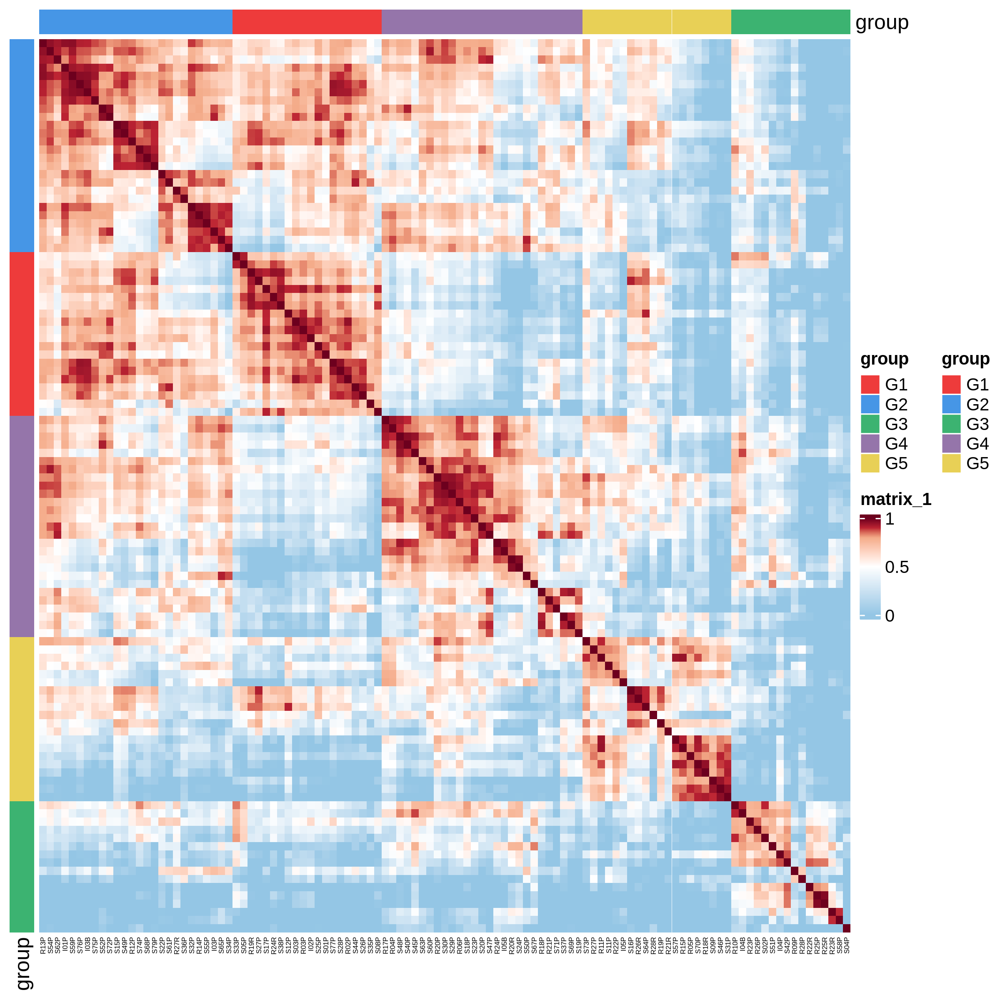
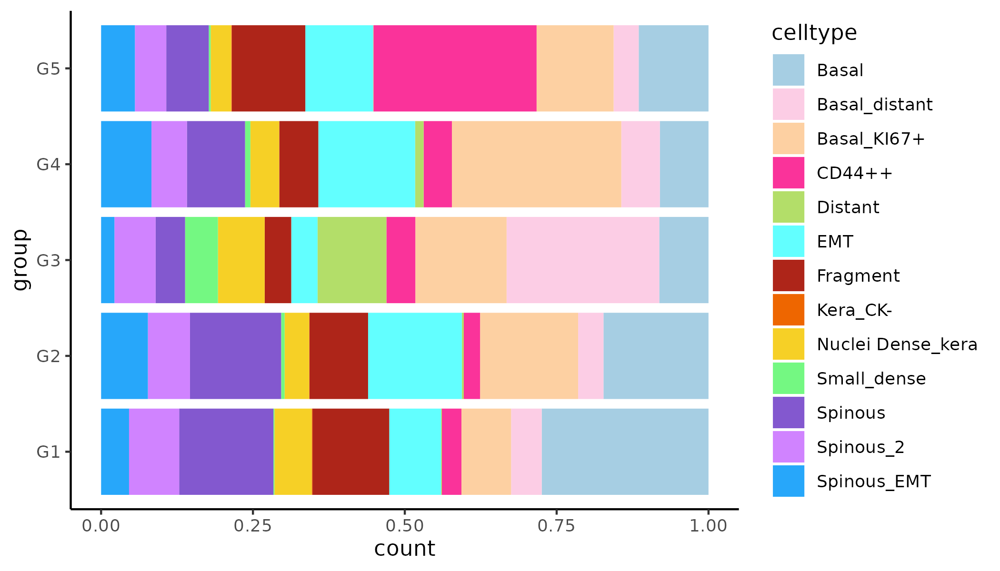
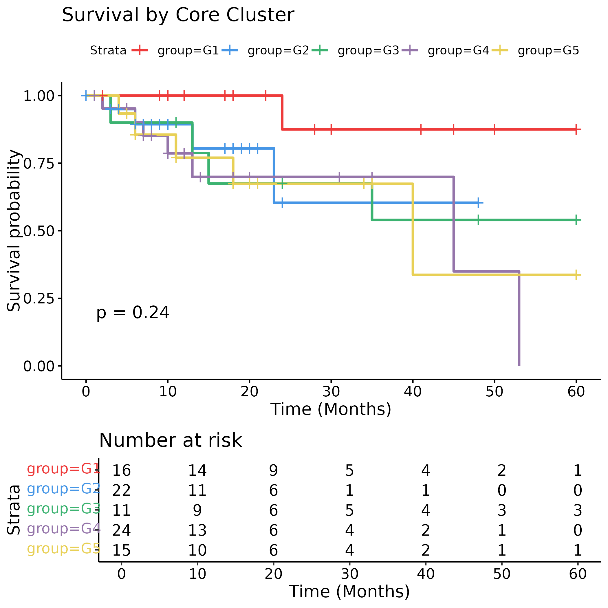
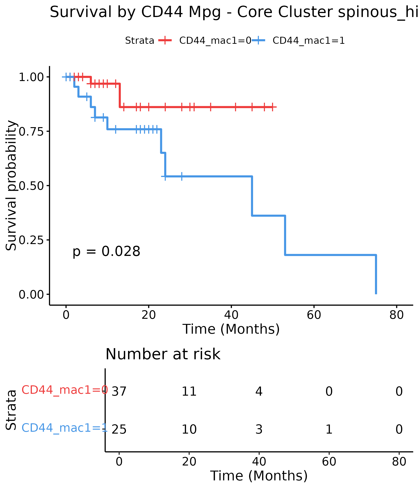

# Figure 1

Package load and plot settings.

```{r warning=FALSE}
pkgs <- c("jhtools", "glue", "readxl", "Seurat", "data.table", "magrittr", "dplyr", 
          "ggplot2", "ComplexHeatmap", "cluster", "survival", "survminer", "RColorBrewer")  
for (pkg in pkgs){
  suppressPackageStartupMessages(library(pkg, character.only = T))
}

dat_dir <- "/cluster/home/jhuang/projects/stomatology/analysis/lvjiong/human/meta/manuscript/rds/polaris"
doc_dir <- "/cluster/home/jhuang/projects/stomatology/docs/lvjiong/sampleinfo"
fig_dir <- "/cluster/home/wyye_jh/projects/stomatology/analysis/lvjiong/human/polaris/figures"
img_dir <- "/cluster/home/wyye_jh/projects/stomatology/analysis/lvjiong/human/polaris/images"

#cols_fn <- "/cluster/home/jhuang/projects/stomatology/analysis/lvjiong/human/meta/manuscript/configs/colors.yaml"
cols_fn <- "/cluster/home/wyye_jh/projects/stomatology/analysis/lvjiong/human/polaris/colors.yaml"
cols <- show_me_the_colors(cols_fn)
col_fun <- circlize::colorRamp2(c(0, 0.5, 0.8, 0.9, 1), unname(cols$col_map))
cols_ct <- cols$cell_type
cols_grp <- cols$cluster[1:6]
names(cols_grp) <- paste0("G", 1:6)
```

## (a) Sample correlation heatmap

```{r cache=FALSE, warning=FALSE, message=FALSE}
#| label: fig1a
# read data
srat_qt_fil <- readRDS(glue("{dat_dir}/srat_qt_fil.rds"))
srat_core <- subset(srat_qt_fil, subset = roi_type == "Core")

# cluster samples by cell type proportion - pool multiple TMA together
## correlation mat
df_prop <- srat_core[[]] %>%
  group_by(sample_id, celltype) %>%
  summarise(n = n()) %>%
  mutate(freq = n / sum(n)) %>%
  as.data.table() %>%
  dcast(sample_id ~ celltype, value.var = "freq", fill = 0) 
mat_prop <- df_prop[, -1] %>% as.matrix()
rownames(mat_prop) <- df_prop$sample_id
mat_cor <- cor(t(mat_prop), method = "pearson")
# plot group
dt_grp <- fread(glue("{dat_dir}/sample_cluster_group_newcore.csv"))
df_anno <- as.data.frame(dt_grp[match(colnames(mat_cor), sample_id), ]) %>%
  `rownames<-`(colnames(mat_cor)) %>%
  .[, "group", drop = FALSE]
row_ha <- rowAnnotation(df = df_anno, col = list(group = cols_grp))
col_ha <- HeatmapAnnotation(df = df_anno, col = list(group = cols_grp))
idx_order <- match(dt_grp$sample_id, rownames(df_anno))
p1 <- ComplexHeatmap::Heatmap(mat_cor, col = col_fun,
                              column_order = idx_order,
                              row_order = idx_order,
                              column_names_gp = grid::gpar(fontsize = 4),
                              show_row_names = FALSE,
                              top_annotation = col_ha,
                              left_annotation = row_ha)
pdf(glue("{fig_dir}/fig1a_heatmap_sample_correlation_group_anno.pdf"), width = 8, height = 8)
draw(p1)
dev.off()
png(glue("{img_dir}/fig1a_heatmap_sample_correlation_group_anno.png"), width = 8, height = 8, units = "in", res = 300)
draw(p1)
dev.off()
```

{.align-center .lightbox fig-alt="1st round clustering" fig-cap="Figure a: Sample correlation heatmap"}

## (b) Sample group celltype propotion

```{r cache=FALSE, warning=FALSE, message=FALSE}
#| label: fig1b
# plot group freq
df_grp_ct <- srat_core[[]] %>%
  select(sample_id, roi_id, cell_id, celltype) %>%
  left_join(tibble::rownames_to_column(df_anno, var = "sample_id"))
p2 <- ggplot(df_grp_ct, aes(group, fill = celltype)) +
  geom_bar(position = "fill") +
  scale_fill_manual(values = cols_ct) +
  coord_flip() +
  theme_classic()
ggsave(glue("{fig_dir}/fig1b_bar_stack_sample_group_celltype_prop.pdf"), p2, width = 7, height = 4)
ggsave(glue("{img_dir}/fig1b_bar_stack_sample_group_celltype_prop.png"), p2, width = 7, height = 4, dpi = 300)
```

{.align-center .lightbox fig-alt="1st round clustering" fig-cap="Figure b: Sample group celltype propotion"}

## (c) Survival curve sample core cluster

```{r cache=FALSE, warning=FALSE, message=FALSE}
#| label: fig1c
# ===================== survival analysis ===========================
# clinical data
clin <- read_excel(glue("{doc_dir}/sampleinfo.xlsx"), sheet = "polaris_clinical") %>% # clinical_info.tsv
  as.data.table()
clin[RFS_time > 60, `:=`(RFS_time = 60,
                         RFS = 0)]

# read group data
dt <- dt_grp %>%
  left_join(clin, by = "sample_id") %>%
  na.omit(cols = c("RFS", "RFS_time"))
dt[, group := as.factor(group)]

# survival analysis
fit <- survfit(Surv(RFS_time, RFS) ~ group, data = dt)

p3 <- ggsurvplot(fit, data = dt, xlab = "Time (Months)", pval = TRUE, risk.table = TRUE,
                risk.table.height = 0.3, 
                palette = unname(cols_grp), title = "Survival by Core Cluster")
p3 <- arrange_ggsurvplots(list(p3), ncol = 1, print = FALSE)
ggsave(glue("{fig_dir}/fig1c_survival_curve_sample_core_cluster.pdf"), p3, width = 7, height = 7)
ggsave(glue("{img_dir}/fig1c_survival_curve_sample_core_cluster.png"), p3, width = 7, height = 7)
```

{.align-center .lightbox fig-alt="1st round clustering" fig-cap="Figure c: Survival curve sample core cluster"}

## (d) Survival curve cd44 mac1 core cluster m2 spinous high

```{r cache=FALSE, warning=FALSE, message=FALSE}
#| label: fig1d
# cd44 macrophage group
df_mac <- read_excel(glue("{doc_dir}/sampleinfo.xlsx"), sheet = "polaris_CD44_Mac") %>%
  filter(!is.na(CD44_mac1))

# sample info
dt_sp <- read_excel(glue("{doc_dir}/sampleinfo.xlsx"), sheet = "polaris_clinical") %>% # clinical_info.tsv
  as.data.table()

# sample core cluster 
dt_core <- dt_grp %>%
  mutate(group_m1 = ifelse(group %in% c("G1", "G2"), "spinous_high", "spinous_low")) %>%
  mutate(group_m2 = ifelse(group %in% c("G1", "G2", "G4"), "spinous_high", "spinous_low"))

# merge
df_surv <- df_mac %>% 
  left_join(dt_core, by = "sample_id") %>%
  left_join(dt_sp, by = c("patient_id", "sample_id"))

grp <- "spinous_high"
df_sub <- df_surv %>% filter(group_m2 == grp)
fit <- survfit(Surv(RFS_time, RFS) ~ CD44_mac1, data = df_sub)
p4 <- ggsurvplot(fit, data = df_sub, xlab = "Time (Months)", pval = TRUE, risk.table = TRUE,
                risk.table.height = 0.3, 
                palette = unname(cols_grp), title = paste0("Survival by CD44 Mpg - Core Cluster ", grp))
p4 <- arrange_ggsurvplots(list(p4), ncol = 1, print = FALSE)
ggsave(glue("{fig_dir}/fig1d_survival_curve_cd44_mac1_core_cluster_m2_{grp}.pdf"), p4, width = 6, height = 7)
ggsave(glue("{img_dir}/fig1d_survival_curve_cd44_mac1_core_cluster_m2_{grp}.png"), p4, width = 6, height = 7)
```

{.align-center .lightbox fig-alt="1st round clustering" fig-cap="Figure d: Survival curve cd44 mac1 core cluster m2 spinous high"}
