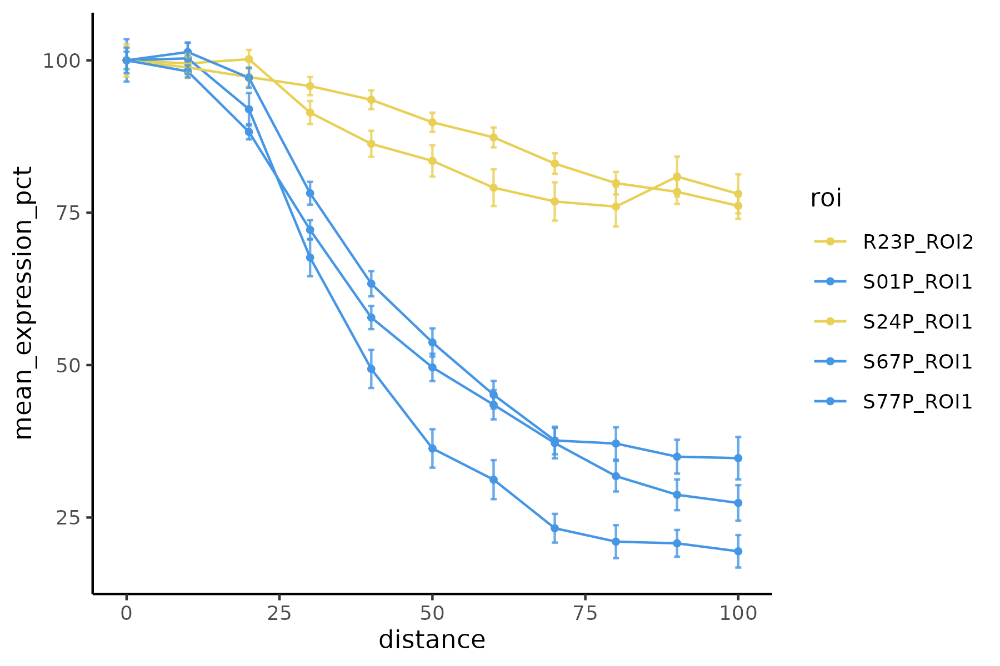
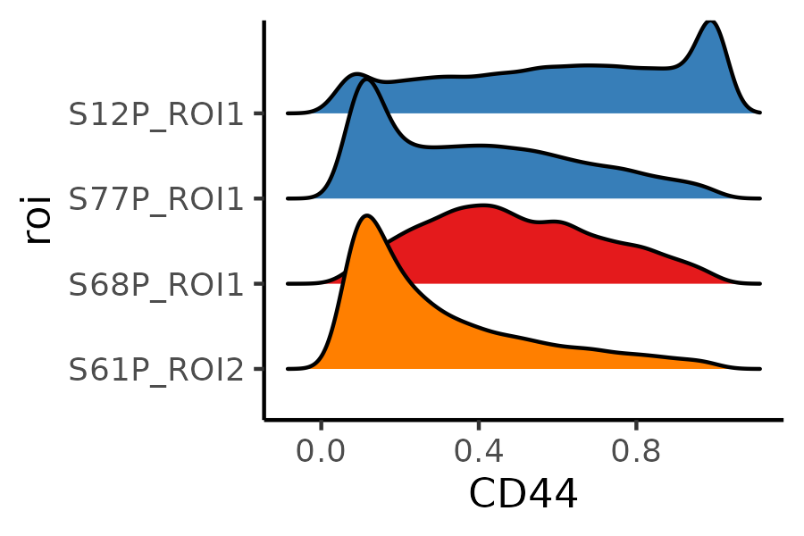
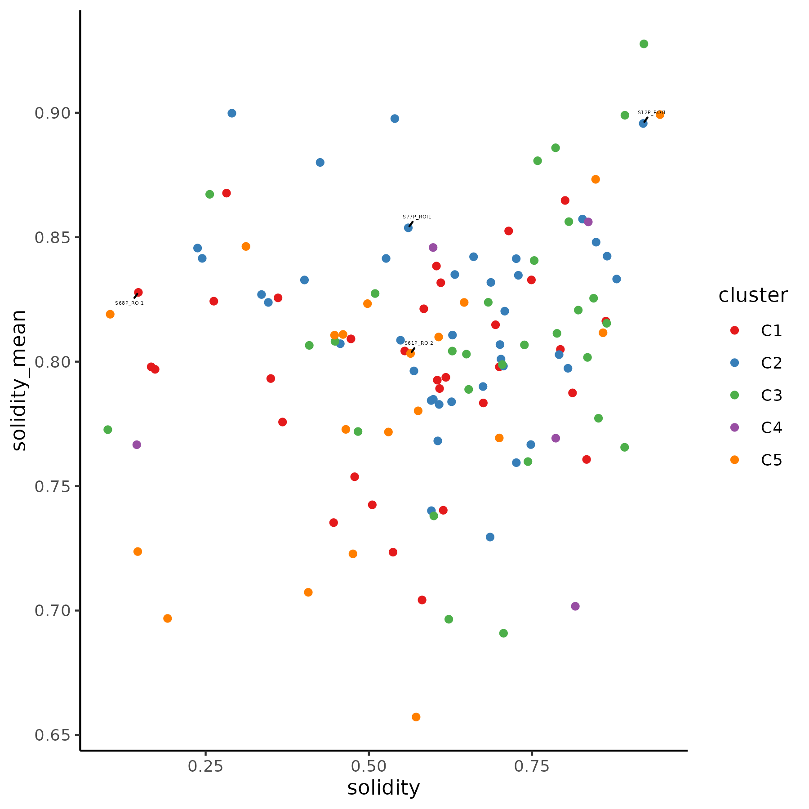

# Figure 1

Package load and plot settings.

```{r warning=FALSE}
pkgs <- c("jhtools", "glue", "readxl", "Seurat", "data.table", "magrittr", "dplyr", 
          "ggplot2", "ComplexHeatmap", "cluster", "survival", "survminer", "RColorBrewer", 
          "sva", "ggridges", "transport", "philentropy", "ggpubr", "rstatix", "ggrepel", 
          "readr", "stringr", "sf", "Nebulosa")
for (pkg in pkgs){
  suppressPackageStartupMessages(library(pkg, character.only = T))
}

dat_dir <- "/cluster/home/jhuang/projects/stomatology/analysis/lvjiong/human/meta/manuscript/rds/polaris"
doc_dir <- "/cluster/home/jhuang/projects/stomatology/docs/lvjiong/sampleinfo"
fig_dir <- "/cluster/home/wyye_jh/projects/stomatology/analysis/lvjiong/human/polaris/figures"
img_dir <- "/cluster/home/wyye_jh/projects/stomatology/analysis/lvjiong/human/polaris/images"

cols_fn <- "/cluster/home/jhuang/projects/stomatology/analysis/lvjiong/human/meta/manuscript/configs/colors.yaml"
cols <- show_me_the_colors(cols_fn)
col_fun1 <- circlize::colorRamp2(c(-2.5, 0, 1, 2, 2.5), unname(cols$col_map))
col_fun2 <- circlize::colorRamp2(c(0, 0.5, 0.8, 0.9, 1), unname(cols$col_map))
cols_ct <- cols$cell_type
cols_grp <- c(cols$cluster[2], cols$cluster[1], cols$cluster[3:5])
names(cols_grp) <- paste0("G", 1:5)
cols_cl <- cols_grp
names(cols_cl) <- paste0("C", 1:5)
```

## Spatial CD44

```{r cache=FALSE, warning=FALSE, message=FALSE}
df <- fs::dir_ls(glue("{dat_dir}/spatial_CD44/data"), regexp = "(S01P_ROI1|S24P_ROI1|S67P_ROI1|S77P_ROI1|R23P_ROI2).*binned.csv") %>% 
  read_delim(id = "roi")
df$roi <- df$roi %>% str_replace_all(c(".*/" = "", "_CD44_vs_distance_to_boundary_binned.csv" = ""))
df_percent <- df %>%
  group_by(roi) %>%
  mutate(
    baseline = first(mean_expression),
    mean_expression_pct = (mean_expression ) / baseline * 100,
    lower_ci_pct = (lower_ci ) / baseline * 100,
    upper_ci_pct = (upper_ci ) / baseline * 100
  ) %>%
  ungroup()
p <- ggplot(df_percent, aes(x = distance, y = mean_expression_pct, color = roi)) +
  geom_line(linewidth = 0.5) +
  geom_point(size = 1) +
  geom_errorbar(aes(ymin = lower_ci_pct, ymax = upper_ci_pct), alpha = 0.8, width = 1) +
  scale_color_manual(values = c("S01P_ROI1" = unname(cols_grp[1]), "S67P_ROI1" = unname(cols_grp[1]), "S77P_ROI1" = unname(cols_grp[1]), "R23P_ROI2" = unname(cols_grp[2]), "S24P_ROI1" = unname(cols_grp[2]))) +
  theme_classic()
ggsave(glue("{fig_dir}/CD44_curve_slow_vs_quick.pdf"), p, width = 6, height = 4)
ggsave(glue("{img_dir}/CD44_curve_slow_vs_quick.png"), p, width = 6, height = 4, dpi = 300)
```

{.align-center .lightbox fig-alt="1st round clustering" fig-cap="CD44_curve_slow_vs_quick.png"}

## CD44 Cluster

```{r cache=FALSE, warning=FALSE, message=FALSE}
# data read
srt <- readRDS(glue("{dat_dir}/srat_qt_fil.rds"))
spinfo <- read_excel(glue("{doc_dir}/sampleinfo.xlsx"), sheet = "polaris_EMT") %>% 
  rename("EMT_mode" = "EMT mode")

# CD44 expression in tumor region
idx <- lapply(unique(srt$roi), function(s){
  dt <- fread(glue("{dat_dir}/shape_metric/data/louvain_community_{s}.csv"), drop = 1)
  return(dt$cell_id)
}) %>% unlist()
df <- subset(srt, cells = idx) %>%
  FetchData(vars = c("CD44", "roi"), layer = "data")
sps <- unique(df$roi)
n <- length(sps)

# Jensen-Shannon divergence
jsd_dist <- matrix(0, nrow = n, ncol = n)
rownames(jsd_dist) <- sps
colnames(jsd_dist) <- sps

calculate_jsd <- function(x, y){
  breaks <- seq(min(c(x, y)), max(c(x, y)), length.out = 50)
  p <- hist(x, breaks = breaks, plot = FALSE)$counts
  q <- hist(y, breaks = breaks, plot = FALSE)$counts
  p <- p / sum(p)
  q <- q / sum(q)
  jsd <- JSD(rbind(p, q), unit = "log2")
  return(jsd)
}
for (i in 1:(n - 1)) {
  for (j in (i + 1):n) {
    jsd_dist[i, j] <- calculate_jsd(df[df$roi == sps[i], "CD44"], df[df$roi == sps[j], "CD44"])
    jsd_dist[j, i] <- jsd_dist[i, j]
  }
}
##write.csv(jsd_dist, glue("{dat_dir}/spatial_CD44/jsd_dist_matrix_CD44.csv"))
# ========================== JSD & 95 Quantile ========================
prob_lst <- lapply(sps, function(s){
  x <- df[df$roi == s, "CD44"]
  x95 <- quantile(x, 0.95)
  x <- x[x < x95]
  
  breaks <- seq(min(x), max(x), length.out = 50)
  p <- hist(x, breaks = breaks, plot = FALSE)$counts
  p <- p / sum(p)
  return(p)
})
prob <- do.call(rbind, prob_lst)
jsd_dist <- JSD(prob, unit = "log2")
rownames(jsd_dist) <- sps
colnames(jsd_dist) <- sps
##write.csv(jsd_dist, glue("{dat_dir}/spatial_CD44/jsd_dist_matrix_CD44_quantile95.csv"))

# core roi
idx <- which(rownames(jsd_dist) %in% spinfo$ROI[spinfo$Type == "Core"])
dist_core <- jsd_dist[idx, idx]
df_core <- df %>%
  filter(roi %in% rownames(dist_core))

# mds
mds <- cmdscale(dist_core, k = nrow(dist_core) - 1, eig = TRUE)
idx_pos <- which(mds$eig > 0)
dist_euc <- dist(mds$points[, idx_pos])

# hclust
hc <- hclust(dist_euc, method = "ward.D2")
##saveRDS(hc, glue("{dat_dir}/spatial_CD44/hclust_jst_quantile95.rds"))
# cluster
clusters <- cutree(hc, k = 5)
df_cl <- data.frame(roi = names(clusters),
                    cluster = clusters) %>%
  arrange(cluster)
##fwrite(df_cl, glue("{dat_dir}/spatial_CD44/hclust_jsd_quantile95_k5.csv"))

sp_order <- hc$labels[hc$order]
df_core_qt <- df_core %>%
  mutate(roi = factor(roi, levels = sp_order)) %>%
  group_by(roi) %>%
  mutate(CD44 = CD44 / quantile(CD44, 0.95)) %>%
  ungroup() %>%
  filter(CD44 <= 1)

# plot
cl_colors <- cols_cl
names(cl_colors) <- 1:5
roi_colors <- setNames(
  cl_colors[as.character(df_cl$cluster)],
  df_cl$roi
)
p <- ggplot(df_core_qt, aes(CD44, roi)) +
  geom_density_ridges(aes(fill = roi)) + 
  scale_fill_manual(values = roi_colors) + 
  theme_classic() +
  guides(fill = "none")
ggsave(glue("{fig_dir}/density_CD44_sample_core_hclust_mds_jsd_quantile95.pdf"), p, width = 6, height = 18)
pdf(glue("{fig_dir}/density_CD44_sample_core_hclust_mds_jsd_quantile95_dendrogram.pdf"), width = 18, height = 6)
plot(rev(as.dendrogram(hc)), nodePar = list(lab.cex = 0.7, pch = NA))
dev.off()

ggsave(glue("{img_dir}/density_CD44_sample_core_hclust_mds_jsd_quantile95.png"), p, width = 6, height = 18)

# 4 samples
df_core_qt_4 <- df_core_qt %>% dplyr::filter(grepl("S12P_ROI1|R18R_ROI2|R19R_ROI3|S37P_ROI1", roi))
roi_colors <- c("S12P_ROI1" = unname(cl_colors[2]), "R18R_ROI2" = unname(cl_colors[4]), "R19R_ROI3" = unname(cl_colors[5]), "S37P_ROI1" = unname(cl_colors[3]))
p <- ggplot(df_core_qt_4, aes(CD44, roi)) +
  geom_density_ridges(aes(fill = roi)) + 
  scale_fill_manual(values = roi_colors) + 
  theme_classic() +
  guides(fill = "none")
ggsave(glue("{fig_dir}/density_CD44_sample_core_hclust_mds_jsd_quantile95_4s.pdf"), p, width = 3, height = 2)
ggsave(glue("{img_dir}/density_CD44_sample_core_hclust_mds_jsd_quantile95_4s.png"), p, width = 3, height = 2)
```

{.align-center .lightbox fig-alt="1st round clustering" fig-cap="density_CD44_sample_core_hclust_mds_jsd_quantile95.png"}
{.align-center .lightbox fig-alt="1st round clustering" fig-cap="density_CD44_sample_core_hclust_mds_jsd_quantile95_4s.png"}

## CD44 cluster vs Shape metrics scatterplot & boxplot

```{r cache=FALSE, warning=FALSE, message=FALSE}
# read data
dt_score <- fread(glue("{dat_dir}/all_shape_metrics.csv"))
dt <- df_cl %>%
  left_join(dt_score) %>%
  mutate(cluster = paste0("C", cluster))
# cd44 group vs shape metrics scatterplot
specified_rois <- c("S12P_ROI1", "R18R_ROI2", "R19R_ROI3", "S37P_ROI1")
metric <- "solidity"
metric_mean <- "solidity_mean"
p <- ggplot(dt, aes(!!sym(metric), !!sym(metric_mean))) +
  geom_point(aes(color = cluster)) +
  scale_color_manual(values = cols_cl) +
  geom_text_repel(data = subset(dt, roi %in% specified_rois), aes(label = roi), size = 5, min.segment.length = 0) +
  labs(x = "Global solidity", y = "Average solidity") + 
  theme_classic()

pdf(glue("{fig_dir}/CD44_group_jsd_quantile_vs_shape_metrics_scatterplot_with_roi.pdf"), width = 6, height = 6)
print(p)
dev.off()
ggsave(glue("{img_dir}/CD44_group_jsd_quantile_vs_shape_metrics_scatterplot_with_roi.png"), p, width = 6, height = 6)

# cd44 group vs shape metrics boxplot
metrics <- colnames(dt_score)[-1]
my_comparisons <- combn(unique(dt$cluster), 2, simplify = TRUE) %>% as.data.frame() %>% as.list
p_lst <- lapply(metrics, function(metric){
  form <- as.formula(paste(metric, "~ cluster"))
  test_sig <- wilcox_test(dt, form) %>% 
    filter(p <= 0.05)
  my_comparisons <- test_sig %>% select(group1, group2) %>% t %>% as.data.frame() %>% as.list
  p <- ggboxplot(dt, x = "cluster", y = metric, color = "cluster", 
                 width = 0.5, add = "jitter", legend = "none") +
    stat_compare_means(comparisons = my_comparisons, hide.ns = T) + 
    scale_color_manual(values = cols_cl)
  return(p)
})
pdf(glue("{fig_dir}/CD44_group_jsd_quantile_vs_shape_metrics_all_boxplot.pdf"), width = 5, height = 5)
print(p_lst)
dev.off()
```

{.align-center .lightbox fig-alt="1st round clustering" fig-cap="CD44_group_jsd_quantile_vs_shape_metrics_scatterplot_with_roi.png"}
## Celltype heatmap
```{r cache=FALSE, warning=FALSE, message=FALSE}
# umap celltype
srat_new <- readRDS(glue("{dat_dir}/srat_qt_fil.rds"))
srat_new <- RenameIdents(srat_new, 
                    "Small_dense" = "Spatial_dense", 
                    "Fragment" = "Microcluster", 
                    "Nuclei Dense_kera" = "Kera_Dapi+")
srat_new@meta.data$celltype <- Idents(srat_new)
# heatmap celltype
features <- c("area", "DAPI", "PanCK", "Vimentin", "Ki67", "CD44", 
              "dist-stroma", "percent-epi", "n-neighbors")
#levels(srat_new) <- names(cols_ct)
expr <- srat_new[["CODEX"]]$scale.data %>% t() %>%
  as.data.frame() %>%
  select(all_of(features)) %>%
  mutate(across(everything(), ~ pmax(pmin(., 2.5), -2.5))) %>%
  mutate(celltype = srat_new$celltype) %>%
  group_by(celltype) %>% 
  summarise_if(is.numeric, mean, na.rm = TRUE) %>% 
  tibble::column_to_rownames(var = "celltype")

n_cell <- table(Idents(srat_new)) 
ha <- rowAnnotation(n_cell = anno_barplot(as.vector(n_cell[match(rownames(expr), names(n_cell))]), 
                                          gp=gpar(fill = cols_ct[match(rownames(expr), names(cols_ct))]),
                                          width = unit(3, "cm")))
ht <- ComplexHeatmap::Heatmap(expr, 
                              col = col_fun1,
                              row_labels = rownames(expr),
                              right_annotation = ha,
                              heatmap_legend_param = list(title = "scale.data", at = seq(-2, 2, 1)), 
                              column_names_rot = 45, column_names_centered = FALSE)
pdf(glue("{fig_dir}/heatmap_celltype_features_newcore.pdf"), width = 10, height = 10)
draw(ht)
dev.off()
png(glue("{img_dir}/heatmap_celltype_features_newcore.png"), width = 10, height = 10, units = "in", res = 300)
draw(ht)
dev.off()
```
{.align-center .lightbox fig-alt="1st round clustering" fig-cap="heatmap_celltype_features_newcore.png"}

## Voronoi celltype

```{r cache=FALSE, warning=FALSE, message=FALSE}
# voronoi plot of celltype
srat_qt_fil <- srat_new #readRDS(glue("{dat_dir}/srat_qt_fil.rds"))
df_ct <- srat_qt_fil[[]][, c("Centroid.X.µm", "Centroid.Y.µm", "sample_id", "roi_id", "celltype")] %>%
  mutate(roi_id = paste0(sample_id, "_", roi_id),
         cell_id = colnames(srat_qt_fil))
rois <- c("R04P_ROI3", "S27P_ROI2", "R06P_ROI4", "R25P_ROI3")
purrr::walk(rois, function(roi){
  # data
  sf_pt <- df_ct %>%
    filter(roi_id == roi) %>%
    st_as_sf(coords = c("Centroid.X.µm", "Centroid.Y.µm"), crs = NA)
  f_tis <- glue("{dat_dir}/20250223_tidy/{roi}.geojson")
  sf_tis <- read_sf(f_tis, crs = NA) %>%
    filter(classification == "Tumor")
  
  # voronoi 
  sf_voronoi <- st_union(sf_pt) %>%
    st_voronoi() %>%
    st_collection_extract("POLYGON")%>%
    st_as_sf() %>%
    st_join(sf_pt) %>%
    st_intersection(sf_tis)
  
  # reverse y-axis
  scale_mat <- matrix(c(1, 0, 0, -1), nrow = 2)
  sf_invert <- sf_voronoi
  st_geometry(sf_invert) <- st_geometry(sf_invert) * scale_mat
  
  # plot
  n <- nrow(sf_invert)
  p <- ggplot() +
    geom_sf(data = sf_invert, aes(fill = celltype), linewidth = 0.001) +
    scale_fill_manual(values = cols_ct) +
    theme_void() 
  ggsave(glue("{fig_dir}/{roi}_spatial_celltype_map.pdf"), p, 
         width = sqrt(n)/10, height = sqrt(n)/10)
  ggsave(glue("{img_dir}/{roi}_spatial_celltype_map.png"), p, 
         width = sqrt(n)/10, height = sqrt(n)/10)
})
```

{.align-center .lightbox fig-alt="1st round clustering" fig-cap="R04P_ROI3_spatial_celltype_map.png"}

## Sample correlation heatmap

```{r cache=FALSE, warning=FALSE, message=FALSE}
# read data
#srat_qt_fil <- readRDS(glue("{dat_dir}/srat_qt_fil.rds"))
srat_core <- subset(srat_qt_fil, subset = roi_type == "Core")

# cluster samples by cell type proportion - pool multiple TMA together
## correlation mat
df_prop <- srat_core[[]] %>%
  group_by(sample_id, celltype) %>%
  summarise(n = n()) %>%
  mutate(freq = n / sum(n)) %>%
  as.data.table() %>%
  dcast(sample_id ~ celltype, value.var = "freq", fill = 0) 
mat_prop <- df_prop[, -1] %>% as.matrix()
rownames(mat_prop) <- df_prop$sample_id
mat_cor <- cor(t(mat_prop), method = "pearson")
# plot group
dt_grp <- fread(glue("{dat_dir}/sample_cluster_group_newcore.csv"))
df_anno <- as.data.frame(dt_grp[match(colnames(mat_cor), sample_id), ]) %>%
  `rownames<-`(colnames(mat_cor)) %>%
  .[, "group", drop = FALSE]
row_ha <- rowAnnotation(df = df_anno, col = list(group = cols_grp))
col_ha <- HeatmapAnnotation(df = df_anno, col = list(group = cols_grp))
idx_order <- match(dt_grp$sample_id, rownames(df_anno))
p1 <- ComplexHeatmap::Heatmap(mat_cor, col = col_fun2,
                              column_order = idx_order,
                              row_order = idx_order,
                              column_names_gp = grid::gpar(fontsize = 4),
                              show_row_names = FALSE,
                              top_annotation = col_ha,
                              left_annotation = row_ha)
pdf(glue("{fig_dir}/fig1a_heatmap_sample_correlation_group_anno.pdf"), width = 8, height = 8)
draw(p1)
dev.off()
png(glue("{img_dir}/fig1a_heatmap_sample_correlation_group_anno.png"), width = 8, height = 8, units = "in", res = 300)
draw(p1)
dev.off()
```

{.align-center .lightbox fig-alt="1st round clustering" fig-cap="fig1a_heatmap_sample_correlation_group_anno.png"}

## Sample group celltype propotion

```{r cache=FALSE, warning=FALSE, message=FALSE}
# plot group freq
df_grp_ct <- srat_core[[]] %>%
  select(sample_id, roi_id, cell_id, celltype) %>%
  left_join(tibble::rownames_to_column(df_anno, var = "sample_id"))
p2 <- ggplot(df_grp_ct, aes(group, fill = celltype)) +
  geom_bar(position = "fill") +
  scale_fill_manual(values = cols_ct) +
  coord_flip() +
  theme_classic()
ggsave(glue("{fig_dir}/fig1b_bar_stack_sample_group_celltype_prop.pdf"), p2, width = 7, height = 4)
ggsave(glue("{img_dir}/fig1b_bar_stack_sample_group_celltype_prop.png"), p2, width = 7, height = 4, dpi = 300)
```

{.align-center .lightbox fig-alt="1st round clustering" fig-cap="fig1b_bar_stack_sample_group_celltype_prop.png"}

## Survival curve sample core cluster

```{r cache=FALSE, warning=FALSE, message=FALSE}
# ===================== survival analysis ===========================
# clinical data
clin <- read_excel(glue("{doc_dir}/sampleinfo.xlsx"), sheet = "polaris_clinical") %>% 
  as.data.table()
clin[RFS_time > 60, `:=`(RFS_time = 60,
                         RFS = 0)]

# read group data
dt <- dt_grp %>%
  left_join(clin, by = "sample_id") %>%
  na.omit(cols = c("RFS", "RFS_time"))
dt[, group := as.factor(group)]

# survival analysis
fit <- survfit(Surv(RFS_time, RFS) ~ group, data = dt)

## pairwise_survdiff(Surv(RFS_time, RFS) ~ group, data = dt)
## Pairwise comparisons using Log-Rank test 
## data:  dt and group 
##    G1   G2   G3   G4  
## G2 0.23 -    -    -   
## G3 0.23 0.89 -    -   
## G4 0.17 0.89 0.89 -   
## G5 0.17 0.89 0.89 0.89

p3 <- ggsurvplot(fit, data = dt, xlab = "Time (Months)", pval = TRUE, risk.table = TRUE,
                risk.table.height = 0.3, 
                palette = unname(cols_grp), title = "Survival by Core Cluster")
p3$plot <- p3$plot + 
  theme(axis.title.x = element_blank(),
        axis.text.x = element_blank())
p3$table <- p3$table + 
  xlab("Time (Months)") + 
  theme(axis.title.x = element_text())
pdf(glue("{fig_dir}/fig1c_survival_curve_sample_core_cluster.pdf"), width = 7, height = 7)
print(p3$plot/p3$table + patchwork::plot_layout(heights = c(3, 2)))
dev.off()
p3 <- arrange_ggsurvplots(list(p3), ncol = 1, print = FALSE)
ggsave(glue("{img_dir}/fig1c_survival_curve_sample_core_cluster.png"), p3, width = 7, height = 7)
```

{.align-center .lightbox fig-alt="1st round clustering" fig-cap="fig1c_survival_curve_sample_core_cluster.png"}

## Survival curve cd44 mac1 core cluster m2 spinous high

```{r cache=FALSE, warning=FALSE, message=FALSE}
# cd44 macrophage group
df_mac <- read_excel(glue("{doc_dir}/sampleinfo.xlsx"), sheet = "polaris_CD44_Mac") %>%
  filter(!is.na(CD44_mac1))

# sample info
dt_sp <- read_excel(glue("{doc_dir}/sampleinfo.xlsx"), sheet = "polaris_clinical") %>% # clinical_info.tsv
  as.data.table()
dt_sp[RFS_time > 60, `:=`(RFS_time = 60,
                         RFS = 0)]

# sample core cluster 
dt_core <- dt_grp %>%
  mutate(group_m1 = ifelse(group %in% c("G1", "G2"), "spinous_high", "spinous_low")) %>%
  mutate(group_m2 = ifelse(group %in% c("G1", "G2", "G4"), "spinous_high", "spinous_low"))

# merge
df_surv <- df_mac %>% 
  left_join(dt_core, by = "sample_id") %>%
  left_join(dt_sp, by = c("patient_id", "sample_id"))

for(grp in c("spinous_high", "spinous_low")){
  df_sub <- df_surv %>% filter(group_m2 == grp)
  fit <- survfit(Surv(RFS_time, RFS) ~ CD44_mac1, data = df_sub)
  p4 <- ggsurvplot(fit, data = df_sub, xlab = "Time (Months)", pval = TRUE, risk.table = TRUE,
                  risk.table.height = 0.3, 
                  palette = unname(cols_grp), title = paste0("Survival by CD44 Mpg - Core Cluster ", grp))
  p4$plot <- p4$plot + 
    theme(axis.title.x = element_blank(),
          axis.text.x = element_blank())
  p4$table <- p4$table + 
    xlab("Time (Months)") + 
    theme(axis.title.x = element_text())
  pdf(glue("{fig_dir}/fig1d_survival_curve_cd44_mac1_core_cluster_m2_{grp}.pdf"), width = 6, height = 7)
  print(p4$plot/p4$table + patchwork::plot_layout(heights = c(3, 2)))
  dev.off()
  p4 <- arrange_ggsurvplots(list(p4), ncol = 1, print = FALSE)
  ggsave(glue("{img_dir}/fig1d_survival_curve_cd44_mac1_core_cluster_m2_{grp}.png"), p4, width = 6, height = 7)
}
```

{.align-center .lightbox fig-alt="1st round clustering" fig-cap="fig1d_survival_curve_cd44_mac1_core_cluster_m2_spinous_high.png"}

## EMT_vs_metrics

```{r cache=FALSE, warning=FALSE, message=FALSE}
# read data
dt_score <- fread(glue("{dat_dir}/all_shape_metrics.csv"))
dt <- dt_score %>%
  left_join(spinfo, by = join_by(roi == ROI)) %>%
  mutate(EMT_mode = factor(EMT_mode, levels = c("No", "Partial", "Full")))

# emt mode vs shape metrics
metric <- "compactness"
form <- as.formula(paste(metric, "~ EMT_mode"))
test_sig <- wilcox_test(dt, form) %>% filter(p <= 0.05)
my_comparisons <- test_sig %>% select(group1, group2) %>% t %>% as.data.frame() %>% as.list

p <- ggboxplot(dt, x = "EMT_mode", y = metric, color = "EMT_mode", 
               width = 0.5, add = "jitter", legend = "none") +
  scale_color_brewer(palette = "Set1") + 
  ylim(0, 10000) #coord_cartesian(ylim = c(0, 10000))

if(length(my_comparisons) > 0) {
  for(i in 1:nrow(test_sig)) {
    group1 <- test_sig$group1[i]
    group2 <- test_sig$group2[i]
    p_val <- test_sig$p[i]
      x_pos <- which(levels(dt$EMT_mode) %in% c(group1, group2))
      y_position <- 9500 - (i-1) * 800
      p <- p + 
        annotate("segment",
                 x = x_pos[1], xend = x_pos[2],
                 y = y_position, yend = y_position,
                 color = "black", linewidth = 0.5) +
        annotate("segment",
                 x = x_pos[1], xend = x_pos[1],
                 y = y_position - 100, yend = y_position,
                 color = "black", linewidth = 0.5) +
        annotate("segment",
                 x = x_pos[2], xend = x_pos[2],
                 y = y_position - 100, yend = y_position,
                 color = "black", linewidth = 0.5) +
        annotate("text",
                 x = mean(x_pos),
                 y = y_position + 200,
                 label = p_val,
                 size = 5,
                 vjust = 0)
  }
}
ggsave(glue("{fig_dir}/emt_mode_vs_shape_metrics_all_boxplot.pdf"), p, width = 5, height = 5)
ggsave(glue("{img_dir}/emt_mode_vs_shape_metrics_all_boxplot.png"), p, width = 5, height = 5)
```

{.align-center .lightbox fig-alt="1st round clustering" fig-cap="emt_mode_vs_shape_metrics_all_boxplot.png"}

## CD44 vs Ki67 & PanCK
```{r cache=FALSE, warning=FALSE, message=FALSE}
# CD44, Ki67 & PanCK umap
p <- plot_density(srat_qt_fil, c("CD44", "Ki67", "PanCK"), reduction = "umap", raster = TRUE, size = 0.1) +
  plot_layout(ncol = 3)
ggsave(glue("{fig_dir}/umap_density_CD44_Ki67_PanCK.pdf"), p, width = 14, height = 4)
ggsave(glue("{img_dir}/umap_density_CD44_Ki67_PanCK.png"), p, width = 14, height = 4)

# corr plot
pt <- FetchData(srat_qt_fil, vars = c("CD44", "Ki67", "PanCK"), layer = "data") %>%
  tidyr::pivot_longer(cols = Ki67:PanCK, names_to = "gene", values_to = "expr")
pt <- pt %>% filter(CD44 > 0 & expr > 0)
p <- ggplot(pt, aes(CD44, expr)) +
  geom_hex() +
  scale_fill_gradient(low = "white", high = "red") +
  facet_wrap(~ gene, scales = "free_y") +
  geom_smooth(method = lm, color = "black", se = FALSE) +
  stat_cor(method = "pearson") +
  theme_classic()
ggsave(glue("{fig_dir}/correlation_CD44_vs_Ki67_PanCK.pdf"), p, width = 9, height = 4)
ggsave(glue("{img_dir}/correlation_CD44_vs_Ki67_PanCK.png"), p, width = 9, height = 4)
```

{.align-center .lightbox fig-alt="1st round clustering" fig-cap="correlation_CD44_vs_Ki67_PanCK.png"}

## EMT CD44 vs Vim
```{r cache=FALSE, warning=FALSE, message=FALSE}
# corr plot by emt_mode
pt <- FetchData(srat_qt_fil, vars = c("CD44", "Vimentin", "roi"), layer = "data") %>%
  left_join(spinfo, by = join_by(roi == ROI)) %>%
  mutate(EMT_mode = factor(EMT_mode, levels = c("No", "Partial", "Full")))
pt <- pt %>% filter(CD44 > 0 & Vimentin > 0)
p <- ggplot(pt, aes(CD44, Vimentin)) +
  geom_hex() +
  scale_fill_gradient(low = "white", high = "red") +
  facet_wrap(~ EMT_mode, ncol = 3) +
  geom_smooth(method = lm, color = "black", se = FALSE) +
  stat_cor(method = "pearson") +
  theme_classic()
ggsave(glue("{fig_dir}/emt_correlation_CD44_vs_Vim.pdf"), p, width = 12, height = 4)
ggsave(glue("{img_dir}/emt_correlation_CD44_vs_Vim.png"), p, width = 12, height = 4)

# specific samples
sps <- c("S02P_ROI3", "S48P_ROI1", "S48P_ROI2", "S70P_ROI1", "S74P_ROI3", "S79P_ROI2")
pt_s <- pt %>%
  filter(roi %in% sps)
p <- ggplot(pt_s, aes(CD44, Vimentin)) +
  geom_hex() +
  scale_fill_gradient(low = "white", high = "red") +
  facet_wrap(~ roi, ncol = 3) +
  geom_smooth(method = lm, color = "black", se = FALSE) +
  stat_cor(method = "pearson") +
  theme_classic()
ggsave(glue("{fig_dir}/correlation_CD44_vs_Vim_select_samples.pdf"), p, width = 12, height = 8)
ggsave(glue("{img_dir}/correlation_CD44_vs_Vim_select_samples.png"), p, width = 12, height = 8)
```

{.align-center .lightbox fig-alt="1st round clustering" fig-cap="correlation_CD44_vs_Vim_select_samples.png"}