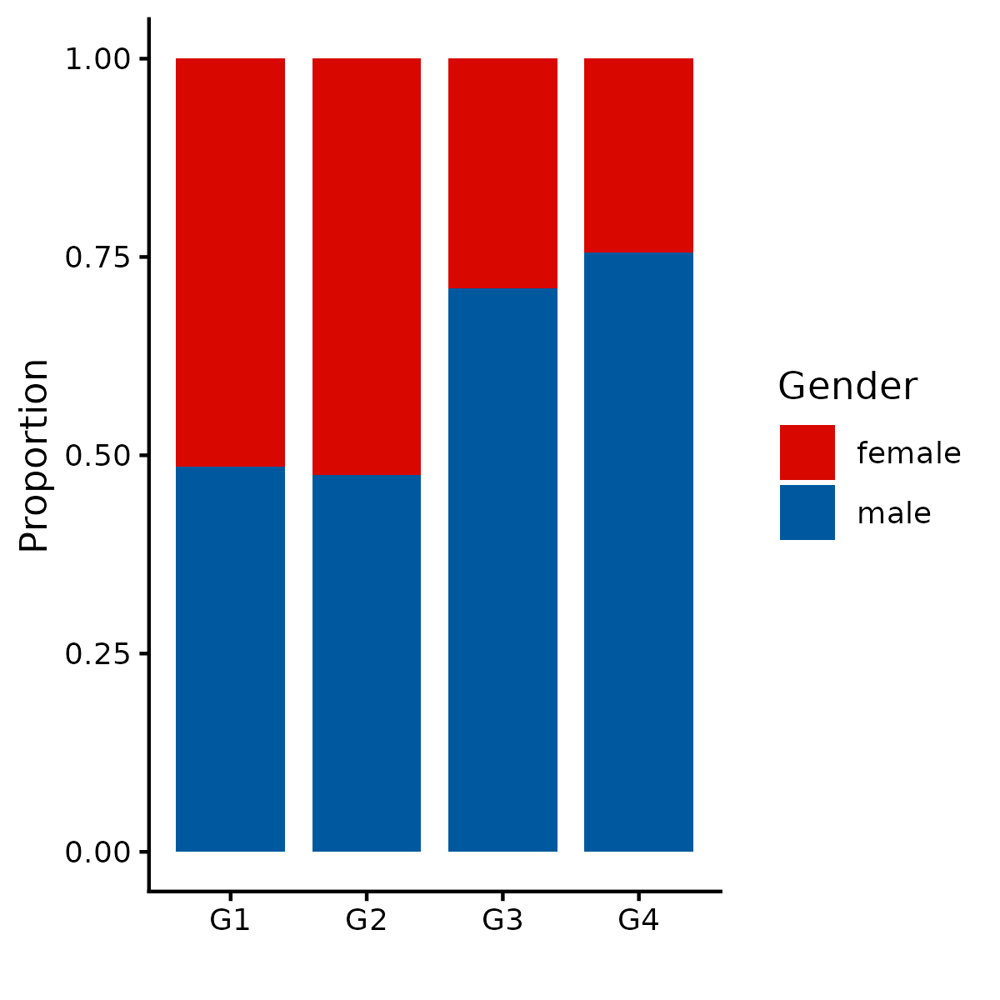
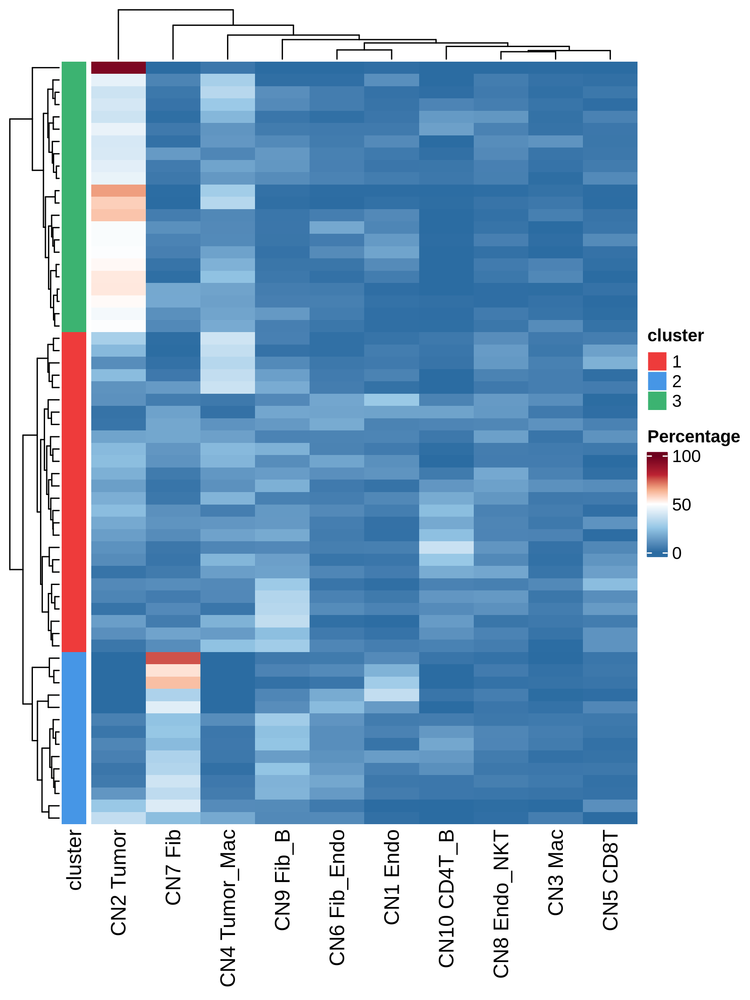

# FigureS1

## Package load and plot settings.

```{r warning=FALSE}
.libPaths(c(.libPaths(), "/cluster/home/yliang_jh/sbin/R/library/4.3.0"))
pkgs <- c("fs", "configr", "stringr", 
          "jhtools", "glue", "patchwork", "tidyverse", "dplyr", "Seurat", "magrittr", 
          "readxl", "writexl", "ComplexHeatmap", 
          "data.table", "ggplot2", "ggbeeswarm", "ggdendro", "dendextend", "deldir",
          "sf", "corrplot", "ggpubr", "survival", "survminer", "forestmodel", "BiocParallel", "BiocNeighbors")  
for (pkg in pkgs){
  suppressPackageStartupMessages(library(pkg, character.only = T))
}

rds_dir <- "/cluster/home/lixiyue_jh/projects/stomatology/analysis/lvjiong/human/meta/manuscript/rds/codex"
fig_dir <- "/cluster/home/lixiyue_jh/projects/stomatology/analysis/lvjiong/human/meta/manuscript/figs/fig2_new"


# colors setting
config_fn = "/cluster/home/jhuang/projects/stomatology/analysis/lvjiong/human/meta/manuscript/configs/colors.yaml"
config_list <- show_me_the_colors(config_fn, "all")
colors_celltype <- config_list$cell_type

config <- read.config(config_fn)
cell_type_order <- config$cell_type_order

sampleinfo <- readRDS("/cluster/home/jhuang/projects/stomatology/docs/lvjiong/sampleinfo/sampleinfo.rds")

sampleinfo$codex <- sampleinfo$codex %>% mutate(
    Time = case_when(Time > 60 ~ 60, TRUE ~ Time),
    Status = case_when(Time > 60 ~ 0,TRUE ~ Status)
  ) %>% as.data.frame()

```

## A: srt, celltype define heatmap

```{r echo=TRUE, eval=FALSE}

srt <- readRDS(glue("{rds_dir}/srt_split_anno.rds"))
Idents(srt) <- factor(srt$celltype, levels=intersect(config$cell_type_order, unique(srt$celltype)))
markers_10 <- c("CD45", "CD20", "CD3e", "Granzyme B", "CD4", "CD8", "CD68", "SMA", "CD31", "Pan-Cytokeratin")
srt_sub <- subset(srt, downsample = 200, features = markers_10)
p <- DoHeatmap(srt_sub, slot = "scale.data", assay = "CODEX", features = markers_10,
              group.colors = config_list$cell_type, angle = 90, size = 4, disp.min = -2.5, disp.max = 2.5) +
              NoLegend()
ggsave(glue("{fig_dir}/heatmap_celltype_markers_10_200cell.pdf"), p, width = 8, height = 6)
ggsave(glue("{fig_dir}/heatmap_celltype_markers_10_200cell.png"), p, width = 8, height = 6)
```
{.align-center .lightbox width="900px" 
					fig_alt="codex: celltype define" 
                    fig-cap="Figure: codex: celltype define"}


## B: celltype_cn, heatmap_celltype_cn_composition

```{r echo=TRUE, eval=FALSE}

codex_cluster <- readRDS(glue("{rds_dir}/codex_cluster_plot.rds"))

results <- codex_cluster$celltype_CN
mat <- results$mat
dt_anno <- results$dt_anno

bar_colors <- config_list$cell_type[colnames(mat)]

ha <- rowAnnotation(CN = anno_barplot(mat, 
                                      bar_width = 1, 
                                      gp = gpar(fill = bar_colors), 
                                      border = FALSE,
                                      axis = TRUE,
                                      axis_param = list(direction = "reverse"),
                                      width = unit(4, "cm")),
                    show_annotation_name = FALSE)
lgd_list <- list(Legend(labels = colnames(mat), title = "Cell type",  legend_gp = gpar(fill = bar_colors)))
row_labels <- structure(paste(dt_anno$cn, dt_anno$anno), names = dt_anno$cn)
ht <- Heatmap(scale(mat), name = "Relative enrichment",
              col = circlize::colorRamp2(c(-3, -2, -1, 0, 1, 2, 3), config_list$scale_7),
              right_annotation = ha,
              cluster_rows = TRUE,
              cluster_columns = TRUE,
              row_labels = row_labels[rownames(mat)])
pdf(glue("{fig_dir}/heatmap_celltype_cn_composition.pdf"), width = 10, height = 6)
draw(ht, heatmap_legend_list = lgd_list)
dev.off()
png(glue("{fig_dir}/heatmap_celltype_cn_composition.png"), width = 10, height = 6, units = "in", res = 300)
draw(ht, heatmap_legend_list = lgd_list)
dev.off()

```
{.align-center .lightbox width="900px" 
										fig_alt="codex: heatmap of celltype CN composition" 
                    fig-cap="Figure: heatmap of celltype CN composition"}


## C: Barplot: stacked celltype cluster clinical stage

```{r echo=TRUE, eval=FALSE}

codex_cluster <- readRDS(glue("{rds_dir}/codex_cluster_plot.rds"))

results <- codex_cluster$celltype_cluster
mat <- results$mat
df_anno <- results$df_anno
df_cluster <- results$df_cluster
dend <- results$dend
hc <- results$hc
cl <- results$cl

color_use <- config_list$cluster[unique(cl[labels(dend)])]

df <- df_anno %>% mutate(sample_id = rownames(.)) %>% left_join(df_cluster, by = "sample_id") %>%
    mutate(cluster = factor(paste("G", cluster, sep = ""), levels = paste("G", 1:4, sep = "")))
colorM <- list("Gender"="Gender", "Age level"="Age_level", "Tumor site"="tumor_site",
              "Diff. level"="diff_level", "Metastasis"="Metastasis", `Clinical stage`="clinical_stage", `T stage`="T_stage")
for (barname in names(colorM)){
  color_name = colorM[[barname]]
  p <- ggplot(df, aes(x = .data[["cluster"]], fill = .data[[barname]])) +
        geom_bar(position = "fill", width = 0.8) +
        scale_fill_manual(values=config_list[[color_name]]) +
        theme_classic() +
        labs(y = "Proportion", x = "", fill = barname) +
        scale_y_continuous(labels = scales::comma) +
        theme(axis.text.x = element_text(angle = 0, hjust = 0.5, vjust = 1))
  ggsave(glue("{fig_dir}/stacked_bar_celltype_cluster_clinical_{color_name}.pdf"), p, width = 4, height = 4)
  ggsave(glue("{fig_dir}/stacked_bar_celltype_cluster_clinical_{color_name}.png"), p, width = 4, height = 4)
}
```
{.align-center .lightbox width="900px" 
										fig_alt="codex: stacked bar of gender messages in patient clusters" 
                    fig-cap="Figure: stacked bar of gender messages in patient clusters"}


## D,F: celltype_cn, sample_cluster_heatmap_celltype_cn, surv curve

```{r echo=TRUE, eval=FALSE}

codex_cluster <- readRDS(glue("{rds_dir}/codex_cluster_plot.rds"))

results <- codex_cluster$celltype_CN_cluster
mat <- results$mat
df_anno <- results$df_anno
dt_anno <- results$dt_anno
dend <- results$dend
hc <- results$hc
cl <- results$cl

color_use <- config_list$cluster[unique(cl[labels(dend)])]

col_labels <- structure(paste(dt_anno$cn, dt_anno$anno), names = dt_anno$cn)

ha <- rowAnnotation(df = df_anno %>% dplyr::select(sample_id, cluster) %>% column_to_rownames("sample_id"), 
                    col = list(cluster = color_use))
ht <- Heatmap(mat, name = "Percentage",
              col = circlize::colorRamp2(c(0, 25, 50, 65, 80, 100), config_list$scale_6),
              cluster_rows = dend,
              cluster_columns = TRUE,
              column_labels = col_labels[colnames(mat)],
              show_row_names = FALSE,
              left_annotation = ha)
pdf(glue("{fig_dir}/sample_cluster_heatmap_celltype_cn.pdf"), width = 6, height = 8)
ht <- draw(ht, padding = unit(c(2, 2, 2, 2), "mm"))
dev.off()
png(glue("{fig_dir}/sample_cluster_heatmap_celltype_cn.png"), width = 6, height = 8, units = "in", res = 300)
ht <- draw(ht, padding = unit(c(2, 2, 2, 2), "mm"))
dev.off()

df_surv <- df_anno %>% filter(Type == "Tumor")
fit <- survfit(Surv(Time, Status) ~ cluster, data = df_surv)
names(color_use) <- paste0("cluster=",names(color_use))
p <- ggsurvplot(fit, data = df_surv, xlab = "Time (Months)", pval = TRUE, risk.table = TRUE,
                risk.table.height = 0.35, palette = color_use, break.x.by = 12, xlim = c(0,60),
                title = "RFS - Celltype CN cluster")
p$plot <- p$plot + theme(axis.title.x = element_blank(), axis.text.x = element_blank(), axis.ticks.x = element_blank(), 
                plot.margin  = margin(t = 5.5, r = 5.5, b = 6.5, l = 5.5))
p <- arrange_ggsurvplots(list(p), ncol = 1, print = FALSE)
ggsave(glue("{fig_dir}/sample_cluster_surv_curve_celltype_cn.pdf"), p, width = 5, height = 6)
ggsave(glue("{fig_dir}/sample_cluster_surv_curve_celltype_cn.png"), p, width = 5, height = 6)


```
{.align-center .lightbox width="900px" 
										fig_alt="codex: clusters of celltype CN composition" 
                    fig-cap="Figure: clusters of celltype CN composition"}

{.align-center .lightbox width="900px" 
										fig_alt="codex: surv curve of celltype CN cluster" 
                    fig-cap="Figure: surv curve of celltype CN cluster"}

