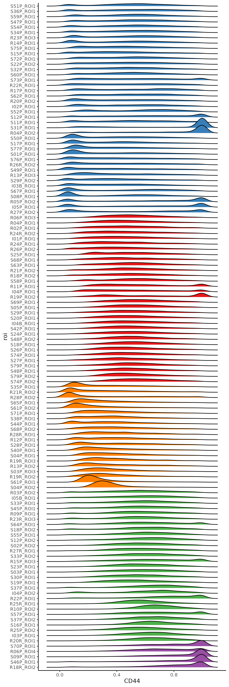

# Sup figure 5

## package load and plot settings.

```{r warning=FALSE}
pkgs <- c("jhtools", "glue", "readxl", "Seurat", "data.table", "magrittr", "dplyr", 
          "ggplot2", "ComplexHeatmap", "cluster", "survival", "survminer", "RColorBrewer", 
          "sva", "ggridges", "transport", "philentropy", "ggpubr", "rstatix", "ggrepel", 
          "readr", "stringr", "sf", "Nebulosa")
for (pkg in pkgs){
  suppressPackageStartupMessages(library(pkg, character.only = T))
}

dat_dir <- "/cluster/home/jhuang/projects/stomatology/analysis/lvjiong/human/meta/manuscript/rds/polaris"
doc_dir <- "/cluster/home/jhuang/projects/stomatology/docs/lvjiong/sampleinfo"
fig_dir <- "/cluster/home/wyye_jh/projects/stomatology/analysis/lvjiong/human/fig/figures"
img_dir <- "/cluster/home/wyye_jh/projects/stomatology/analysis/lvjiong/human/fig/images"

cols_fn <- "/cluster/home/jhuang/projects/stomatology/analysis/lvjiong/human/meta/manuscript/configs/colors.yaml"
cols <- show_me_the_colors(cols_fn)
col_fun1 <- circlize::colorRamp2(c(-2.5, 0, 1, 2, 2.5), unname(cols$col_map))
col_fun2 <- circlize::colorRamp2(c(0, 0.5, 0.8, 0.9, 1), unname(cols$col_map))
cols_ct <- cols$cell_type
cols_grp <- c(cols$cluster[2], cols$cluster[1], cols$cluster[3:5])
names(cols_grp) <- paste0("G", 1:5)
cols_cl <- cols_grp
names(cols_cl) <- paste0("C", 1:5)
```

## B: CD44 density & cluster dendrogram
```{r cache=FALSE, warning=FALSE, message=FALSE}
# data read
srt <- readRDS(glue("{dat_dir}/srat_qt_fil.rds"))
spinfo <- read_excel(glue("{doc_dir}/sampleinfo.xlsx"), sheet = "polaris_EMT") %>% 
  rename("EMT_mode" = "EMT mode")

# CD44 expression in tumor region
idx <- lapply(unique(srt$roi), function(s){
  dt <- fread(glue("{dat_dir}/shape_metric/data/louvain_community_{s}.csv"), drop = 1)
  return(dt$cell_id)
}) %>% unlist()
df <- subset(srt, cells = idx) %>%
  FetchData(vars = c("CD44", "roi"), layer = "data")
sps <- unique(df$roi)
n <- length(sps)

# Jensen-Shannon divergence
jsd_dist <- matrix(0, nrow = n, ncol = n)
rownames(jsd_dist) <- sps
colnames(jsd_dist) <- sps

calculate_jsd <- function(x, y){
  breaks <- seq(min(c(x, y)), max(c(x, y)), length.out = 50)
  p <- hist(x, breaks = breaks, plot = FALSE)$counts
  q <- hist(y, breaks = breaks, plot = FALSE)$counts
  p <- p / sum(p)
  q <- q / sum(q)
  jsd <- JSD(rbind(p, q), unit = "log2")
  return(jsd)
}
for (i in 1:(n - 1)) {
  for (j in (i + 1):n) {
    jsd_dist[i, j] <- calculate_jsd(df[df$roi == sps[i], "CD44"], df[df$roi == sps[j], "CD44"])
    jsd_dist[j, i] <- jsd_dist[i, j]
  }
}
##write.csv(jsd_dist, glue("{dat_dir}/spatial_CD44/jsd_dist_matrix_CD44.csv"))
# ========================== JSD & 95 Quantile ========================
prob_lst <- lapply(sps, function(s){
  x <- df[df$roi == s, "CD44"]
  x95 <- quantile(x, 0.95)
  x <- x[x < x95]
  
  breaks <- seq(min(x), max(x), length.out = 50)
  p <- hist(x, breaks = breaks, plot = FALSE)$counts
  p <- p / sum(p)
  return(p)
})
prob <- do.call(rbind, prob_lst)
jsd_dist <- JSD(prob, unit = "log2")
rownames(jsd_dist) <- sps
colnames(jsd_dist) <- sps
##write.csv(jsd_dist, glue("{dat_dir}/spatial_CD44/jsd_dist_matrix_CD44_quantile95.csv"))

# core roi
idx <- which(rownames(jsd_dist) %in% spinfo$ROI[spinfo$Type == "Core"])
dist_core <- jsd_dist[idx, idx]
df_core <- df %>%
  filter(roi %in% rownames(dist_core))

# mds
mds <- cmdscale(dist_core, k = nrow(dist_core) - 1, eig = TRUE)
idx_pos <- which(mds$eig > 0)
dist_euc <- dist(mds$points[, idx_pos])

# hclust
hc <- hclust(dist_euc, method = "ward.D2")
##saveRDS(hc, glue("{dat_dir}/spatial_CD44/hclust_jst_quantile95.rds"))
# cluster
clusters <- cutree(hc, k = 5)
df_cl <- data.frame(roi = names(clusters),
                    cluster = clusters) %>%
  arrange(cluster)
##fwrite(df_cl, glue("{dat_dir}/spatial_CD44/hclust_jsd_quantile95_k5.csv"))

sp_order <- hc$labels[hc$order]
df_core_qt <- df_core %>%
  mutate(roi = factor(roi, levels = sp_order)) %>%
  group_by(roi) %>%
  mutate(CD44 = CD44 / quantile(CD44, 0.95)) %>%
  ungroup() %>%
  filter(CD44 <= 1)

# plot
cl_colors <- cols_cl
names(cl_colors) <- 1:5
roi_colors <- setNames(
  cl_colors[as.character(df_cl$cluster)],
  df_cl$roi
)
p <- ggplot(df_core_qt, aes(CD44, roi)) +
  geom_density_ridges(aes(fill = roi)) + 
  scale_fill_manual(values = roi_colors) + 
  theme_classic() +
  guides(fill = "none")
ggsave(glue("{fig_dir}/density_CD44_sample_core_hclust_mds_jsd_quantile95.pdf"), p, width = 6, height = 18)
ggsave(glue("{img_dir}/density_CD44_sample_core_hclust_mds_jsd_quantile95.png"), p, width = 6, height = 18)

pdf(glue("{fig_dir}/density_CD44_sample_core_hclust_mds_jsd_quantile95_dendrogram.pdf"), width = 18, height = 6)
plot(rev(as.dendrogram(hc)), nodePar = list(lab.cex = 0.7, pch = NA))
dev.off()
png(glue("{img_dir}/density_CD44_sample_core_hclust_mds_jsd_quantile95_dendrogram.png"), width = 18, height = 6, units = "in", res = 300)
plot(rev(as.dendrogram(hc)), nodePar = list(lab.cex = 0.7, pch = NA))
dev.off()
```
{.align-center .lightbox fig-alt="1st round clustering" fig-cap="density_CD44_sample_core_hclust_mds_jsd_quantile95.png"}
{.align-center .lightbox fig-alt="1st round clustering" fig-cap="density_CD44_sample_core_hclust_mds_jsd_quantile95_dendrogram.png"}

## C,D: CD44 cluster vs shape metrics boxplot
```{r cache=FALSE, warning=FALSE, message=FALSE}
# read data
dt_score <- fread(glue("{dat_dir}/all_shape_metrics.csv"))
dt <- df_cl %>%
  left_join(dt_score) %>%
  mutate(cluster = paste0("C", cluster))
# cd44 group vs shape metrics boxplot
metrics <- c("solidity", "solidity_mean")
my_comparisons <- combn(unique(dt$cluster), 2, simplify = TRUE) %>% as.data.frame() %>% as.list
p_lst <- lapply(metrics, function(metric){
  form <- as.formula(paste(metric, "~ cluster"))
  test_sig <- wilcox_test(dt, form) %>% 
    filter(p <= 0.05)
  my_comparisons <- test_sig %>% select(group1, group2) %>% t %>% as.data.frame() %>% as.list
  p <- ggboxplot(dt, x = "cluster", y = metric, color = "cluster", 
                 width = 0.5, add = "jitter", legend = "none") +
    stat_compare_means(comparisons = my_comparisons, hide.ns = T) + 
    scale_color_manual(values = cols_cl)
  return(p)
})
pdf(glue("{fig_dir}/CD44_group_jsd_quantile_vs_shape_metrics_all_boxplot.pdf"), width = 5, height = 5)
print(p_lst)
dev.off()
png(glue("{img_dir}/CD44_group_jsd_quantile_vs_shape_metrics_all_boxplot.png"), width = 10, height = 5, units = "in", res = 300)
print(p_lst[[1]]|p_lst[[2]])
dev.off()
```
{.align-center .lightbox fig-alt="1st round clustering" fig-cap="CD44_group_jsd_quantile_vs_shape_metrics_all_boxplot.png"}