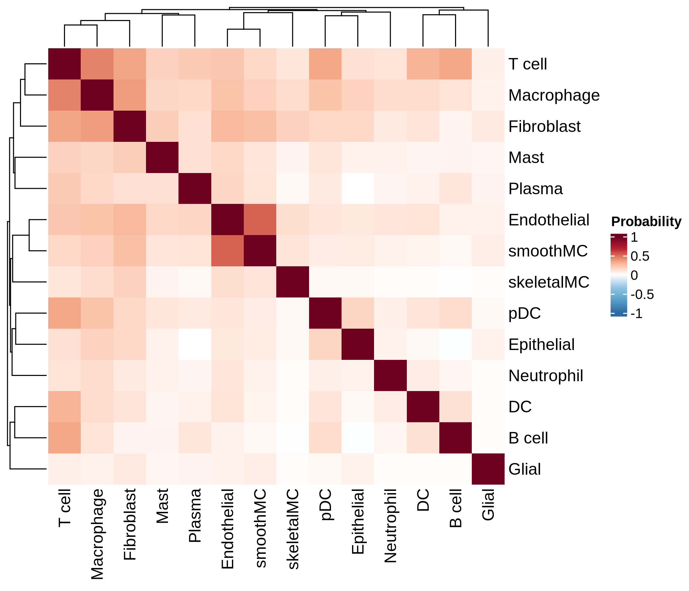
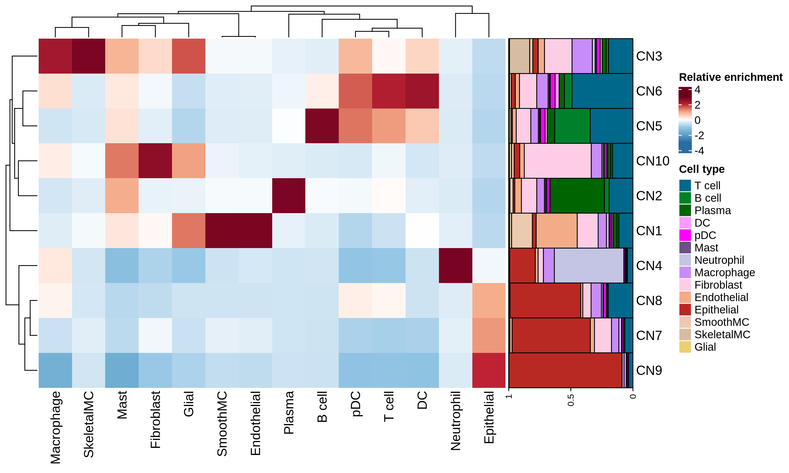
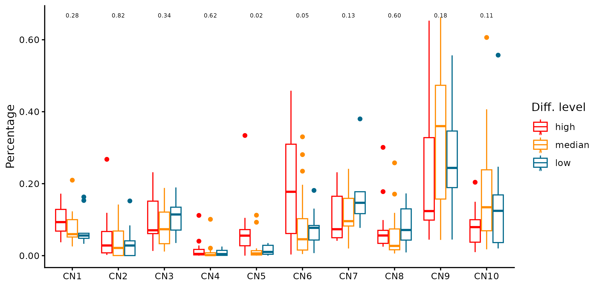
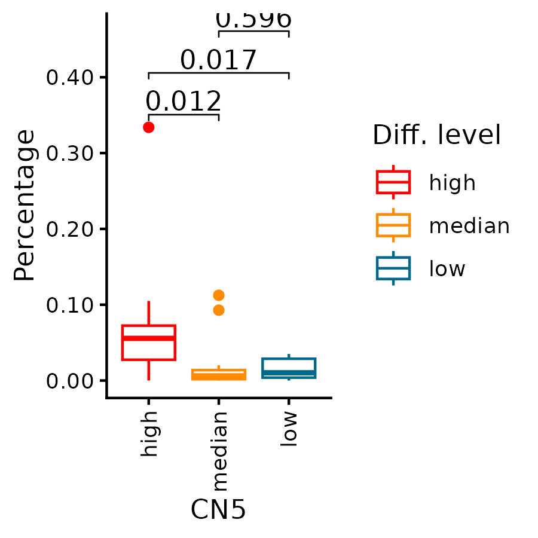
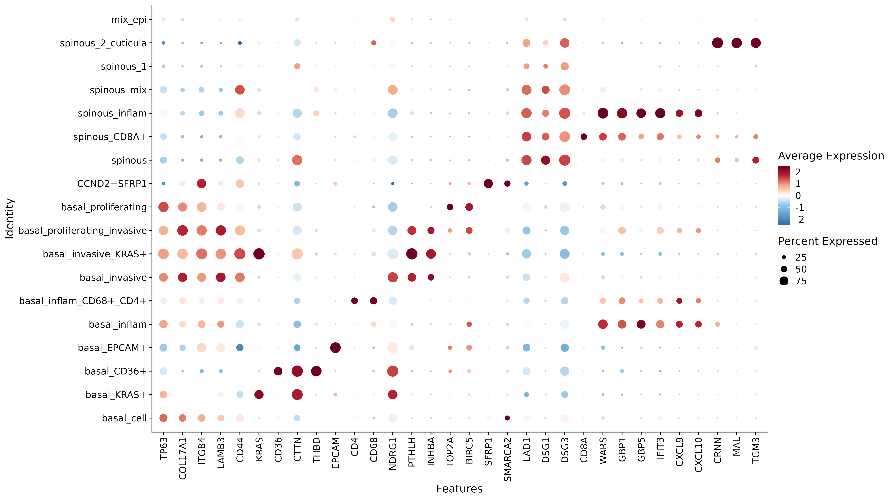
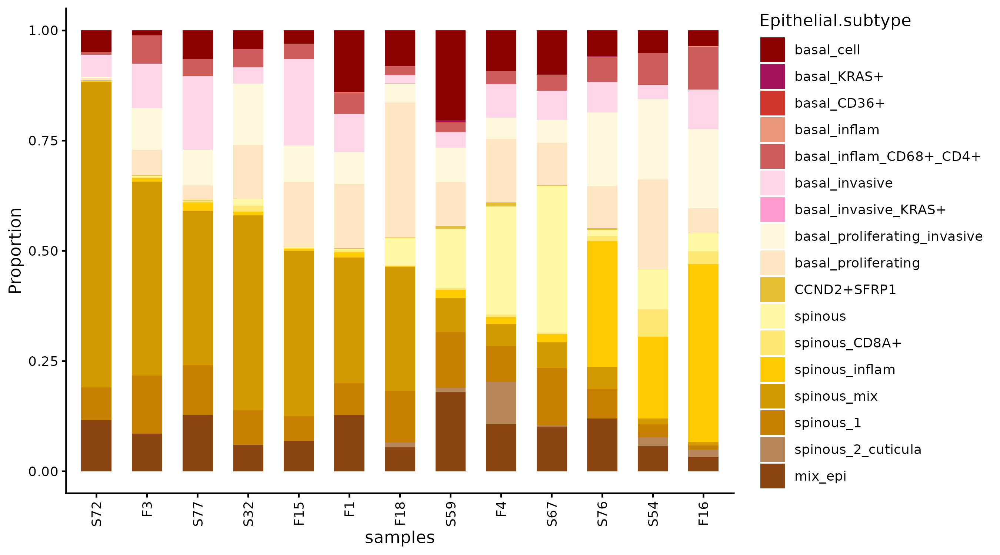
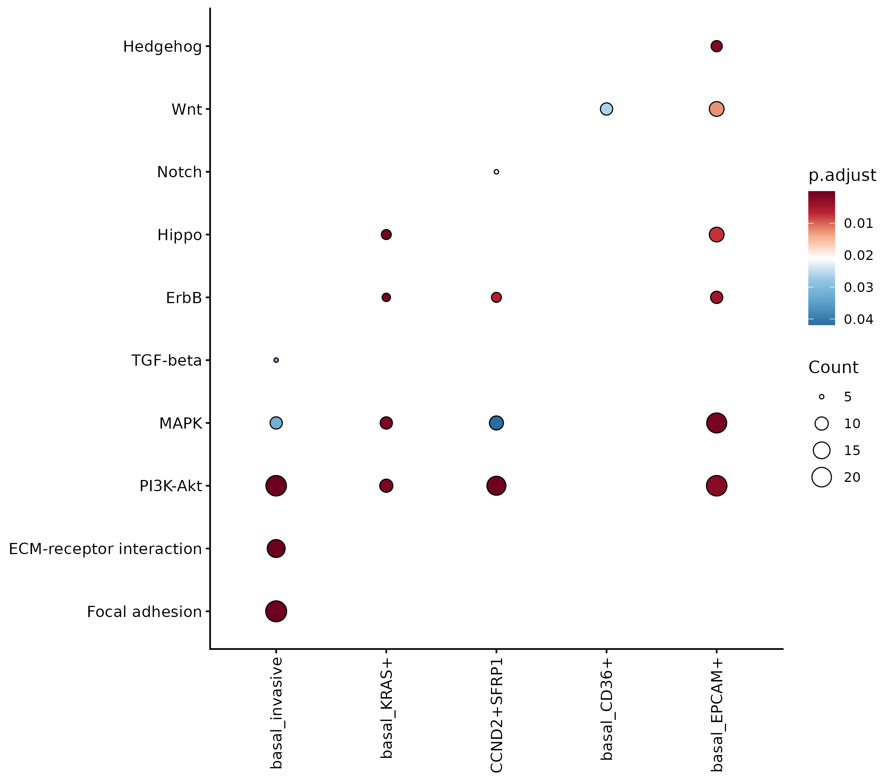
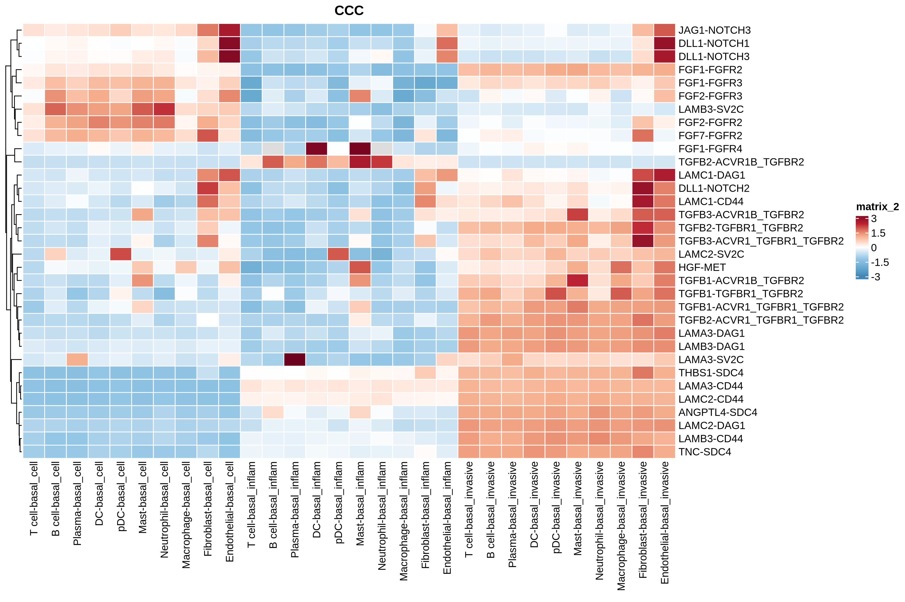

# FigureS8


## Package load and plot settings.


```{r warning=FALSE}
pkgs <- c("fs", "configr", "stringr", 
          "jhtools", "glue", "patchwork", "tidyverse", "dplyr", "Seurat", "magrittr", "rstatix",
          "readxl", "writexl", "ComplexHeatmap", "SpatialExperiment", "imcRtools",
          "data.table", "ggplot2", "viridis", "ggbeeswarm", "ggdendro", "ggrepel", "dendextend", "deldir",
          "sf", "corrplot", "ggpubr", "ggrastr", "BiocParallel", "BiocNeighbors", "BPCells",
          "clusterProfiler")  
for (pkg in pkgs){
  suppressPackageStartupMessages(library(pkg, character.only = T))
}


rds_dir <- "/cluster/home/lixiyue_jh/projects/stomatology/analysis/lvjiong/human/meta/manuscript/rds/xenium"
fig_dir <- "/cluster/home/lixiyue_jh/projects/stomatology/analysis/lvjiong/human/meta/manuscript/figs/fig5_new"


# colors setting
config_fn = "/cluster/home/jhuang/projects/stomatology/analysis/lvjiong/human/meta/manuscript/configs/colors.yaml"
config_list <- show_me_the_colors(config_fn, "all")
colors_celltype <- config_list$cell_type

config <- read.config(config_fn)
cell_type_order <- config$cell_type_order

sampleinfo <- readRDS("/cluster/home/jhuang/projects/stomatology/docs/lvjiong/sampleinfo/sampleinfo.rds")

```


## A: xenium co-localization

```{r echo=TRUE, eval=FALSE}

cor_lst <- readRDS(glue("{rds_dir}/xenium_sqe_cor.rds"))

cor_names <- names(cor_lst)[grep("matrix", names(cor_lst))]
purrr::walk(cor_names, function(cor_name){
    cor <- cor_lst[[cor_name]]
    ht <- Heatmap(cor, name = "Probability",
                col = circlize::colorRamp2(c(-1, -2/3, -1/3, 0, 1/3, 2/3, 1), config_list$scale_7),
                cluster_rows = TRUE,
                cluster_columns = TRUE)
    pdf(glue("{fig_dir}/xenium_colocal_heatmap_{cor_name}.pdf"), width = 7, height = 6)
    draw(ht)
    dev.off()
    png(glue("{fig_dir}/xenium_colocal_heatmap_{cor_name}.png"), width = 7, height = 6, units = "in", res = 300)
    draw(ht)
    dev.off()
})

dt_cor_s <- cor_lst[["cor_prob_sampleid_simplify"]]
df_diff <- sampleinfo$xenium
dt_m <- dt_cor_s %>%
  left_join(df_diff %>% select(sample_id, `Diff. level`), by = "sample_id") %>%
  mutate(`Diff. level` = factor(`Diff. level`, levels = c("high", "median", "low")))

pairs <- dt_cor_s[as.numeric(from) != as.numeric(to), .(from, to)] %>% unique
p_lst <- lapply(1:nrow(pairs), function(i){
  pt <- dt_m %>%
    filter(from == pairs[i, ] %>% pull(from) & to == pairs[i, ] %>% pull(to))
  p <- ggboxplot(pt, x = "Diff. level", y = "prob", color = "Diff. level") +
    stat_compare_means(aes(label = after_stat(sprintf("p=%.2f", p)))) +
    scale_color_manual(values = config_list$diff_level) +
    labs(title = paste0(pairs[i, ] %>% pull(from), " - ", pairs[i, ] %>% pull(to))) +
    scale_y_continuous(labels = scales::label_number(accuracy = 0.01))
  return(p)
})
pdf(glue("{fig_dir}/xenium_colocal_prob_boxplot_all_pairs.pdf"), width = 3, height = 5)
print(p_lst)
dev.off()
png(glue("{fig_dir}/xenium_colocal_prob_boxplot_all_pairs.png"), width = 3, height = 5, units = "in", res = 300)
print(p_lst)
dev.off()

```

{.align-center .lightbox width="900px" 
										fig_alt="heatmap of celltype colocalation" 
                    fig-cap="Figure: heatmap of celltype colocalation"}


## B,C,D: xenium celltype neiborhood 

```{r echo=TRUE, eval=FALSE}

neiborhood_list <- readRDS(glue("{rds_dir}/celltype_neiborhood.rds"))
mat <- neiborhood_list$mat
mat_scale <- scale(mat)

celltypes <- intersect(cell_type_order, unique(colnames(mat)))
mat_anno <- mat[, match(celltypes, colnames(mat))] %>% as.matrix()
bar_colors <- config_list$cell_type[celltypes]

ha <- rowAnnotation(CN = anno_barplot(mat_anno, 
                                      bar_width = 1, 
                                      gp = gpar(fill = bar_colors), 
                                      border = FALSE,
                                      axis = TRUE,
                                      axis_param = list(direction = "reverse"),
                                      width = unit(4, "cm")),
                    show_annotation_name = FALSE)
lgd_list <- list(Legend(labels = celltypes, title = "Cell type", 
                        legend_gp = gpar(fill = bar_colors)))
ht <- Heatmap(mat_scale, name = "Relative enrichment",
              col = circlize::colorRamp2(c(-3, -2, -1, 0, 1, 2, 3), config_list$scale_7),
              right_annotation = ha,
              cluster_rows = TRUE,
              cluster_columns = TRUE
              )
pdf(glue("{fig_dir}/xenium_heatmap_celltype_cn_composition.pdf"), width = 10, height = 6)
draw(ht, heatmap_legend_list = lgd_list)
dev.off()
png(glue("{fig_dir}/xenium_heatmap_celltype_cn_composition.png"), width = 10, height = 6, units = "in", res = 300)
draw(ht, heatmap_legend_list = lgd_list)
dev.off()

metadata <- neiborhood_list$metadata
pt <- metadata[, c("sample_id", "celltype_cn", "Diff. level")] %>%
        dplyr::count(sample_id, `Diff. level`, celltype_cn, name = "n") %>%
        group_by(sample_id) %>%
        mutate(freq = n / sum(n)) %>%
        ungroup() %>%
        mutate(`Diff. level` = factor(`Diff. level`, levels = c("high", "median", "low")))


p <- ggplot(pt, aes(celltype_cn, freq, color = `Diff. level`)) +
        geom_boxplot() +
        stat_compare_means(aes(label = after_stat(sprintf("%.2f", p))), method = "anova", size = 2) +
        scale_color_manual(values = config_list$diff_level)+
        theme(axis.text.x = element_text(angle = 0, hjust = 1)) +
        labs(x = "", y = "Percentage") +
        theme_classic() +
        scale_y_continuous(labels = scales::label_number(accuracy = 0.01))
ggsave(glue("{fig_dir}/xenium_boxplot_celltype_cn_pct_diff.pdf"), p, width = 8, height = 4)
ggsave(glue("{fig_dir}/xenium_boxplot_celltype_cn_pct_diff.png"), p, width = 8, height = 4)


select_cns <- c("CN5")
for (select_cn in select_cns){
  pt_s <- pt %>% filter(celltype_cn == select_cn) %>% mutate(`Diff. level` = factor(`Diff. level`, levels = c("high", "median", "low")), 
                                                              Diff.level = `Diff. level`)
  stat.test <- pt_s %>% pairwise_wilcox_test(freq ~ `Diff.level`, p.adjust.method = "BH", detailed = TRUE) %>%
    mutate(p.adj = ifelse(is.na(p.adj), 1, p.adj), 
          label = sprintf("%.3f", p), 
          y.position = max(pt_s$freq) * (1 + 0.05 * row_number()))
  p <- ggplot(pt_s, aes(`Diff. level`, freq, color = `Diff. level`)) +
        geom_boxplot() +
        stat_pvalue_manual(stat.test, label = "label", tip.length = 0.02, step.increase = 0.1, hide.ns = FALSE) +  
        scale_color_manual(values = config_list$diff_level) +
        theme_classic() +
        theme(axis.text.x = element_text(angle = 90, hjust = 1, vjust = 0.5)) +
        labs(x = select_cn, y = "Percentage") +
        scale_y_continuous(labels = scales::label_number(accuracy = 0.01))
ggsave(glue("{fig_dir}/xenium_boxplot_celltype_cn_pct_diff_{select_cn}.pdf"), p, width = 3, height = 3)
ggsave(glue("{fig_dir}/xenium_boxplot_celltype_cn_pct_diff_{select_cn}.png"), p, width = 3, height = 3)

}

```


{.align-center .lightbox width="900px" 
										fig_alt="heatmap of sample cluster by celltype CN" 
                    fig-cap="Figure: heatmap of sample cluster by celltype CN"}
{.align-center .lightbox width="900px" 
										fig_alt="boxplot of celltype CN in diff_level" 
										fig-cap="Figure: boxplot of celltype CN in diff_level"}
{.align-center .lightbox width="900px" 
										fig_alt="boxplot of celltype CN5 in diff_level" 
										fig-cap="Figure: boxplot of celltype CN5 in diff_level"}


## E,F: xenium umap

```{r echo=TRUE, eval=FALSE}

srt <- readRDS(glue("{rds_dir}/xenium_sketch_celltyped.rds"))
DefaultAssay(srt) <- "Xenium"
srat <- subset(srt, subset = !is.na(cell_type) & !is.na(`Diff. level`))
DefaultAssay(srat) <- "Xenium"

srat$cell_type <- factor(srat$cell_type, levels = intersect(cell_type_order, unique(srat$cell_type)))
srat$`Diff. level` <- factor(srat$`Diff. level`, levels = c("high", "median", "low"))
srat$Epithelial.1.subtype <- factor(srat$Epithelial.1.subtype, levels = intersect(cell_type_order, unique(srat$Epithelial.1.subtype)))
srat$Macrophage.1.subtype <- factor(srat$Macrophage.1.subtype, levels = intersect(cell_type_order, unique(srat$Macrophage.1.subtype)))
Idents(srat) <- srat$cell_type

meta_srat_tumor_epi <- srat@meta.data %>% filter(Type == "tumor", cell_type == "Epithelial") %>% as.data.frame()

markers_epi_1 <- c("TP63", "COL17A1", "ITGB4","LAMB3","CD44","KRAS","CD36","CTTN","THBD","EPCAM",
                    "CD4", "CD68","NDRG1", "PTHLH", "INHBA","TOP2A","BIRC5","SFRP1","SMARCA2",
                    "LAD1","DSG1","DSG3","CD8A","WARS", "GBP1", "GBP5", "IFIT3", "CXCL9", "CXCL10","CRNN","MAL","TGM3")
p <- DotPlot(srat, features=markers_epi_1, group.by="Epithelial.1.subtype", idents = "Epithelial") + 
  theme(axis.text.x = element_text(angle = 90, hjust = 1, vjust = 0.5)) +
  scale_color_gradientn(colors = config_list$scale_7)
ggsave(glue("{fig_dir}/xenium_dotplot_markers_epi_1.pdf"), p, width = 16, height = 9)
ggsave(glue("{fig_dir}/xenium_dotplot_markers_epi_1.png"), p, width = 16, height = 9)

df_prop <- meta_srat_tumor_epi %>%
  dplyr::count(sample_id, Epithelial.1.subtype, `Diff. level`, names = "n") %>%
  dplyr::group_by(sample_id) %>%
  dplyr::mutate(prop = n / sum(n)) %>% ungroup %>% 
  mutate(`Diff. level` = factor(`Diff. level`, levels = c("high", "median", "low")), 
        Epithelial.1.subtype = factor(Epithelial.1.subtype, levels = intersect(config$cell_type_order, unique(Epithelial.1.subtype))))
select_epi_subtypes <- c("spinous_mix")
for (subtype in select_epi_subtypes){
  pt_sub <- df_prop %>% filter(Epithelial.1.subtype == subtype) %>% mutate(Diff.level = `Diff. level`)
  stat.test <- pt_sub %>% pairwise_wilcox_test(prop ~ `Diff.level`, p.adjust.method = "BH", detailed = TRUE) %>%
    mutate(p.adj = ifelse(is.na(p.adj), 1, p.adj), 
          label = sprintf("%.3f", p), 
          y.position = max(pt_sub$prop) * (1 + 0.05 * row_number()))
  p <- ggplot(pt_sub, aes(`Diff. level`, prop, color = `Diff. level`)) +
        geom_boxplot() +
        stat_pvalue_manual(stat.test, label = "label", tip.length = 0.02, step.increase = 0.1, hide.ns = FALSE) +
        scale_y_continuous(labels = scales::label_number(accuracy = 0.01)) + 
        scale_color_manual(values = config_list$diff_level) +
        theme_classic() +
        theme(axis.text.x = element_text(angle = 90, hjust = 1, vjust = 0.5)) +
        labs(x = "spinous_CD44+", y = "Percentage")
  ggsave(glue("{fig_dir}/xenium_boxplot_subtypePercent_Epithelial_tumor_by_diff_level_{subtype}.pdf"), p, width = 3, height = 3)
  ggsave(glue("{fig_dir}/xenium_boxplot_subtypePercent_Epithelial_tumor_by_diff_level_{subtype}.png"), p, width = 3, height = 3)
}


```
{.align-center .lightbox width="900px" 
										fig_alt="dotplot of Epithelial subtype markers" 
										fig-cap="Figure: dotplot of Epithelial subtype markers"}


## H: xenium differentiation block samples

```{r echo=TRUE, eval=FALSE}

srat <- readRDS(glue("{rds_dir}/xenium_sketch_celltyped.rds"))
high_samples <- c("S72", "F3", "S77", "S32", "F15", "F1", "F18", "S59", "F4", "S67", "S76", "S54", "F16")
pt <- srat[[]] %>% filter(cell_type == "Epithelial") %>% filter(sample_id %in% high_samples) %>% 
    mutate(Epithelial.1.subtype = factor(Epithelial.1.subtype, levels = intersect(config$cell_type_order, unique(.$Epithelial.1.subtype)))) %>%
    mutate(`Diff. level` = factor(`Diff. level`, levels = c("median", "low"))) %>%
    mutate(sample_id = factor(sample_id, levels = high_samples))
p <- ggplot(pt, aes(x = .data[["sample_id"]], fill = .data[["Epithelial.1.subtype"]])) +
  geom_bar(position = "fill", width = 0.6) +
  scale_fill_manual(values = config_list$cell_type) +
  theme_classic() +
  labs(y = "Proportion", x = "samples", fill = "Epithelial.subtype") +
        theme(axis.text.x = element_text(angle = 90, hjust = 1, vjust = 0.5)) +
  scale_y_continuous(labels = scales::label_number(accuracy = 0.01))
ggsave(glue("{fig_dir}/xenium_barplot_diffblock_highdiff_Epithelial_subtype_sampleid.pdf"), p, width = 9, height = 5)
ggsave(glue("{fig_dir}/xenium_barplot_diffblock_highdiff_Epithelial_subtype_sampleid.png"), p, width = 9, height = 5)


```
{.align-center .lightbox width="900px" 
										fig_alt="barplot of Epithelial subtype in diff. samples" 
										fig-cap="Figure: barplot of Epithelial subtype in diff. samples"}


## I: xenium KEGG Epithelial subcluster vs basal_cell

```{r echo=TRUE, eval=FALSE}

ls_vs_basal_cell_select <- readRDS(glue("{rds_dir}/kegg_epithelial_cluster_marker_gene_vs_basal_cell_select.rds"))
df <- do.call(rbind, ls_vs_basal_cell_select$df)
cases <- names(ls_vs_basal_cell_select$df)

select10 <- c("hsa04010", "hsa04012", "hsa04151", "hsa04310", "hsa04340", 
              "hsa04350", "hsa04390", "hsa04510", "hsa04512", "hsa04330")

df <- df %>% filter(ID %in% select10) %>% 
  dplyr::select(case, Description, Count, p.adjust) %>% mutate(Description = str_replace(Description, " signaling pathway$", "")) %>%
  mutate(case = factor(case , levels = cases), Description = factor(Description, levels = unique(Description)))

p <- ggplot(df, aes(x = case, y = Description)) +
  geom_point(aes(fill = p.adjust, size = Count), shape=21) +
  theme_classic() +
  theme(axis.text.x = element_text(angle=90, hjust=1, vjust=0.5),
        axis.text = element_text(color = "black", size = 10)) +
  scale_fill_gradientn(colors = rev(config_list$scale_7),
                        guide = guide_colorbar(reverse = TRUE)) +
  labs(x=NULL, y=NULL)
ggsave(glue("{fig_dir}/xenium_kegg_Epithelial_subtype_vs_basal_call_dot.pdf"), p,  width = 8, height = 7)
ggsave(glue("{fig_dir}/xenium_kegg_Epithelial_subtype_vs_basal_call_dot.png"), p,  width = 8, height = 7)


```

{.align-center .lightbox width="900px" 
										fig_alt="kegg of Epithelial subtype versus basal_cell" 
                    fig-cap="Figure: kegg of Epithelial subtype versus basal_cell"}


## J: xenium CCC of basal Epithelial

```{r echo=TRUE, eval=FALSE}

df_heat_cp_wide <- readRDS(glue("{rds_dir}/xenium_CCC_Epithelial_basal_plot.rds"))

sender <- df_heat_cp_wide$s
receiver <- df_heat_cp_wide$r

p2 <- pheatmap(receiver, scale = "row", 
  color = config_list$scale_7, border_color = "white",
  cluster_rows = TRUE, cluster_cols = FALSE, cutree_rows = NA,, treeheight_row = 15, treeheight_col = 0,
  show_rownames = TRUE, show_colnames = TRUE,
  fontsize_row = 10, fontsize_col = 10, angle_col = "90", main = "CCC")

pdf(glue("{fig_dir}/xenium_ccc_heatmaps_cc_mean_target_Epithelial_basal.pdf"), width = 12, height = 8)
print(p2)
dev.off()
png(glue("{fig_dir}/xenium_ccc_heatmaps_cc_mean_target_Epithelial_basal.png"), width = 12, height = 8, units = "in", res = 300)
print(p2)
dev.off()

```
{.align-center .lightbox width="900px" 
										fig_alt="heatmap of cell-cell communication of epithelial basal as target with other cell types" 
										fig-cap="Figure: heatmap of cell-cell communication of epithelial basal as target with other cell types"}


