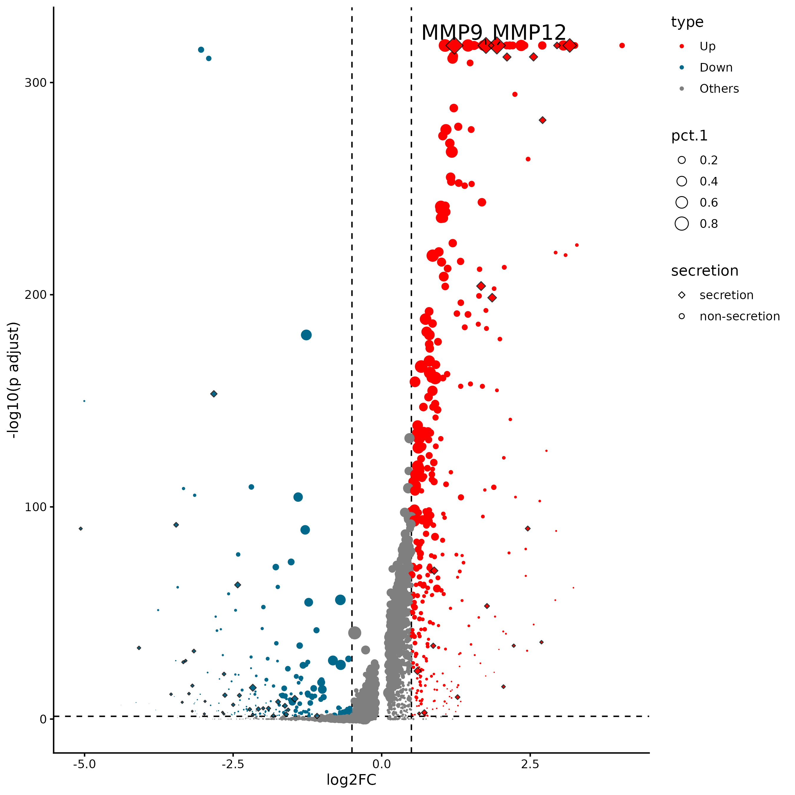
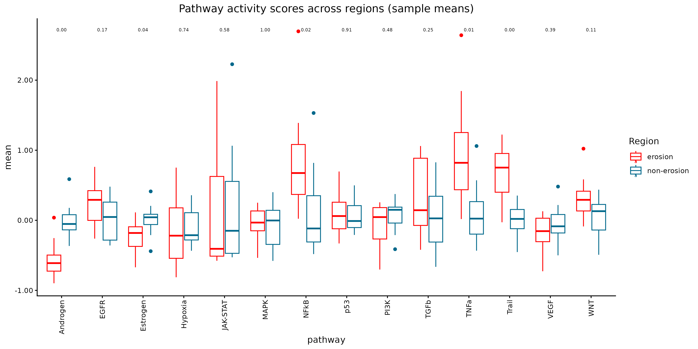
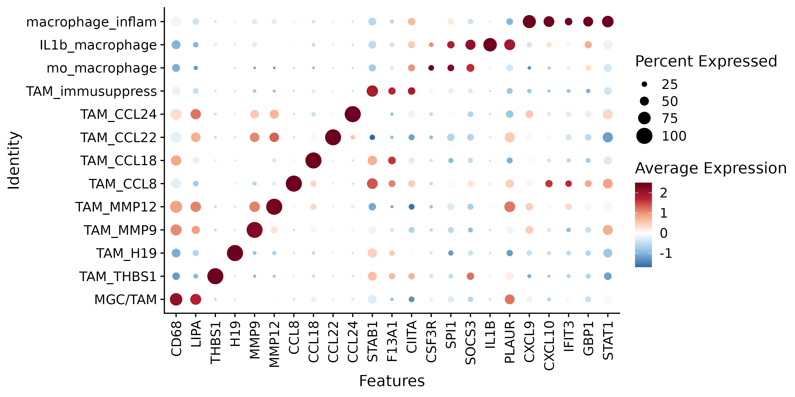
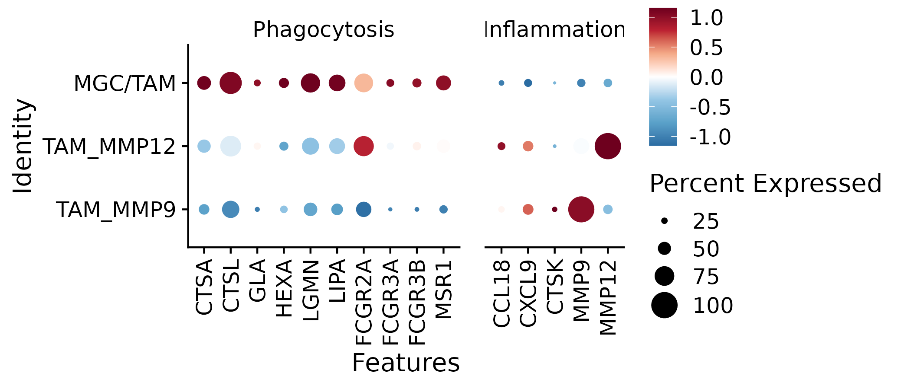

# FigureS9


## Package load and plot settings.


```{r warning=FALSE}
pkgs <- c("fs", "configr", "stringr", 
          "jhtools", "glue", "patchwork", "tidyverse", "dplyr", "Seurat", "magrittr", "rstatix",
          "readxl", "writexl", "ComplexHeatmap", "SpatialExperiment", "imcRtools",
          "data.table", "ggplot2", "viridis", "ggbeeswarm", "ggdendro", "ggrepel", "dendextend", "deldir",
          "sf", "corrplot", "ggpubr", "ggrastr", "BiocParallel", "BiocNeighbors", "BPCells",
          "clusterProfiler")  
for (pkg in pkgs){
  suppressPackageStartupMessages(library(pkg, character.only = T))
}


rds_dir <- "/cluster/home/lixiyue_jh/projects/stomatology/analysis/lvjiong/human/meta/manuscript/rds/xenium"
fig_dir <- "/cluster/home/lixiyue_jh/projects/stomatology/analysis/lvjiong/human/meta/manuscript/figs/fig5_new"


# colors setting
config_fn = "/cluster/home/jhuang/projects/stomatology/analysis/lvjiong/human/meta/manuscript/configs/colors.yaml"
config_list <- show_me_the_colors(config_fn, "all")
colors_celltype <- config_list$cell_type

config <- read.config(config_fn)
cell_type_order <- config$cell_type_order

sampleinfo <- readRDS("/cluster/home/jhuang/projects/stomatology/docs/lvjiong/sampleinfo/sampleinfo.rds")

```


# A: scretion 

```{r echo=TRUE, eval=FALSE}

dt <- readRDS(glue("{rds_dir}/erosion_in_out_zone_Macrophage_secretion.rds"))

p <- ggplot(dt,aes(avg_log2FC, -log10(p_val_adj))) +
  geom_hline(yintercept = -log10(0.05), linetype = "dashed", color = "black")+
  geom_vline(xintercept = c(-0.5,0.5), linetype = "dashed", color = "black")+
  geom_point(aes(size = pct.1, fill = type, shape = secretion), alpha = 1, stroke = 0)+
  geom_point(data = dplyr::filter(dt, secretion == "secretion"), aes(avg_log2FC, -log10(p_val_adj), size = pct.1), 
            shape = 23, alpha = 0.8, show.legend = FALSE) +
  scale_fill_manual(values = config_list$volcano_type)+
  scale_shape_manual(values = c("secretion" = 23, "non-secretion" = 21))+
  scale_size_continuous(range = c(0,5))+
  theme_classic(base_size = 12)+
  theme(panel.grid = element_blank(),legend.position = 'right',legend.justification = c(0,1))+
  geom_text_repel(data = dplyr::filter(dt, !is.na(label)), aes(label = label), size = 6, color = 'black',
                  segment.color = "black", segment.size = 0.5, min.segment.length = 0, vjust = 1, nudge_y = 2) +
  guides(fill = guide_legend(order = 1, override.aes = list(shape = 21)),
         size = guide_legend(order = 2, override.aes = list(shape = 21, fill = NA, color = "black", stroke = 0.5)),
         shape = guide_legend(order = 3, override.aes = list(fill = NA, color = "black", stroke = 0.5))) +
  xlab("log2FC")+
  ylab("-log10(p adjust)") 

ggsave(glue("{fig_dir}/xenium_volcano_erosion_region_macrophage.pdf"), p, width = 9, height = 9)
ggsave(glue("{fig_dir}/xenium_volcano_erosion_region_macrophage.png"), p, width = 9, height = 9)
```
{.align-center .lightbox width="900px" 
										fig_alt="volcano of Macrophage in erosion vs. non-erosion" 
                    fig-cap="Figure: volcano of Macrophage in erosion vs. non-erosion"}


## B: xenium erosion activated tfs and path: Epithelial

```{r echo=TRUE, eval=FALSE}

srt_epi <- readRDS(glue("{rds_dir}/srt_decoupleR_Epithelial.rds"))
decoupleR_epi_messages <- readRDS(glue("{rds_dir}/decoupleR_message_Epithelial.rds"))


df_path_score_sample <- decoupleR_epi_messages$path_score_sam
p <- ggplot(df_path_score_sample, aes(x = pathway, y = mean, color = Region)) +
  geom_boxplot() +
  scale_color_manual(values = config_list$erosion_site) +
  theme_classic() +
  theme(plot.title = element_text(hjust = 0.5),
        axis.text.x = element_text(angle = 90, hjust = 1, vjust = 0.5)) +
  labs(title = "Pathway activity scores across regions (sample means)") +
  scale_y_continuous(labels = scales::label_number(accuracy = 0.01)) + 
  ggpubr::stat_compare_means(aes(group = Region, label = after_stat(sprintf("%.2f", p))),
                             method = "wilcox.test", size = 2)
ggsave(glue("{fig_dir}/xenium_erosion_decoupleR_boxplot_epi_pathway_region_samplemean.pdf"), p, width = 12, height = 6)
ggsave(glue("{fig_dir}/xenium_erosion_decoupleR_boxplot_epi_pathway_region_samplemean.png"), p, width = 12, height = 6)


```
{.align-center .lightbox width="900px" 
										fig_alt="boxplot of pathway samplemean of Epithelial in erosion region" 
										fig-cap="Figure: boxplot of pathway samplemean of Epithelial in erosion region"}


## C,D: xenium

```{r echo=TRUE, eval=FALSE}

srt <- readRDS(glue("{rds_dir}/xenium_sketch_celltyped.rds"))
DefaultAssay(srt) <- "Xenium"
srat <- subset(srt, subset = !is.na(cell_type) & !is.na(`Diff. level`))
DefaultAssay(srat) <- "Xenium"

srat$cell_type <- factor(srat$cell_type, levels = intersect(cell_type_order, unique(srat$cell_type)))
srat$`Diff. level` <- factor(srat$`Diff. level`, levels = c("high", "median", "low"))
srat$Epithelial.1.subtype <- factor(srat$Epithelial.1.subtype, levels = intersect(cell_type_order, unique(srat$Epithelial.1.subtype)))
srat$Macrophage.1.subtype <- factor(srat$Macrophage.1.subtype, levels = intersect(cell_type_order, unique(srat$Macrophage.1.subtype)))
Idents(srat) <- srat$cell_type

markers_macro_1 <- c("CD68", "LIPA", "THBS1", "H19", "MMP9", "MMP12", "CCL8", "CCL18", "CCL22", "CCL24", "STAB1", "F13A1", "CIITA",
                    "CSF3R", "SPI1", "SOCS3", "IL1B", "PLAUR", "CXCL9", "CXCL10", "IFIT3", "GBP1", "STAT1")
p <- DotPlot(srat, features=markers_macro_1, group.by="Macrophage.1.subtype", idents = "Macrophage") + 
  theme(axis.text.x = element_text(angle = 90, hjust = 1, vjust = 0.5)) +
  scale_color_gradientn(colors = config_list$scale_6)
ggsave(glue("{fig_dir}/xenium_dotplot_markers_macro_1.pdf"), p, width = 10, height = 5)
ggsave(glue("{fig_dir}/xenium_dotplot_markers_macro_1.png"), p, width = 10, height = 5)

srat_sub <- subset(srat, subset = Macrophage.1.subtype %in% c("TAM_MMP9", "TAM_MMP12", "MGC/TAM"))
srat_sub$Macrophage.1.subtype <- factor(srat_sub$Macrophage.1.subtype, levels = c("TAM_MMP9", "TAM_MMP12", "MGC/TAM"))
list_markers <- list("Phagocytosis" = c("CTSA","CTSL","GLA", "HEXA", "LGMN", "LIPA", "FCGR2A", "FCGR3A", "FCGR3B", "MSR1"), 
                     "Inflammation" = c("CCL18", "CXCL9", "CTSK", "MMP9", "MMP12"))
p <- DotPlot(srat_sub, features=list_markers, group.by="Macrophage.1.subtype", idents = "Macrophage") + 
  theme(axis.text.x = element_text(angle = 90, hjust = 1, vjust = 0.5)) +
  scale_color_gradientn(colors = config_list$scale_7)
ggsave(glue("{fig_dir}/xenium_dotplot_markers_macro_function_sub.pdf"), p, width = 7, height = 3)
ggsave(glue("{fig_dir}/xenium_dotplot_markers_macro_function_sub.png"), p, width = 7, height = 3)

```
{.align-center .lightbox width="900px" 
										fig_alt="dotplot of Macrophage subtype markers" 
										fig-cap="Figure: dotplot of Macrophage subtype markers"}
{.align-center .lightbox width="900px" 
										fig_alt="dotplot of Macrophage subtype function markers" 
										fig-cap="Figure: dotplot of Macrophage subtype function markers"}