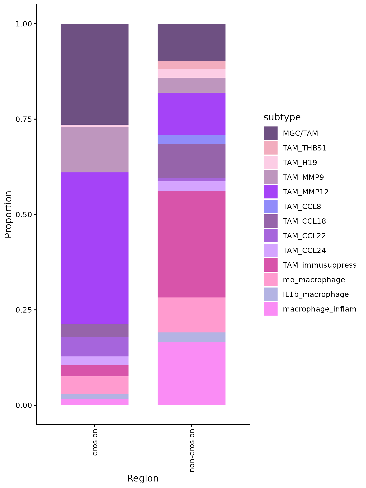

# XENIUM

## Package load and plot settings.


```{r warning=FALSE}
pkgs <- c("fs", "configr", "stringr", 
          "jhtools", "glue", "patchwork", "tidyverse", "dplyr", "Seurat", "magrittr", "rstatix",
          "readxl", "writexl", "ComplexHeatmap", "SpatialExperiment", "imcRtools",
          "data.table", "ggplot2", "viridis", "ggbeeswarm", "ggdendro", "ggrepel", "dendextend", "deldir",
          "sf", "corrplot", "ggpubr", "BiocParallel", "BiocNeighbors", "BPCells",
          "clusterProfiler")  
for (pkg in pkgs){
  suppressPackageStartupMessages(library(pkg, character.only = T))
}


rds_dir <- "/cluster/home/lixiyue_jh/projects/stomatology/analysis/lvjiong/human/meta/manuscript/rds/xenium"
fig_dir <- "/cluster/home/lixiyue_jh/projects/stomatology/analysis/lvjiong/human/meta/manuscript/figs/fig4"


# colors setting
config_fn = "/cluster/home/jhuang/projects/stomatology/analysis/lvjiong/human/meta/manuscript/configs/colors.yaml"
config_list <- show_me_the_colors(config_fn, "all")
colors_celltype <- config_list$cell_type

config <- read.config(config_fn)
cell_type_order <- config$cell_type_order

sampleinfo <- readRDS("/cluster/home/jhuang/projects/stomatology/docs/lvjiong/sampleinfo/sampleinfo.rds")

```


## xenium umap
```{r cache=FALSE}
srat <- readRDS(glue("{rds_dir}/xenium_sketch_celltyped.rds"))
DefaultAssay(srat) <- "Xenium"
srat <- subset(srat, subset = !is.na(cell_type) & !is.na(diff_level))

Idents(srat) <- srat$cell_type
srat$cell_type <- factor(srat$cell_type, levels = intersect(cell_type_order, unique(srat$cell_type)))
srat$diff_level <- factor(srat$diff_level, levels = c("high", "median", "low"))
srat$Epithelial.1.subtype <- factor(srat$Epithelial.1.subtype, levels = intersect(cell_type_order, unique(srat$Epithelial.1.subtype)))
srat$Macrophage.1.subtype <- factor(srat$Macrophage.1.subtype, levels = intersect(cell_type_order, unique(srat$Macrophage.1.subtype)))

srat_tumor <- subset(srat, subset = type == "tumor")
srat_tumor$cell_type <- factor(srat_tumor$cell_type, levels = intersect(cell_type_order, unique(srat_tumor$cell_type)))
srat_tumor$Epithelial.1.subtype <- factor(srat_tumor$Epithelial.1.subtype, levels = intersect(cell_type_order, unique(srat_tumor$Epithelial.1.subtype)))
srat_tumor$Macrophage.1.subtype <- factor(srat_tumor$Macrophage.1.subtype, levels = intersect(cell_type_order, unique(srat_tumor$Macrophage.1.subtype)))
srat_tumor$diff_level <- factor(srat_tumor$diff_level, levels = c("high", "median", "low"))

srat_epi <- subset(srat, subset = cell_type == "Epithelial")
srat_epi$Epithelial.1.subtype <- factor(srat_epi$Epithelial.1.subtype, levels = intersect(cell_type_order, unique(srat_epi$Epithelial.1.subtype)))
srat_epi$diff_level <- factor(srat_epi$diff_level, levels = c("high", "median", "low"))

srat_macro <- subset(srat, subset = cell_type == "Macrophage")
srat_macro$Macrophage.1.subtype <- factor(srat_macro$Macrophage.1.subtype, levels = intersect(cell_type_order, unique(srat_macro$Macrophage.1.subtype)))
srat_macro$diff_level <- factor(srat_macro$diff_level, levels = c("high", "median", "low"))

srat_tumor_epi <- subset(srat, subset = cell_type == "Epithelial" & type == "tumor")
srat_tumor_epi$Epithelial.1.subtype <- factor(srat_tumor_epi$Epithelial.1.subtype, levels = intersect(cell_type_order, unique(srat_tumor_epi$Epithelial.1.subtype)))
srat_tumor_epi$diff_level <- factor(srat_tumor_epi$diff_level, levels = c("high", "median", "low"))


p1 <- Seurat::DimPlot(srat, reduction = "full.umap", order = T, label = T, cols = config_list$cell_type,
                          label.size = 8, group.by = "cell_type",raster = T) +
    ggplot2::coord_fixed() + theme(legend.text = element_text(size = 8))
ggsave(glue("{fig_dir}/xenium_umap_celltype.pdf"), p1, width = 8, height = 8)
ggsave(glue("{fig_dir}/xenium_umap_celltype.png"), p1, width = 8, height = 8)


p2 <- ggplot(srat@meta.data, aes(x = .data[["sample_id"]], fill = .data[["cell_type"]])) +
        geom_bar(position = "fill", width = 0.8) +
        facet_grid(~ .data[["diff_level"]], scales = "free_x", space = "free_x") +
        scale_fill_manual(values=config_list$cell_type) +
        theme_bw() +
        labs(y = "Proportion", x = "samples", fill = "cell_type") +
        scale_y_continuous(labels = scales::percent) +
        theme(axis.text.x = element_text(angle = 45, hjust = 1)) 
ggsave(glue("{fig_dir}/xenium_bar_celltypePercent_by_diff_level.pdf"), p2, width = 16, height = 8)
ggsave(glue("{fig_dir}/xenium_bar_celltypePercent_by_diff_level.png"), p2, width = 16, height = 8)

p3 <- ggplot(srat_tumor@meta.data, aes(x = .data[["sample_id"]], fill = .data[["cell_type"]])) +
        geom_bar(position = "fill", width = 0.8) +
        facet_grid(~ .data[["diff_level"]], scales = "free_x", space = "free_x") +
        scale_fill_manual(values=config_list$cell_type) +
        theme_bw() +
        labs(y = "Proportion", x = "samples", fill = "cell_type") +
        scale_y_continuous(labels = scales::percent) +
        theme(axis.text.x = element_text(angle = 45, hjust = 1)) 
ggsave(glue("{fig_dir}/xenium_bar_celltypePercent_tumor_by_sampleid.pdf"), p3, width = 16, height = 8)
ggsave(glue("{fig_dir}/xenium_bar_celltypePercent_tumor_by_sampleid.png"), p3, width = 16, height = 8)


cell_markers <- list(
  Tcell = c("CD2", "CD3E", "CD8A", "CD4"),
  Bcell = c("MS4A1", "CD79A", "CD19", "CD79B", "BANK1"),
  Plasma = c("XBP1","MZB1","IRF4"),
  DC = c("LILRA4", "CLEC4C", "FLT3", "LAMP3"),
  Mast = c("KIT","MS4A2","HDC"),
  Neutrophil = c("FCGR3B","CSF3R"),
  Macrophage = c("CD14","CD68","CD163","CSF1R"),
  Fibroblast = c("COL5A1","COL5A2","POSTN","FAP"),
  Endothelial = c("CD34", "CLEC14A", "CDH5", "PLVAP", "CLDN5","FLT4"),
  Epithelial = c("EPCAM","TP63","TGM1"),
  smoothMC = c("MCAM","NOTCH3","RGS5"),
  skeletalMC = c("MYH1","MYH2","MYOT","ACTN2"),
  Glial = c("SOX10", "SOX8","NGFR")
)
cell_markers_2 <- c("CD3E", "CD8A", "CD4", "CD19", "CD79A", "CD79B", "MS4A1", "XBP1", "LILRA4", "CLEC4C", "FLT3", "LAMP3",
                    "KIT","FCGR3B","CSF3R","CD14","CD68","CD163","CSF1R","COL5A1","COL5A2","POSTN","CD34","CLEC14A","EPCAM","TP63",
                    "MCAM","NOTCH3","RGS5","MYH1","MYH2","MYOT","SOX10", "SOX8","NGFR")
p4 <- DotPlot(srat, features=cell_markers, group.by="cell_type") + 
  theme(axis.text.x = element_text(angle = 90, hjust = 1, vjust = 0.5))
p41 <- DotPlot(srat, features=cell_markers_2, group.by="cell_type") + 
  theme(axis.text.x = element_text(angle = 90, hjust = 1, vjust = 0.5))
ggsave(glue("{fig_dir}/xenium_dotplot_cell_type_markers.pdf"), p4, width = 16, height = 8)
ggsave(glue("{fig_dir}/xenium_dotplot_cell_type_markers.png"), p4, width = 16, height = 8)
ggsave(glue("{fig_dir}/xenium_dotplot_cell_type_markers_2.pdf"), p41, width = 16, height = 8)
ggsave(glue("{fig_dir}/xenium_dotplot_cell_type_markers_2.png"), p41, width = 16, height = 8)


markers <- c("CD3E","MS4A1","CD1C","KIT",'CD163',"CD34","EPCAM",
              "COL1A1","NKG7","VMF","FGF7","LRRC15","SDC4","FABP4")
p5 <- FeaturePlot(srat, features = markers, reduction = "full.umap", ncol = 3)
ggsave(glue("{fig_dir}/xenium_umap_feaplot_markers.pdf"), p5, width = 16, height = 16)
ggsave(glue("{fig_dir}/xenium_umap_feaplot_markers.png"), p5, width = 16, height = 16)


markers_macro <- c("CD68", "CD14", "CD163", "MRC1", "CCL18", "CCL22", "CCL24", "IL1B",
                  "MMP9", "MMP12", "CXCL9", "CXCL10", "IFIT3", "GBP1", "STAT1", "CCL8", "LGMN", "F13A1", "STAB1",
                  "LIPA", "PLAUR", "SOCS3", "THBS1", "H19", "CSF3R",
                  "CIITA", "SPI1", "CD1C", "CLEC10A", "CD1A", "CD207",  "TP63",
                  "DSG3", "CDH3", "POSTN", "COL5A1", "MMP11", "CD3E", "XBP1")
p6 <- DotPlot(srat_macro, features=markers_macro, group.by="Macrophage.1.subtype") + 
  theme(axis.text.x = element_text(angle = 90, hjust = 1, vjust = 0.5))
ggsave(glue("{fig_dir}/xenium_dotplot_markers_macro.pdf"), p6, width = 16, height = 8)
ggsave(glue("{fig_dir}/xenium_dotplot_markers_macro.png"), p6, width = 16, height = 8)


p7 <- ggplot(srat_epi@meta.data, aes(x = .data[["diff_level"]], fill = .data[["Epithelial.1.subtype"]])) +
        geom_bar(position = "fill", width = 0.8) +
        scale_fill_manual(values=config_list$cell_type) +
        theme_classic() +
        labs(y = "Proportion", x = "Differentiation Grade", fill = "Epithelial.subtype") +
        scale_y_continuous(labels = scales::percent) +
        theme(axis.text.x = element_text(angle = 0, hjust = 1))

p71 <- ggplot(srat_epi@meta.data, aes(x = .data[["sample_id"]], fill = .data[["Epithelial.1.subtype"]])) +
        geom_bar(position = "fill", width = 0.8) +
        facet_grid(~ .data[["diff_level"]], scales = "free_x", space = "free_x") +
        scale_fill_manual(values=config_list$cell_type) +
        theme_bw() +
        labs(y = "Proportion", x = "samples", fill = "Epithelial.subtype") +
        scale_y_continuous(labels = scales::percent) +
        theme(axis.text.x = element_text(angle = 45, hjust = 1)) 
ggsave(glue("{fig_dir}/xenium_bar_subtypePercent_Epithelial_by_diff_level.pdf"), p7, width = 6, height = 8)
ggsave(glue("{fig_dir}/xenium_bar_subtypePercent_Epithelial_by_diff_level.png"), p7, width = 6, height = 8)
ggsave(glue("{fig_dir}/xenium_bar_subtypePercent_Epithelial_by_sample_id.pdf"), p71, width = 16, height = 8)
ggsave(glue("{fig_dir}/xenium_bar_subtypePercent_Epithelial_by_sample_id.png"), p71, width = 16, height = 8)


markers_epi <- c("EPCAM", "TP63", "DSG1","DSG3", "CHD3", "COL17A1", "ITGB4","LAMB3",
  "CD44","PTPRF", "DST","TOP2A", "BIRC5", "PCNA", "KRAS","EGFR", "TUBB", "SLC2A1", "BMP7",
  "LAD1","SFRP1", "SMARCA2", "IL1RN", "SESN3", "MMP14","THBD", "A2ML1","SERPINB7", "KLK10", 
  "NTRK2", "CTTN", "CRNN", "MAL", "TGM3", "KLK6", "CDSN","EMP1", "HOPX", "PGD", "SEPTIN5", 
  "WARS", "GBP1", "GBP5", "IFIT3", "CXCL9", "CXCL10", "GJA1", "CDH3", "EEF1G","PPFIA1",
  "DSG2","SERPINA3", "DEFB4A","CTSL", "SDC4", "TMEM45A", "CD274", "IGFBP2","NDRG1", "PTHLH", "INHBA")
p8 <- DotPlot(srat_epi, features=markers_epi, group.by="Epithelial.1.subtype") + 
  theme(axis.text.x = element_text(angle = 90, hjust = 1, vjust = 0.5))
ggsave(glue("{fig_dir}/xenium_dotplot_markers_epi.pdf"), p8, width = 20, height = 8)
ggsave(glue("{fig_dir}/xenium_dotplot_markers_epi.png"), p8, width = 20, height = 8)


p9 <- ggplot(srat_tumor@meta.data, aes(x = .data[["diff_level"]], fill = .data[["cell_type"]])) +
        geom_bar(position = "fill", width = 0.8) +
        scale_fill_manual(values=config_list$cell_type) +
        theme_classic() +
        labs(y = "Proportion", x = "Differentiation Grade", fill = "cell_type") +
        scale_y_continuous(labels = scales::percent) +
        theme(axis.text.x = element_text(angle = 0, hjust = 1)) 
ggsave(glue("{fig_dir}/xenium_bar_celltypePercent_tumor_by_diff_level.pdf"), p9, width = 6, height = 8)
ggsave(glue("{fig_dir}/xenium_bar_celltypePercent_tumor_by_diff_level.png"), p9, width = 6, height = 8)


p10 <- ggplot(srat_tumor_epi@meta.data, aes(x = .data[["diff_level"]], fill = .data[["Epithelial.1.subtype"]])) +
        geom_bar(position = "fill", width = 0.8) +
        scale_fill_manual(values=config_list$cell_type) +
        theme_classic() +
        labs(y = "Proportion", x = "Differentiation Grade", fill = "Epithelial.subtype") +
        scale_y_continuous(labels = scales::percent) +
        theme(axis.text.x = element_text(angle = 0, hjust = 1))
p101 <- ggplot(srat_tumor_epi@meta.data, aes(x = .data[["sample_id"]], fill = .data[["Epithelial.1.subtype"]])) +
        geom_bar(position = "fill", width = 0.8) +
        facet_grid(~ .data[["diff_level"]], scales = "free_x", space = "free_x") +
        scale_fill_manual(values=config_list$cell_type) +
        theme_bw() +
        labs(y = "Proportion", x = "samples", fill = "Epithelial.subtype") +
        scale_y_continuous(labels = scales::percent) +
        theme(axis.text.x = element_text(angle = 45, hjust = 1))
df_prop <- srat_tumor_epi@meta.data %>%
  dplyr::count(Epithelial.1.subtype, diff_level) %>%
  tidyr::complete(Epithelial.1.subtype, diff_level, fill = list(n = 0)) %>%
  dplyr::group_by(Epithelial.1.subtype) %>%
  dplyr::mutate(prop = n / sum(n)) %>%
  mutate(diff_level = factor(diff_level, levels = c("high", "median", "low")), 
        Epithelial.1.subtype = factor(Epithelial.1.subtype, levels = intersect(config$cell_type_order, unique(Epithelial.1.subtype))))
p102 <- ggplot(df_prop, aes(x = .data[["Epithelial.1.subtype"]], y = .data[["prop"]], fill = .data[["diff_level"]])) +
        geom_col(position = position_dodge(width = 0.8), width = 0.7) +
        scale_fill_manual(values=config_list$diff_level) +
        theme_classic() +
        labs(y = "Proportion", x = "Epithelial.subtype", fill = "Differentiation Grade") +
        scale_y_continuous(labels = scales::percent) +
        theme(axis.text.x = element_text(size = 12, angle = 90, hjust = 1),
              axis.text.y = element_text(size = 12),
              legend.title  = element_text(size = 14),
              legend.text  = element_text(size = 12))
ggsave(glue("{fig_dir}/xenium_bar_subtypePercent_Epithelial_tumor_by_diff_level.pdf"), p10, width = 6, height = 8)
ggsave(glue("{fig_dir}/xenium_bar_subtypePercent_Epithelial_tumor_by_diff_level.png"), p10, width = 6, height = 8)
ggsave(glue("{fig_dir}/xenium_bar_subtypePercent_Epithelial_tumor_by_sample_id.pdf"), p101, width = 16, height = 8)
ggsave(glue("{fig_dir}/xenium_bar_subtypePercent_Epithelial_tumor_by_sample_id.png"), p101, width = 16, height = 8)
ggsave(glue("{fig_dir}/xenium_bar_subtypePercent_Epithelial_tumor_by_diff_level_wide.pdf"), p102, width = 22, height = 6)
ggsave(glue("{fig_dir}/xenium_bar_subtypePercent_Epithelial_tumor_by_diff_level_wide.png"), p102, width = 22, height = 6)


```
{.align-center .lightbox width="900px" 
										fig_alt="umap of xenium celltype" 
                    fig-cap="Figure: umap of xenium celltype"}
{.align-center .lightbox width="900px" 
										fig_alt="barplot of celltype in samples by diff_level" 
										fig-cap="Figure: barplot of celltype in samples by diff_level"}
{.align-center .lightbox width="900px" 
										fig_alt="barplot of celltype in tumor samples by diff_level" 
										fig-cap="Figure: barplot of celltype in tumor samples by diff_level"}
{.align-center .lightbox width="900px" 
										fig_alt="dotplot of celltype markers" 
										fig-cap="Figure: dotplot of celltype markers"}
{.align-center .lightbox width="900px" 
										fig_alt="dotplot of Macrophage subtype markers" 
										fig-cap="Figure: dotplot of Macrophage subtype markers"}
{.align-center .lightbox width="900px" 
										fig_alt="featureplot of celltype markers" 
										fig-cap="Figure: featureplot of celltype markers"}


## xenium insitu celltype plot 
```{r echo=TRUE, eval=FALSE}
dt_anno <- readRDS(glue("{rds_dir}/celltype_anno.rds"))
dt_anno <- dt_anno %>% mutate(cell_id = sapply(strsplit(cell_id, "_"),function(X){return(X[1])}))


srat <- readRDS(glue("{rds_dir}/sv5_xenium_object_0066253.rds"))
sample_select <- unique(srat$sample_id)
df_anno <- dt_anno %>% filter(slide == "slide1") %>%
  .[match(colnames(srat), .$cell_id), ]
srat$cell_type <- df_anno$cell_type
srat$Macrophage.1.subtype <- df_anno$Macrophage.1.subtype
srat$Epithelial.1.subtype <- df_anno$Epithelial.1.subtype
srat$Macrophage.sub.supply <- df_anno$Macrophage.sub.supply
srat$Epithelial.sub.supply <- df_anno$Epithelial.sub.supply

for (subsample in sample_select){
  sub_srat <- subset(srat,subset = sample_id == subsample)
  sub_srat$cell_type <- factor(sub_srat$cell_type, levels = intersect(cell_type_order, unique(sub_srat$cell_type)))
  sub_srat$Macrophage.1.subtype <- factor(sub_srat$Macrophage.1.subtype, levels = intersect(cell_type_order, unique(sub_srat$Macrophage.1.subtype)))
  sub_srat$Epithelial.1.subtype <- factor(sub_srat$Epithelial.1.subtype, levels = intersect(cell_type_order, unique(sub_srat$Epithelial.1.subtype)))
  sub_srat$Macrophage.sub.supply <- factor(sub_srat$Macrophage.sub.supply, levels = intersect(cell_type_order, unique(sub_srat$Macrophage.sub.supply)))
  sub_srat$Epithelial.sub.supply <- factor(sub_srat$Epithelial.sub.supply, levels = intersect(cell_type_order, unique(sub_srat$Epithelial.sub.supply)))
  


  image1 <- ImageDimPlot(sub_srat,group.by = "cell_type", cols=config_list$cell_type, na.value="black",
                          boundaries = "segmentations",border.size = 0.01, dark.background = TRUE) + ggtitle(subsample)
  image2 <- ImageDimPlot(sub_srat,group.by = "Macrophage.1.subtype", cols=config_list$cell_type, na.value="black",
                          boundaries = "segmentations",border.size = 0.01, dark.background = TRUE) + ggtitle(subsample)
  image3 <- ImageDimPlot(sub_srat,group.by = "Epithelial.1.subtype", cols=config_list$cell_type, na.value="black",
                          boundaries = "segmentations",border.size = 0.01, dark.background = TRUE) + ggtitle(subsample)
  image4 <- ImageDimPlot(sub_srat,group.by = "Macrophage.sub.supply", cols=config_list$cell_type, na.value="black",
                          boundaries = "segmentations",border.size = 0.01, dark.background = TRUE) + ggtitle(subsample)
  image5 <- ImageDimPlot(sub_srat,group.by = "Epithelial.sub.supply", cols=config_list$cell_type, na.value="black",
                          boundaries = "segmentations",border.size = 0.01, dark.background = TRUE) + ggtitle(subsample)

  img <- ImageFeaturePlot(sub_srat,fov = "fov",features = c("nCount_Xenium"), max.cutoff="q99", min.cutoff=0,
            boundaries = "segmentations", border.size = 0.01, dark.background = FALSE)

  image1[[1]]$data %<>%mutate(x = img[[1]]$data$x, y = img[[1]]$data$y)
  image2[[1]]$data %<>%mutate(x = img[[1]]$data$x, y = img[[1]]$data$y)
  image3[[1]]$data %<>%mutate(x = img[[1]]$data$x, y = img[[1]]$data$y)
  image4[[1]]$data %<>%mutate(x = img[[1]]$data$x, y = img[[1]]$data$y)
  image5[[1]]$data %<>%mutate(x = img[[1]]$data$x, y = img[[1]]$data$y)

  pdf(glue("{fig_dir}/insitu/xenium_image_insitu_{subsample}_celltype.pdf"), width = 8, height = 8)
  print(image1)
  dev.off()
  png(glue("{fig_dir}/insitu/xenium_image_insitu_{subsample}_celltype.png"), width = 8, height = 8, units = "in", res = 300)
  print(image1)
  dev.off()
  pdf(glue("{fig_dir}/insitu/xenium_image_insitu_{subsample}_macro.pdf"), width = 8, height = 8)
  print(image2)
  dev.off()
  png(glue("{fig_dir}/insitu/xenium_image_insitu_{subsample}_macro.png"), width = 8, height = 8, units = "in", res = 300)
  print(image2)
  dev.off()
  pdf(glue("{fig_dir}/insitu/xenium_image_insitu_{subsample}_epi.pdf"), width = 8, height = 8)
  print(image3)
  dev.off()
  png(glue("{fig_dir}/insitu/xenium_image_insitu_{subsample}_epi.png"), width = 8, height = 8, units = "in", res = 300)
  print(image3)
  dev.off()
  pdf(glue("{fig_dir}/insitu/xenium_image_insitu_{subsample}_macro_supply.pdf"), width = 8, height = 8)
  print(image4)
  dev.off()
  png(glue("{fig_dir}/insitu/xenium_image_insitu_{subsample}_macro_supply.png"), width = 8, height = 8, units = "in", res = 300)
  print(image4)
  dev.off()
  pdf(glue("{fig_dir}/insitu/xenium_image_insitu_{subsample}_epi_supply.pdf"), width = 8, height = 8)
  print(image5)
  dev.off()
  png(glue("{fig_dir}/insitu/xenium_image_insitu_{subsample}_epi_supply.png"), width = 8, height = 8, units = "in", res = 300)
  print(image5)
  dev.off()
}


sample_select <- c("R18R","F1","F4")
srat <- readRDS(glue("{rds_dir}/sv5_xenium_object_0066266.rds"))
sample_select <- unique(srat$sample_id)
df_anno <- dt_anno %>% filter(slide == "slide2") %>%
  .[match(colnames(srat), .$cell_id), ]
srat$cell_type <- df_anno$cell_type
srat$Macrophage.1.subtype <- df_anno$Macrophage.1.subtype
srat$Epithelial.1.subtype <- df_anno$Epithelial.1.subtype
srat$Macrophage.sub.supply <- df_anno$Macrophage.sub.supply
srat$Epithelial.sub.supply <- df_anno$Epithelial.sub.supply

for (subsample in sample_select){
  sub_srat <- subset(srat,subset = sample_id == subsample)
  sub_srat$cell_type <- factor(sub_srat$cell_type, levels = intersect(cell_type_order, unique(sub_srat$cell_type)))
  sub_srat$Macrophage.1.subtype <- factor(sub_srat$Macrophage.1.subtype, levels = intersect(cell_type_order, unique(sub_srat$Macrophage.1.subtype)))
  sub_srat$Epithelial.1.subtype <- factor(sub_srat$Epithelial.1.subtype, levels = intersect(cell_type_order, unique(sub_srat$Epithelial.1.subtype)))
  sub_srat$Macrophage.sub.supply <- factor(sub_srat$Macrophage.sub.supply, levels = intersect(cell_type_order, unique(sub_srat$Macrophage.sub.supply)))
  sub_srat$Epithelial.sub.supply <- factor(sub_srat$Epithelial.sub.supply, levels = intersect(cell_type_order, unique(sub_srat$Epithelial.sub.supply)))
  

  image1 <- ImageDimPlot(sub_srat,group.by = "cell_type", cols=config_list$cell_type, na.value="black",
                          boundaries = "segmentations",border.size = 0.01, dark.background = TRUE) + ggtitle(subsample)
  image2 <- ImageDimPlot(sub_srat,group.by = "Macrophage.1.subtype", cols=config_list$cell_type, na.value="black",
                          boundaries = "segmentations",border.size = 0.01, dark.background = TRUE) + ggtitle(subsample)
  image3 <- ImageDimPlot(sub_srat,group.by = "Epithelial.1.subtype", cols=config_list$cell_type, na.value="black",
                          boundaries = "segmentations",border.size = 0.01, dark.background = TRUE) + ggtitle(subsample)
  image4 <- ImageDimPlot(sub_srat,group.by = "Macrophage.sub.supply", cols=config_list$cell_type, na.value="black",
                          boundaries = "segmentations",border.size = 0.01, dark.background = TRUE) + ggtitle(subsample)
  image5 <- ImageDimPlot(sub_srat,group.by = "Epithelial.sub.supply", cols=config_list$cell_type, na.value="black",
                          boundaries = "segmentations",border.size = 0.01, dark.background = TRUE) + ggtitle(subsample)
  
  img <- ImageFeaturePlot(sub_srat,fov = "fov",features = c("nCount_Xenium"), max.cutoff="q99", min.cutoff=0,
            boundaries = "segmentations", border.size = 0.01, dark.background = FALSE)

  image1[[1]]$data %<>%mutate(x = img[[1]]$data$x, y = img[[1]]$data$y)
  image2[[1]]$data %<>%mutate(x = img[[1]]$data$x, y = img[[1]]$data$y)
  image3[[1]]$data %<>%mutate(x = img[[1]]$data$x, y = img[[1]]$data$y)
  image4[[1]]$data %<>%mutate(x = img[[1]]$data$x, y = img[[1]]$data$y)
  image5[[1]]$data %<>%mutate(x = img[[1]]$data$x, y = img[[1]]$data$y)

  pdf(glue("{fig_dir}/insitu/xenium_image_insitu_{subsample}_celltype.pdf"), width = 8, height = 8)
  print(image1)
  dev.off()
  png(glue("{fig_dir}/insitu/xenium_image_insitu_{subsample}_celltype.png"), width = 8, height = 8, units = "in", res = 300)
  print(image1)
  dev.off()
  pdf(glue("{fig_dir}/insitu/xenium_image_insitu_{subsample}_macro.pdf"), width = 8, height = 8)
  print(image2)
  dev.off()
  png(glue("{fig_dir}/insitu/xenium_image_insitu_{subsample}_macro.png"), width = 8, height = 8, units = "in", res = 300)
  print(image2)
  dev.off()
  pdf(glue("{fig_dir}/insitu/xenium_image_insitu_{subsample}_epi.pdf"), width = 8, height = 8)
  print(image3)
  dev.off()
  png(glue("{fig_dir}/insitu/xenium_image_insitu_{subsample}_epi.png"), width = 8, height = 8, units = "in", res = 300)
  print(image3)
  dev.off()
  pdf(glue("{fig_dir}/insitu/xenium_image_insitu_{subsample}_macro_supply.pdf"), width = 8, height = 8)
  print(image4)
  dev.off()
  png(glue("{fig_dir}/insitu/xenium_image_insitu_{subsample}_macro_supply.png"), width = 8, height = 8, units = "in", res = 300)
  print(image4)
  dev.off()
  pdf(glue("{fig_dir}/insitu/xenium_image_insitu_{subsample}_epi_supply.pdf"), width = 8, height = 8)
  print(image5)
  dev.off()
  png(glue("{fig_dir}/insitu/xenium_image_insitu_{subsample}_epi_supply.png"), width = 8, height = 8, units = "in", res = 300)
  print(image5)
  dev.off()
}


```

{.align-center .lightbox width="900px" 
										fig_alt="in situ image plot of celltype" 
                    fig-cap="Figure: in situ image plot of celltype"}


## xenium celltype neiborhood 

```{r cache=FALSE}
neiborhood_list <- readRDS(glue("{rds_dir}/celltype_neiborhood.rds"))
mat <- neiborhood_list$mat
mat_scale <- scale(mat)

celltypes <- intersect(cell_type_order, unique(colnames(mat)))
mat_anno <- mat[, match(celltypes, colnames(mat))]
bar_colors <- config_list$cell_type[celltypes]

ha <- rowAnnotation(CN = anno_barplot(mat_anno, 
                                      bar_width = 1, 
                                      gp = gpar(fill = bar_colors), 
                                      border = FALSE,
                                      axis = TRUE,
                                      axis_param = list(direction = "reverse"),
                                      width = unit(4, "cm")),
                    show_annotation_name = FALSE)
lgd_list <- list(Legend(labels = celltypes, title = "Cell type", 
                        legend_gp = gpar(fill = bar_colors)))
ht <- Heatmap(mat_scale, name = "Relative enrichment",
              col = circlize::colorRamp2(c(-3, -2, -1, 0, 1, 2, 3), config_list$scale_7),
              right_annotation = ha,
              cluster_rows = TRUE,
              cluster_columns = TRUE
              )
pdf(glue("{fig_dir}/xenium_heatmap_celltype_cn_composition.pdf"), width = 10, height = 6)
draw(ht, heatmap_legend_list = lgd_list)
dev.off()
png(glue("{fig_dir}/xenium_heatmap_celltype_cn_composition.png"), width = 10, height = 6, units = "in", res = 300)
draw(ht, heatmap_legend_list = lgd_list)
dev.off()

metadata <- neiborhood_list$metadata
pt <- metadata[, c("sample_id", "celltype_cn", "diff_level")] %>%
        dplyr::count(sample_id, diff_level, celltype_cn, name = "n") %>%
        group_by(sample_id) %>%
        mutate(freq = n / sum(n)) %>%
        ungroup()
pt$diff_level <- factor(pt$diff_level, levels = c("high", "median", "low"))

stat_df <- pt %>% group_by(celltype_cn) %>% 
  t_test(freq ~ diff_level, comparisons = list(c("high", "median"), c("high", "low"))) %>%
  adjust_pvalue(method = "BH") %>% add_significance("p.adj") %>%
  dplyr::filter(p < 0.05) %>%
  left_join(pt %>% dplyr::group_by(celltype_cn) %>% dplyr::summarise(y_pos = max(freq, na.rm = TRUE) * 1.05), , by = "celltype_cn")
stat_df$p_label <- paste(stat_df$group1, "-", stat_df$group2, ":", as.character(stat_df$p))

p <- ggplot(pt, aes(celltype_cn, freq, color = diff_level)) +
        geom_boxplot() +
        stat_compare_means(method = "anova", label = "p.format", size = 2) +
        geom_text(data = stat_df, aes(celltype_cn, y_pos, label = p_label), size = 2, inherit.aes = FALSE) +
        scale_color_manual(values = config_list$diff_level)+
        theme(axis.text.x = element_text(angle = 60, hjust = 1)) +
        labs(x = "", y = "Percentage") +
        theme_classic()
ggsave(glue("{fig_dir}/xenium_boxplot_celltype_cn_pct_diff.pdf"), p, width = 8, height = 4)
ggsave(glue("{fig_dir}/xenium_boxplot_celltype_cn_pct_diff.png"), p, width = 8, height = 4)

```

```{r echo=FALSE, fig.width = 12, fig.height = 8, fig.align='center'}
print(ht)
```

```{r echo=FALSE, fig.width = 6, fig.height = 8, fig.align='center'}
print(p)
```

{.align-center .lightbox width="900px" 
										fig_alt="heatmap of sample cluster by celltype CN" 
                                        fig-cap="Figure: heatmap of sample cluster by celltype CN"}
{.align-center .lightbox width="900px" 
										fig_alt="boxplot of celltype CN in diff_level" 
										fig-cap="Figure: boxplot of celltype CN in diff_level"}


## xenium epithelial subtype neiborhood 

```{r cache=FALSE}
neiborhood_list <- readRDS(glue("{rds_dir}/celltype_neiborhood_epithelial.rds"))
mat <- neiborhood_list$mat
mat_scale <- scale(mat)

celltypes <- intersect(cell_type_order, unique(colnames(mat)))
mat_anno <- mat[, match(celltypes, colnames(mat))]
bar_colors <- config_list$cell_type[celltypes]

ha <- rowAnnotation(CN = anno_barplot(mat_anno, 
                                      bar_width = 1, 
                                      gp = gpar(fill = bar_colors), 
                                      border = FALSE,
                                      axis = TRUE,
                                      axis_param = list(direction = "reverse"),
                                      width = unit(4, "cm")),
                    show_annotation_name = FALSE)
lgd_list <- list(Legend(labels = celltypes, title = "Cell type", 
                        legend_gp = gpar(fill = bar_colors)))
ht <- Heatmap(mat_scale, name = "Relative enrichment",
              col = circlize::colorRamp2(c(-3, -2, -1, 0, 1, 2, 3), config_list$scale_7),
              right_annotation = ha,
              cluster_rows = TRUE,
              cluster_columns = TRUE
              )
pdf(glue("{fig_dir}/xenium_heatmap_subtype_epithelial_cn_composition.pdf"), width = 10, height = 6)
draw(ht, heatmap_legend_list = lgd_list)
dev.off()
png(glue("{fig_dir}/xenium_heatmap_subtype_epithelial_cn_composition.png"), width = 10, height = 6, units = "in", res = 300)
draw(ht, heatmap_legend_list = lgd_list)
dev.off()

metadata <- neiborhood_list$metadata
pt <- metadata[, c("sample_id", "subtype_cn", "diff_level")] %>%
        dplyr::count(sample_id, diff_level, subtype_cn, name = "n") %>%
        group_by(sample_id) %>%
        mutate(freq = n / sum(n)) %>%
        ungroup()
pt$diff_level <- factor(pt$diff_level, levels = c("high", "median", "low"))
p <- ggplot(pt, aes(subtype_cn, freq, color = diff_level)) +
        geom_boxplot() +
        scale_color_manual(values = config_list$diff_level)+
        theme(axis.text.x = element_text(angle = 60, hjust = 1)) +
        labs(x = "", y = "Percentage") +
        theme_classic()
ggsave(glue("{fig_dir}/xenium_boxplot_subtype_epithelial_cn_pct_diff.pdf"), p, width = 8, height = 4)
ggsave(glue("{fig_dir}/xenium_boxplot_subtype_epithelial_cn_pct_diff.png"), p, width = 8, height = 4)

```

```{r echo=FALSE, fig.width = 12, fig.height = 8, fig.align='center'}
print(ht)
```

```{r echo=FALSE, fig.width = 6, fig.height = 8, fig.align='center'}
print(p)
```

{.align-center .lightbox width="900px" 
										fig_alt="heatmap of sample cluster by epithelial subtype CN" 
                                        fig-cap="Figure: heatmap of sample cluster by epithelial subtype CN"}
{.align-center .lightbox width="900px" 
										fig_alt="boxplot of subtype epithelial CN in diff_level" 
										fig-cap="Figure: boxplot of subtype epithelial CN in diff_level"}


## xenium co-localization

```{r cache=FALSE}

cor_lst <- readRDS(glue("{rds_dir}/xenium_sqe_cor.rds"))

cor_names <- names(cor_lst)[grep("matrix", names(cor_lst))]
purrr::walk(cor_names, function(cor_name){
    cor <- cor_lst[[cor_name]]
    ht <- Heatmap(cor, name = "Probability",
                col = circlize::colorRamp2(c(-1, -2/3, -1/3, 0, 1/3, 2/3, 1), config_list$scale_7),
                cluster_rows = TRUE,
                cluster_columns = TRUE)
    pdf(glue("{fig_dir}/xenium_colocal_heatmap_{cor_name}.pdf"), width = 7, height = 6)
    draw(ht)
    dev.off()
    png(glue("{fig_dir}/xenium_colocal_heatmap_{cor_name}.png"), width = 7, height = 6, units = "in", res = 300)
    draw(ht)
    dev.off()
})

dt_cor_s <- cor_lst[["cor_prob_sampleid_simplify"]]
df_diff <- sampleinfo$xenium
dt_m <- dt_cor_s %>%
  left_join(df_diff %>% select(sample_id, diff_level), by = "sample_id") %>%
  mutate(diff_level = factor(diff_level, levels = c("high", "median", "low")))

pairs <- dt_cor_s[as.numeric(from) != as.numeric(to), .(from, to)] %>% unique
p_lst <- lapply(1:nrow(pairs), function(i){
  pt <- dt_m %>%
    filter(from == pairs[i, ] %>% pull(from) & to == pairs[i, ] %>% pull(to))
  p <- ggboxplot(pt, x = "diff_level", y = "prob", color = "diff_level") +
    stat_compare_means() +
    scale_color_manual(values = config_list$diff_level) +
    labs(title = paste0(pairs[i, ] %>% pull(from), " - ", pairs[i, ] %>% pull(to)))
  return(p)
})
pdf(glue("{fig_dir}/xenium_colocal_prob_boxplot_all_pairs.pdf"), width = 3, height = 5)
print(p_lst)
dev.off()
png(glue("{fig_dir}/xenium_colocal_prob_boxplot_all_pairs.png"), width = 3, height = 5, units = "in", res = 300)
print(p_lst)
dev.off()

```


```{r echo=FALSE, fig.width = 12, fig.height = 8, fig.align='center'}
print(ht)
```

```{r echo=FALSE, fig.width = 6, fig.height = 8, fig.align='center'}
print(p)
```

{.align-center .lightbox width="900px" 
										fig_alt="heatmap of sample cluster by celltype CN" 
                                        fig-cap="Figure: heatmap of sample cluster by celltype CN"}
{.align-center .lightbox width="900px" 
										fig_alt="boxplot of celltype CN in diff_level" 
										fig-cap="Figure: boxplot of celltype CN in diff_level"}


## xenium immune mediated tumor erosion: region

```{r cache=FALSE}

srat <- readRDS(glue("{rds_dir}/srt_erosion_region.rds"))
pt_mpg <- srat[[]] %>% filter(cell_type == "Macrophage") %>% 
  mutate(subtype = factor(subtype, levels = intersect(config$cell_type_order, unique(.$subtype))))
pt_epi <- srat[[]] %>% filter(cell_type == "Epithelial") %>% 
  mutate(subtype = factor(subtype, levels = intersect(config$cell_type_order, unique(.$subtype))))
pt_celltype <- srat[[]] %>% filter(!is.na(cell_type)) %>% 
  mutate(cell_type = factor(cell_type, levels = intersect(config$cell_type_order, unique(.$cell_type))))

p1 <- ggplot(pt_mpg, aes(x = .data[["sample_id"]], fill = .data[["subtype"]])) +
  geom_bar(position = "fill", width = 0.6) +
  facet_grid(~ .data[["region"]], scales = "free_x", space = "free_x") +
  scale_fill_manual(values = config_list$cell_type) +
  theme_bw() +
  labs(y = "Proportion", x = "samples", fill = "Macrophage.subtype") +
  scale_y_continuous(labels = scales::percent)
ggsave(glue("{fig_dir}/xenium_in_out_zone_macrophage_subtype_stack_bar_sampleid.pdf"), p1, width = 8, height = 5)
ggsave(glue("{fig_dir}/xenium_in_out_zone_macrophage_subtype_stack_bar_sampleid.png"), p1, width = 8, height = 5)
p2 <- ggplot(pt_mpg, aes(region, fill = subtype)) +
  geom_bar(position = "fill", width = 0.6) +
  scale_fill_manual(values = config_list$cell_type) +
  theme_classic()
ggsave(glue("{fig_dir}/xenium_in_out_zone_macrophage_subtype_stack_bar_region.pdf"), p2, width = 5, height = 5)
ggsave(glue("{fig_dir}/xenium_in_out_zone_macrophage_subtype_stack_bar_region.png"), p2, width = 5, height = 5)
p3 <- ggplot(pt_celltype, aes(x = .data[["sample_id"]], fill = .data[["cell_type"]])) +
  geom_bar(position = "fill", width = 0.6) +
  facet_grid(~ .data[["region"]], scales = "free_x", space = "free_x") +
  scale_fill_manual(values = config_list$cell_type) +
  theme_bw() +
  labs(y = "Proportion", x = "samples", fill = "cell_type") +
  scale_y_continuous(labels = scales::percent)
ggsave(glue("{fig_dir}/xenium_in_out_zone_celltype_stack_bar_sampleid.pdf"), p3, width = 8, height = 5)
ggsave(glue("{fig_dir}/xenium_in_out_zone_celltype_stack_bar_sampleid.png"), p3, width = 8, height = 5)
p4 <- ggplot(pt_celltype, aes(region, fill = cell_type)) +
  geom_bar(position = "fill", width = 0.6) +
  scale_fill_manual(values = config_list$cell_type) +
  theme_classic()
ggsave(glue("{fig_dir}/xenium_in_out_zone_celltype_stack_bar_region.pdf"), p4, width = 5, height = 5)
ggsave(glue("{fig_dir}/xenium_in_out_zone_celltype_stack_bar_region.png"), p4, width = 5, height = 5)
p5 <- ggplot(pt_epi, aes(region, fill = subtype)) +
  geom_bar(position = "fill", width = 0.6) +
  scale_fill_manual(values = config_list$cell_type) +
  theme_classic()
ggsave(glue("{fig_dir}/xenium_in_out_zone_epithelial_subtype_stack_bar_region.pdf"), p5, width = 5, height = 5)
ggsave(glue("{fig_dir}/xenium_in_out_zone_epithelial_subtype_stack_bar_region.png"), p5, width = 5, height = 5)
 

select_pathway <- c("hsa04145","hsa04979","hsa04142","hsa04066","hsa00010","hsa04610","hsa03320","hsa04810")
results_kegg <- readRDS(glue("{rds_dir}/kegg_result.rds"))
res <- results_kegg$region_mpg_up_plot
result_filter <- res@result %>% filter(ID %in% select_pathway)
res_filter <- new("enrichResult", result = result_filter)
p1 <- barplot(res_filter, showCategory = length(select_pathway), color = "p.adjust")
ggsave(glue("{fig_dir}/xenium_in_out_zone_macrophage_kegg.pdf"), plot = p1,width = 9,height = 6)
ggsave(glue("{fig_dir}/xenium_in_out_zone_macrophage_kegg.png"), plot = p1,width = 9,height = 6)


```


{.align-center .lightbox width="900px" 
										fig_alt="kegg of macrophages in tumor erosion regions versus non-erosion regions" 
                    fig-cap="Figure: kegg of macrophages in tumor erosion regions versus non-erosion regions"}
{.align-center .lightbox width="900px" 
										fig_alt="kegg of epithelial in tumor erosion regions versus non-erosion regions" 
										fig-cap="Figure: kegg of epithelial in tumor erosion regions versus non-erosion regions"}
{.align-center .lightbox width="900px" 
										fig_alt="Percentage of macrophages subtype in tumor erosion regions versus non-erosion regions" 
                    fig-cap="Figure: Percentage of macrophages subtype in tumor erosion regions versus non-erosion regions"}
{.align-center .lightbox width="900px" 
										fig_alt="Percentage of epithelial subtype in tumor erosion regions versus non-erosion regions" 
										fig-cap="Figure: Percentage of epithelial subtype in tumor erosion regions versus non-erosion regions"}


## xenium immune mediated tumor erosion: sample

```{r cache=FALSE}
srat <- readRDS(glue("{rds_dir}/srt_erosion_sample.rds"))
pt_mpg <- srat[[]] %>% filter(cell_type == "Macrophage") %>% 
  mutate(subtype = factor(subtype, levels = intersect(config$cell_type_order, unique(.$subtype))))
pt_epi <- srat[[]] %>% filter(cell_type == "Epithelial") %>% 
  mutate(subtype = factor(subtype, levels = intersect(config$cell_type_order, unique(.$subtype))))
pt_celltype <- srat[[]] %>% filter(!is.na(cell_type)) %>% 
  mutate(subtype = factor(cell_type, levels = intersect(config$cell_type_order, unique(.$cell_type))))

p1 <- ggplot(pt_epi, aes(x = .data[["sample_id"]], fill = .data[["subtype"]])) +
  geom_bar(position = "fill", width = 0.6) +
  facet_grid(~ .data[["granuloma"]], scales = "free_x", space = "free_x") +
  scale_fill_manual(values = config_list$cell_type) +
  theme_bw() +
  labs(y = "Proportion", x = "samples", fill = "Epithelial.subtype") +
  scale_y_continuous(labels = scales::percent)
ggsave(glue("{fig_dir}/xenium_with_wout_granuloma_epithelial_subtype_stack_bar_sampleid.pdf"), p1, width = 7, height = 5)
ggsave(glue("{fig_dir}/xenium_with_wout_granuloma_epithelial_subtype_stack_bar_sampleid.png"), p1, width = 7, height = 5)
p2 <- ggplot(pt_epi, aes(granuloma, fill = subtype)) +
  geom_bar(position = "fill", width = 0.6) +
  scale_fill_manual(values = config_list$cell_type) +
  theme_classic()
ggsave(glue("{fig_dir}/xenium_with_wout_granuloma_epithelial_subtype_stack_bar_sample.pdf"), p2, width = 4, height = 5)
ggsave(glue("{fig_dir}/xenium_with_wout_granuloma_epithelial_subtype_stack_bar_sample.png"), p2, width = 4, height = 5)
p3 <- ggplot(pt_celltype, aes(x = .data[["sample_id"]], fill = .data[["cell_type"]])) +
  geom_bar(position = "fill", width = 0.6) +
  facet_grid(~ .data[["granuloma"]], scales = "free_x", space = "free_x") +
  scale_fill_manual(values = config_list$cell_type) +
  theme_bw() +
  labs(y = "Proportion", x = "samples", fill = "cell_type") +
  scale_y_continuous(labels = scales::percent)
ggsave(glue("{fig_dir}/xenium_with_wout_granuloma_celltype_stack_bar_sampleid.pdf"), p3, width = 7, height = 5)
ggsave(glue("{fig_dir}/xenium_with_wout_granuloma_celltype_stack_bar_sampleid.png"), p3, width = 7, height = 5)
p4 <- ggplot(pt_celltype, aes(granuloma, fill = cell_type)) +
  geom_bar(position = "fill", width = 0.6) +
  scale_fill_manual(values = config_list$cell_type) +
  theme_classic()
ggsave(glue("{fig_dir}/xenium_with_wout_granuloma_celltype_stack_bar_sample.pdf"), p4, width = 4, height = 5)
ggsave(glue("{fig_dir}/xenium_with_wout_granuloma_celltype_stack_bar_sample.png"), p4, width = 4, height = 5)
p5 <- ggplot(pt_mpg, aes(granuloma, fill = subtype)) +
  geom_bar(position = "fill", width = 0.6) +
  scale_fill_manual(values = config_list$cell_type) +
  theme_classic()
ggsave(glue("{fig_dir}/xenium_with_wout_granuloma_macrophage_subtype_stack_bar_sample.pdf"), p5, width = 4, height = 5)
ggsave(glue("{fig_dir}/xenium_with_wout_granuloma_macrophage_subtype_stack_bar_sample.png"), p5, width = 4, height = 5)


```


{.align-center .lightbox width="900px" 
										fig_alt="kegg of macrophages in granuloma sample versus non-granuloma sample" 
                    fig-cap="Figure: kegg of macrophages in granuloma sample versus non-granuloma sample"}
{.align-center .lightbox width="900px" 
										fig_alt="kegg of epithelial in granuloma sample versus non-granuloma sample" 
										fig-cap="Figure: kegg of epithelial in granuloma sample versus non-granuloma sample"}
{.align-center .lightbox width="900px" 
										fig_alt="Percentage of macrophages subtype in granuloma sample versus non-granuloma sample" 
                    fig-cap="Figure: Percentage of macrophages subtype in granuloma sample versus non-granuloma sample"}
{.align-center .lightbox width="900px" 
										fig_alt="Percentage of epithelial subtype in granuloma sample versus non-granuloma sample" 
										fig-cap="Figure: Percentage of epithelial subtype in granuloma sample versus non-granuloma sample"}


## xenium umap message

```{r cache=FALSE}
umap_message <- readRDS(glue("{rds_dir}/umap_message.rds"))
subumaps <- names(umap_message)
for (subumap in subumaps){
  df <- umap_message[[subumap]]
  df <- df %>% sample_n(size = min(100000, nrow(.)))
  colnames(df) <- c("UMAP1", "UMAP2", "cell_type")
  df <- df %>% mutate(cell_type = factor(cell_type, levels = intersect(config$cell_type_order, unique(.$cell_type))))


  label_data <- df %>% group_by(cell_type) %>% summarise(x = median(UMAP1), y = median(UMAP2))

  p <- ggplot(df, aes(x=UMAP1, y=UMAP2, color=cell_type)) +
          geom_point(size = 0.8, alpha = 0.7) +
          scale_color_manual(values = config_list$cell_type, name = "Cell Type") +
          geom_text_repel(data = label_data, aes(x=x, y=y, label=cell_type),
                            color = "black", size = 8, fontface = "bold", show.legend = FALSE) +
          theme_classic() +
          guides(color = guide_legend(override.aes = list(size = 5))) +
          coord_fixed(ratio = 1) +
          theme(legend.position = "right",
                legend.title = element_text(size = 12, face = "bold", color = "black"), 
                legend.text = element_text(size = 10), 
                legend.key.size = unit(0.5, "cm"))
  ggsave(glue("{fig_dir}/xenium_umap_{subumap}.pdf"), p, width = 12, height = 12)
  ggsave(glue("{fig_dir}/xenium_umap_{subumap}.png"), p, width = 12, height = 12)

}

```
{.align-center .lightbox width="900px" 
										fig_alt="giotto umap of xenium celltype" 
                    fig-cap="Figure: giotto umap of xenium celltype"}


## xenium erosion activated tfs and path: macrophage
```{r cache=FALSE}
srt_mac <- readRDS(glue("{rds_dir}/srt_decoupleR_Macrophage.rds"))
decoupleR_macro_messages <- readRDS(glue("{rds_dir}/decoupleR_message_Macrophage.rds"))


df_path_score_sample <- decoupleR_macro_messages$path_score_sam
p <- ggplot(df_path_score_sample, aes(x = pathway, y = mean, fill = region)) +
  geom_boxplot() +
  scale_fill_manual(values = config_list$erosion_site) +
  theme_bw() +
  theme(plot.title = element_text(hjust = 0.5)) +
  labs(title = "Pathway activity scores across regions (sample means)") +
  ggpubr::stat_compare_means(aes(group = region), label = "p.format",
                             method = "wilcox.test", size = 2)
ggsave(glue("{fig_dir}/xenium_erosion_decoupleR_boxplot_mac_pathway_region_samplemean.pdf"), p, width = 12, height = 6)
ggsave(glue("{fig_dir}/xenium_erosion_decoupleR_boxplot_mac_pathway_region_samplemean.png"), p, width = 12, height = 6)


df_path_score <- decoupleR_macro_messages$path_score
p <- ggplot(df_path_score, aes(x = pathway, y = score, fill = region)) +
  geom_boxplot() +
  scale_fill_manual(values = config_list$erosion_site) +
  theme_bw() +
  theme(plot.title = element_text(hjust = 0.5)) +
  labs(title = "Pathway activity scores across regions") +
  ggpubr::stat_compare_means(aes(group = region), label = "p.format",
                             method = "wilcox.test", size = 2)
ggsave(glue("{fig_dir}/xenium_erosion_decoupleR_boxplot_mac_pathway_region.pdf"), p, width = 12, height = 6)
ggsave(glue("{fig_dir}/xenium_erosion_decoupleR_boxplot_mac_pathway_region.png"), p, width = 12, height = 6)

pl <- list()
for (i in unique(df_path_score$subtype)) {
  df_tmp <- df_path_score %>% dplyr::filter(subtype == i)
  pl[[i]] <- ggplot(df_tmp, aes(x = pathway, y = score, fill = region)) +
    geom_boxplot() +
    scale_fill_manual(values = config_list$erosion_site) +
    theme_bw() +
    theme(plot.title = element_text(hjust = 0.5)) +
    labs(title = glue::glue("Pathway activity scores across regions in {i}")) +
    ggpubr::stat_compare_means(aes(group = region), label = "p.format",
                               method = "wilcox.test", size = 2)
}
jhtools::multi_plot(glue::glue("{fig_dir}/xenium_erosion_decoupleR_boxplot_mac_pathway_region_per_celltype.pdf"),
                    pl, ncol = 1, nrow = 2, width = 12, height = 12)
jhtools::multi_plot(glue::glue("{fig_dir}/xenium_erosion_decoupleR_boxplot_mac_pathway_region_per_celltype.png"),
                    pl, ncol = 1, nrow = 2, width = 12, height = 12)


select_cols <- c("stype_region", "sam_region", "region")
DefaultAssay(srt_mac) <- "tfsulm"
for (col_name in select_cols){
  Idents(srt_mac) <- col_name
  print(col_name)
  p <- DotPlot(srt_mac, features = c("NR1H2", "NR1H3", "NR1H4", "MAFB"), scale = F, dot.scale = 6) +
    RotatedAxis() + 
    scale_colour_viridis_c(option = "D", direction = 1, guide = "colourbar",
                            name = "Average TF Activity Score")
  ggsave(glue("{fig_dir}/xenium_erosion_decoupleR_dotplot_mac_regulon_{col_name}.pdf"), width = 9,
          plot = p)
  ggsave(glue("{fig_dir}/xenium_erosion_decoupleR_dotplot_mac_regulon_{col_name}.png"), width = 9,
          plot = p)
}


acts_path <- decoupleR_macro_messages$path
select_cols <- c("stype_region", "sam_region", "region")
DefaultAssay(srt_mac) <- "pathulm"
for (col_name in select_cols){
  Idents(srt_mac) <- col_name
  print(col_name)
  p <- DotPlot(srt_mac, features = unique(acts_path$source), scale = F, dot.scale = 6) +
    RotatedAxis() + 
    scale_colour_viridis_c(option = "D", direction = 1, guide = "colourbar",
                            name = "Average TF Activity Score")
  ggsave(glue("{fig_dir}/xenium_erosion_decoupleR_dotplot_mac_pathway_{col_name}.pdf"), width = 12,
          plot = p)
  ggsave(glue("{fig_dir}/xenium_erosion_decoupleR_dotplot_mac_pathway_{col_name}.png"), width = 12,
          plot = p)
}


mat_tfs_top100 <- decoupleR_macro_messages$tfs_top100_mat

p <- pheatmap::pheatmap(mat = mat_tfs_top100,
                   color = viridis(256, option = "D"),
                   border_color = "white",
                   cellwidth = 7,
                   cellheight = 14,
                   fontsize = 6,
                   treeheight_row = 20,
                   treeheight_col = 20)
ggsave(glue("{fig_dir}/xenium_erosion_decoupleR_heatmap_mac_tfs_top100.pdf"), width = 12, height = 3,
          plot = p)
ggsave(glue("{fig_dir}/xenium_erosion_decoupleR_heatmap_mac_tfs_top100.png"), width = 12, height = 3,
          plot = p)

```
{.align-center .lightbox width="900px" 
										fig_alt="heatmap of top100 tfs of Macrophage in erosion region" 
                                        fig-cap="Figure: heatmap of top100 tfs of Macrophage in erosion region"}
{.align-center .lightbox width="900px" 
										fig_alt="boxplot of pathway samplemean of Macrophage in erosion region" 
										fig-cap="Figure: boxplot of pathway samplemean of Macrophage in erosion region"}


## xenium erosion activated tfs and path: Epithelial
```{r cache=FALSE}
srt_epi <- readRDS(glue("{rds_dir}/srt_decoupleR_Epithelial.rds"))
decoupleR_epi_messages <- readRDS(glue("{rds_dir}/decoupleR_message_Epithelial.rds"))


df_path_score_sample <- decoupleR_epi_messages$path_score_sam
p <- ggplot(df_path_score_sample, aes(x = pathway, y = mean, fill = region)) +
  geom_boxplot() +
  scale_fill_manual(values = config_list$erosion_site) +
  theme_bw() +
  theme(plot.title = element_text(hjust = 0.5)) +
  labs(title = "Pathway activity scores across regions (sample means)") +
  ggpubr::stat_compare_means(aes(group = region), label = "p.format",
                             method = "wilcox.test", size = 2)
ggsave(glue("{fig_dir}/xenium_erosion_decoupleR_boxplot_epi_pathway_region_samplemean.pdf"), p, width = 12, height = 6)
ggsave(glue("{fig_dir}/xenium_erosion_decoupleR_boxplot_epi_pathway_region_samplemean.png"), p, width = 12, height = 6)


df_path_score <- decoupleR_epi_messages$path_score
p <- ggplot(df_path_score, aes(x = pathway, y = score, fill = region)) +
  geom_boxplot() +
  scale_fill_manual(values = config_list$erosion_site) +
  theme_bw() +
  theme(plot.title = element_text(hjust = 0.5)) +
  labs(title = "Pathway activity scores across regions") +
  ggpubr::stat_compare_means(aes(group = region), label = "p.format",
                             method = "wilcox.test", size = 2)
ggsave(glue("{fig_dir}/xenium_erosion_decoupleR_boxplot_epi_pathway_region.pdf"), p, width = 12, height = 6)
ggsave(glue("{fig_dir}/xenium_erosion_decoupleR_boxplot_epi_pathway_region.png"), p, width = 12, height = 6)

pl <- list()
for (i in unique(df_path_score$subtype)) {
  df_tmp <- df_path_score %>% dplyr::filter(subtype == i)
  pl[[i]] <- ggplot(df_tmp, aes(x = pathway, y = score, fill = region)) +
    geom_boxplot() +
    scale_fill_manual(values = config_list$erosion_site) +
    theme_bw() +
    theme(plot.title = element_text(hjust = 0.5)) +
    labs(title = glue::glue("Pathway activity scores across regions in {i}")) +
    ggpubr::stat_compare_means(aes(group = region), label = "p.format",
                               method = "wilcox.test", size = 2)
}
jhtools::multi_plot(glue::glue("{fig_dir}/xenium_erosion_decoupleR_boxplot_epi_pathway_region_per_celltype.pdf"),
                    pl, ncol = 1, nrow = 2, width = 12, height = 12)
jhtools::multi_plot(glue::glue("{fig_dir}/xenium_erosion_decoupleR_boxplot_epi_pathway_region_per_celltype.png"),
                    pl, ncol = 1, nrow = 2, width = 12, height = 12)


select_cols <- c("stype_region", "sam_region", "region")
DefaultAssay(srt_epi) <- "tfsulm"
for (col_name in select_cols){
  Idents(srt_epi) <- col_name
  print(col_name)
  p <- DotPlot(srt_epi, features = c("NR1H2", "NR1H3", "NR1H4", "MAFB"), scale = F, dot.scale = 6) +
    RotatedAxis() + 
    scale_colour_viridis_c(option = "D", direction = 1, guide = "colourbar",
                            name = "Average TF Activity Score")
  ggsave(glue("{fig_dir}/xenium_erosion_decoupleR_dotplot_mac_regulon_{col_name}.pdf"), width = 9,
          plot = p)
  ggsave(glue("{fig_dir}/xenium_erosion_decoupleR_dotplot_mac_regulon_{col_name}.png"), width = 9,
          plot = p)
}


acts_path <- decoupleR_macro_messages$path
select_cols <- c("stype_region", "sam_region", "region")
DefaultAssay(srt_epi) <- "pathulm"
for (col_name in select_cols){
  Idents(srt_epi) <- col_name
  print(col_name)
  p <- DotPlot(srt_epi, features = unique(acts_path$source), scale = F, dot.scale = 6) +
    RotatedAxis() + 
    scale_colour_viridis_c(option = "D", direction = 1, guide = "colourbar",
                            name = "Average TF Activity Score")
  ggsave(glue("{fig_dir}/xenium_erosion_decoupleR_dotplot_mac_pathway_{col_name}.pdf"), width = 12,
          plot = p)
  ggsave(glue("{fig_dir}/xenium_erosion_decoupleR_dotplot_mac_pathway_{col_name}.png"), width = 12,
          plot = p)
}


mat_tfs_top100 <- decoupleR_epi_messages$tfs_top100_mat

p <- pheatmap::pheatmap(mat = mat_tfs_top100,
                   color = viridis(256, option = "D"),
                   border_color = "white",
                   cellwidth = 7,
                   cellheight = 14,
                   fontsize = 6,
                   treeheight_row = 20,
                   treeheight_col = 20)
ggsave(glue("{fig_dir}/xenium_erosion_decoupleR_heatmap_epi_tfs_top100.pdf"), width = 12, height = 3,
          plot = p)
ggsave(glue("{fig_dir}/xenium_erosion_decoupleR_heatmap_epi_tfs_top100.png"), width = 12, height = 3,
          plot = p)

```
{.align-center .lightbox width="900px" 
										fig_alt="heatmap of top100 tfs of Epithelial in erosion region" 
                                        fig-cap="Figure: heatmap of top100 tfs of Epithelial in erosion region"}
{.align-center .lightbox width="900px" 
										fig_alt="boxplot of pathway samplemean of Epithelial in erosion region" 
										fig-cap="Figure: boxplot of pathway samplemean of Epithelial in erosion region"}


## xenium CCC of stemness and differentiation Epithelial
```{r echo=TRUE, eval=FALSE}
cc_path <- readRDS(glue("{rds_dir}/xenium_CCC_Epithelial_stem_diff_CC_path.rds"))
cc_path_filter <- cc_path$filter
select_path <- cc_path_filter %>% head(200) %>% pull(path) %>% unique()
df <- readRDS(glue("{rds_dir}/xenium_CCC_Epithelial_stem_diff_df_path.rds"))

df_mean <- df %>% group_by(source, target, ligand, receptor) %>% 
    summarise(score = mean(score, na.rm = TRUE), sd_score = sd(score, na.rm = TRUE), 
              n_observations = n(), n_samples = n_distinct(sample_id), .groups = 'drop') 
df_heat_cp <- df_mean_select %>% group_by(source, target, ligand, receptor) %>%
    summarise(score = mean(score, na.rm = TRUE), .groups = "drop") %>% mutate(path = paste(ligand,"-",receptor), cell_cell = paste(source,"-",target)) %>%
    filter(path %in% select_path) %>% as.data.frame()
cell_cell_order <- c(
  paste("stemness", "-", intersect(config$cell_type_order, unique(df$target))),
  paste("differentiation", "-", intersect(config$cell_type_order, unique(df$target)))
) %>% .[. %in% unique(df_heat_cp$cell_cell)]
df_heat_cp_wide <- df_heat_cp %>% dplyr::select(cell_cell, path, score) %>%
    pivot_wider(names_from = cell_cell, values_from = score, values_fill = NA) %>%
    column_to_rownames("path") %>% as.matrix() %>% .[, cell_cell_order, drop = FALSE]


pdf(glue("{fig_dir}/CCC/xenium_ccc_heatmaps_cc_mean.pdf"), width = 8, height = 6)
p11 <- cc_dotplot(df_mean_select, option = 'B', n_top_ints = 100) +
  theme(axis.text.x = element_markdown(angle = 90, hjust = 1))+
  scale_x_discrete(labels = function(x) gsub("&rarr;", " → ", x)) +
  scale_color_gradientn(colors = config_list$scale_7)
p1 <- cc_heatmap(df_mean_select, option = 'B', n_top_ints = 100) + 
  scale_fill_gradientn(colors = config_list$scale_7, oob = scales::squish)

p2 <- cc_heatmap(df_mean_select) + 
  scale_fill_gradientn(colors = config_list$scale_7, oob = scales::squish)

p3 <- ggplot(df_heat_cc, aes(target, source, fill = score)) + geom_tile(color = "black") +
  scale_fill_gradientn(colours = config_list$scale_7) +
  theme_classic()
p4 <- cc_circos(df_mean)
p5 <- cc_network(df_mean %>% filter(
    source %in% c("stemness", "differentiation") |
    target %in% c("stemness", "differentiation")
  ), colours = colors_16)
p6 <- ggplot(df_heat_cp, aes(cell_cell, path, fill = score)) + geom_tile(color = "black") +
  scale_fill_gradientn(colours = config_list$scale_7) +
  theme_classic()
p7 <- pheatmap(df_heat_cp_wide, scale = "row", 
  color = config_list$scale_7, border_color = "white",
  cluster_rows = TRUE, cluster_cols = FALSE, treeheight_row = 0, treeheight_col = 0,
  show_rownames = TRUE, show_colnames = TRUE,
  fontsize_row = 8, fontsize_col = 8, angle_col = "90", main = "CCC"
)


print(p1)
print(p11)
print(p2)
print(p3)
print(p4)
print(p5)
print(p6)
print(p7)
dev.off()

```


## xenium differentiation block samples
```{r cache=FALSE}

srat <- readRDS(glue("{rds_dir}/xenium_sketch_celltyped.rds"))

samples <- c("S48", "R23R", "S65", "S68", "R18R", "F9", "F10")
pt <- srat[[]] %>% filter(cell_type == "Epithelial") %>% filter(sample_id %in% samples) %>% 
    mutate(Epithelial.1.subtype = factor(Epithelial.1.subtype, levels = intersect(config$cell_type_order, unique(.$Epithelial.1.subtype)))) %>%
    mutate(diff_level = factor(diff_level, levels = c("median", "low"))) %>%
    mutate(sample_id = factor(sample_id, levels = c("S48", "R23R", "S65", "S68", "R18R", "F9", "F10")))
p <- ggplot(pt, aes(x = .data[["sample_id"]], fill = .data[["Epithelial.1.subtype"]])) +
  geom_bar(position = "fill", width = 0.6) +
  facet_grid(~ .data[["diff_level"]], scales = "free_x", space = "free_x") +
  scale_fill_manual(values = config_list$cell_type) +
  theme_bw() +
  labs(y = "Proportion", x = "samples", fill = "Epithelial.subtype") +
  scale_y_continuous(labels = scales::percent)
ggsave(glue("{fig_dir}/xenium_barplot_diffblock_Epithelial_subtype_sampleid.pdf"), p, width = 8, height = 5)
ggsave(glue("{fig_dir}/xenium_barplot_diffblock_Epithelial_subtype_sampleid.png"), p, width = 8, height = 5)

```
