# XENIUM


## Package load and plot settings.


```{r warning=FALSE}
pkgs <- c("fs", "configr", "stringr", 
          "jhtools", "glue", "patchwork", "tidyverse", "dplyr", "Seurat", "magrittr", "rstatix",
          "readxl", "writexl", "ComplexHeatmap", "SpatialExperiment", "imcRtools",
          "data.table", "ggplot2", "viridis", "ggbeeswarm", "ggdendro", "ggrepel", "dendextend", "deldir",
          "sf", "corrplot", "ggpubr", "ggrastr", "BiocParallel", "BiocNeighbors", "BPCells",
          "clusterProfiler")  
for (pkg in pkgs){
  suppressPackageStartupMessages(library(pkg, character.only = T))
}


rds_dir <- "/cluster/home/lixiyue_jh/projects/stomatology/analysis/lvjiong/human/meta/manuscript/rds/xenium"
fig_dir <- "/cluster/home/lixiyue_jh/projects/stomatology/analysis/lvjiong/human/meta/manuscript/figs/fig5_new"


# colors setting
config_fn = "/cluster/home/jhuang/projects/stomatology/analysis/lvjiong/human/meta/manuscript/configs/colors.yaml"
config_list <- show_me_the_colors(config_fn, "all")
colors_celltype <- config_list$cell_type

config <- read.config(config_fn)
cell_type_order <- config$cell_type_order

sampleinfo <- readRDS("/cluster/home/jhuang/projects/stomatology/docs/lvjiong/sampleinfo/sampleinfo.rds")

```


## xenium umap

```{r echo=TRUE, eval=FALSE}

srt <- readRDS(glue("{rds_dir}/xenium_sketch_celltyped.rds"))
DefaultAssay(srt) <- "Xenium"
srat <- subset(srt, subset = !is.na(cell_type) & !is.na(`Diff. level`))
DefaultAssay(srat) <- "Xenium"

srat$cell_type <- factor(srat$cell_type, levels = intersect(cell_type_order, unique(srat$cell_type)))
srat$`Diff. level` <- factor(srat$`Diff. level`, levels = c("high", "median", "low"))
srat$Epithelial.1.subtype <- factor(srat$Epithelial.1.subtype, levels = intersect(cell_type_order, unique(srat$Epithelial.1.subtype)))
srat$Macrophage.1.subtype <- factor(srat$Macrophage.1.subtype, levels = intersect(cell_type_order, unique(srat$Macrophage.1.subtype)))
Idents(srat) <- srat$cell_type


meta_srat <- srat@meta.data %>% as.data.frame()
meta_srat_tumor <- srat@meta.data %>% filter(Type == "tumor") %>% as.data.frame()
meta_srat_epi <- srat@meta.data %>% filter(cell_type == "Epithelial") %>% as.data.frame()
meta_srat_macro <- srat@meta.data %>% filter(cell_type == "Macrophage") %>% as.data.frame()
meta_srat_tumor_epi <- srat@meta.data %>% filter(Type == "tumor", cell_type == "Epithelial") %>% as.data.frame()
meta_srat_tumor_macro <- srat@meta.data %>% filter(Type == "tumor", cell_type == "Macrophage") %>% as.data.frame()


cell_markers_2 <- c("CD3E", "CD8A", "CD4", "CD19", "MS4A1", "CD79A", "XBP1", "IRF4", "LAMP3", "FLT3", "LILRA4", "CLEC4C",
                    "KIT","FCGR3B","CSF3R","CD14","CD68","CD163","COL5A1","COL5A2","POSTN","CD34","CLEC14A","EPCAM","TP63",
                    "MCAM","NOTCH3","RGS5","MYH1","MYH2","MYOT","SOX10", "MPZ","NGFR")
p <- DotPlot(srat, features=cell_markers_2, group.by="cell_type") + 
  theme(axis.text.x = element_text(angle = 90, hjust = 1, vjust = 0.5)) +
  scale_color_gradientn(colors = config_list$scale_6)
ggsave(glue("{fig_dir}/xenium_dotplot_cell_type_markers_2.pdf"), p, width = 13, height = 6)
ggsave(glue("{fig_dir}/xenium_dotplot_cell_type_markers_2.png"), p, width = 13, height = 6)


markers_macro_1 <- c("CD68", "LIPA", "THBS1", "H19", "MMP9", "MMP12", "CCL8", "CCL18", "CCL22", "CCL24", "STAB1", "F13A1", "CIITA",
                    "CSF3R", "SPI1", "SOCS3", "IL1B", "PLAUR", "CXCL9", "CXCL10", "IFIT3", "GBP1", "STAT1")
p <- DotPlot(srat, features=markers_macro_1, group.by="Macrophage.1.subtype", idents = "Macrophage") + 
  theme(axis.text.x = element_text(angle = 90, hjust = 1, vjust = 0.5)) +
  scale_color_gradientn(colors = config_list$scale_6)
ggsave(glue("{fig_dir}/xenium_dotplot_markers_macro_1.pdf"), p, width = 10, height = 5)
ggsave(glue("{fig_dir}/xenium_dotplot_markers_macro_1.png"), p, width = 10, height = 5)


markers_epi_1 <- c("TP63", "COL17A1", "ITGB4","LAMB3","CD44","KRAS","CD36","CTTN","THBD","EPCAM",
                    "CD4", "CD68","NDRG1", "PTHLH", "INHBA","TOP2A","BIRC5","SFRP1","SMARCA2",
                    "LAD1","DSG1","DSG3","CD8A","WARS", "GBP1", "GBP5", "IFIT3", "CXCL9", "CXCL10","CRNN","MAL","TGM3")
p <- DotPlot(srat, features=markers_epi_1, group.by="Epithelial.1.subtype", idents = "Epithelial") + 
  theme(axis.text.x = element_text(angle = 90, hjust = 1, vjust = 0.5)) +
  scale_color_gradientn(colors = config_list$scale_7)
ggsave(glue("{fig_dir}/xenium_dotplot_markers_epi_1.pdf"), p, width = 16, height = 9)
ggsave(glue("{fig_dir}/xenium_dotplot_markers_epi_1.png"), p, width = 16, height = 9)


p <- ggplot(meta_srat_epi, aes(x = .data[["Diff. level"]], fill = .data[["Epithelial.1.subtype"]])) +
        geom_bar(position = "fill", width = 0.8) +
        scale_fill_manual(values=config_list$cell_type) +
        theme_classic() +
        labs(y = "Proportion", x = "Differentiation Grade", fill = "Epithelial.subtype") +
        scale_y_continuous(labels = scales::label_number(accuracy = 0.01)) + 
        theme(axis.text.x = element_text(angle = 90, hjust = 1, vjust = 0.5))

ggsave(glue("{fig_dir}/xenium_bar_subtypePercent_Epithelial_by_diff_level.pdf"), p, width = 6, height = 8)
ggsave(glue("{fig_dir}/xenium_bar_subtypePercent_Epithelial_by_diff_level.png"), p, width = 6, height = 8)


srat_sub <- subset(srat, subset = Macrophage.1.subtype %in% c("TAM_MMP9", "TAM_MMP12", "MGC/TAM"))
srat_sub$Macrophage.1.subtype <- factor(srat_sub$Macrophage.1.subtype, levels = c("TAM_MMP9", "TAM_MMP12", "MGC/TAM"))
list_markers <- list("Phagocytosis" = c("CTSA","CTSL","GLA", "HEXA", "LGMN", "LIPA", "FCGR2A", "FCGR3A", "FCGR3B", "MSR1"), 
                     "Inflammation" = c("CCL18", "CXCL9", "CTSK", "MMP9", "MMP12"))
p <- DotPlot(srat_sub, features=list_markers, group.by="Macrophage.1.subtype", idents = "Macrophage") + 
  theme(axis.text.x = element_text(angle = 90, hjust = 1, vjust = 0.5)) +
  scale_color_gradientn(colors = config_list$scale_7)
ggsave(glue("{fig_dir}/xenium_dotplot_markers_macro_function_sub.pdf"), p, width = 7, height = 3)
ggsave(glue("{fig_dir}/xenium_dotplot_markers_macro_function_sub.png"), p, width = 7, height = 3)


p <- ggplot(meta_srat_tumor, aes(x = .data[["Diff. level"]], fill = .data[["cell_type"]])) +
        geom_bar(position = "fill", width = 0.8) +
        scale_fill_manual(values=config_list$cell_type) +
        theme_classic() +
        labs(y = "Proportion", x = "Differentiation Grade", fill = "cell_type") +
        scale_y_continuous(labels = scales::label_number(accuracy = 0.01)) + 
        theme(axis.text.x = element_text(angle = 90, hjust = 1, vjust = 0.5))
ggsave(glue("{fig_dir}/xenium_bar_celltypePercent_tumor_by_diff_level.pdf"), p, width = 6, height = 8)
ggsave(glue("{fig_dir}/xenium_bar_celltypePercent_tumor_by_diff_level.png"), p, width = 6, height = 8)


p <- ggplot(meta_srat_tumor_epi, aes(x = .data[["Diff. level"]], fill = .data[["Epithelial.1.subtype"]])) +
        geom_bar(position = "fill", width = 0.8) +
        scale_fill_manual(values=config_list$cell_type) +
        theme_classic() +
        labs(y = "Proportion", x = "Differentiation Grade", fill = "Epithelial.subtype") +
        scale_y_continuous(labels = scales::label_number(accuracy = 0.01)) + 
        theme(axis.text.x = element_text(angle = 90, hjust = 1, vjust = 0.5))
ggsave(glue("{fig_dir}/xenium_bar_subtypePercent_Epithelial_tumor_by_diff_level.pdf"), p, width = 6, height = 8)
ggsave(glue("{fig_dir}/xenium_bar_subtypePercent_Epithelial_tumor_by_diff_level.png"), p, width = 6, height = 8)

df_prop <- meta_srat_tumor_epi %>%
  dplyr::count(sample_id, Epithelial.1.subtype, `Diff. level`, names = "n") %>%
  dplyr::group_by(sample_id) %>%
  dplyr::mutate(prop = n / sum(n)) %>% ungroup %>% 
  mutate(`Diff. level` = factor(`Diff. level`, levels = c("high", "median", "low")), 
        Epithelial.1.subtype = factor(Epithelial.1.subtype, levels = intersect(config$cell_type_order, unique(Epithelial.1.subtype))))

p <- ggplot(df_prop, aes(x = .data[["Epithelial.1.subtype"]], y = .data[["prop"]], color = .data[["Diff. level"]])) +
        geom_boxplot() +
        stat_compare_means(aes(label = after_stat(sprintf("p=%.2f", p))), method = "anova", size = 2) +
        scale_color_manual(values=config_list$diff_level) +
        theme_classic() +
        labs(y = "Proportion", x = "Epithelial.subtype", color = "Differentiation Grade") +
        scale_y_continuous(labels = scales::label_number(accuracy = 0.01)) + 
        theme(axis.text.x = element_text(size = 12, angle = 90, hjust = 1),
              axis.text.y = element_text(size = 12),
              legend.title  = element_text(size = 14),
              legend.text  = element_text(size = 12))
ggsave(glue("{fig_dir}/xenium_boxplot_subtypePercent_Epithelial_tumor_by_diff_level_wide.pdf"), p, width = 22, height = 6)
ggsave(glue("{fig_dir}/xenium_boxplot_subtypePercent_Epithelial_tumor_by_diff_level_wide.png"), p, width = 22, height = 6)


select_epi_subtypes <- c("spinous_mix")
for (subtype in select_epi_subtypes){
  pt_sub <- df_prop %>% filter(Epithelial.1.subtype == subtype) %>% mutate(Diff.level = `Diff. level`)
  stat.test <- pt_sub %>% pairwise_wilcox_test(prop ~ `Diff.level`, p.adjust.method = "BH", detailed = TRUE) %>%
    mutate(p.adj = ifelse(is.na(p.adj), 1, p.adj), 
          label = sprintf("%.3f", p), 
          y.position = max(pt_sub$prop) * (1 + 0.05 * row_number()))
  p <- ggplot(pt_sub, aes(`Diff. level`, prop, color = `Diff. level`)) +
        geom_boxplot() +
        stat_pvalue_manual(stat.test, label = "label", tip.length = 0.02, step.increase = 0.1, hide.ns = FALSE) +
        scale_y_continuous(labels = scales::label_number(accuracy = 0.01)) + 
        scale_color_manual(values = config_list$diff_level) +
        theme_classic() +
        theme(axis.text.x = element_text(angle = 90, hjust = 1, vjust = 0.5)) +
        labs(x = "spinous_CD44+", y = "Percentage")
  ggsave(glue("{fig_dir}/xenium_boxplot_subtypePercent_Epithelial_tumor_by_diff_level_{subtype}.pdf"), p, width = 3, height = 3)
  ggsave(glue("{fig_dir}/xenium_boxplot_subtypePercent_Epithelial_tumor_by_diff_level_{subtype}.png"), p, width = 3, height = 3)
}


p <- ggplot(meta_srat_tumor_macro, aes(x = .data[["Diff. level"]], fill = .data[["Macrophage.1.subtype"]])) +
        geom_bar(position = "fill", width = 0.8) +
        scale_fill_manual(values=config_list$cell_type) +
        theme_classic() +
        labs(y = "Proportion", x = "Differentiation Grade", fill = "Macrophage.subtype") +
        scale_y_continuous(labels = scales::label_number(accuracy = 0.01)) + 
        theme(axis.text.x = element_text(angle = 90, hjust = 1, vjust = 0.5))
ggsave(glue("{fig_dir}/xenium_bar_subtypePercent_Macrophage_tumor_by_diff_level.pdf"), p, width = 6, height = 8)
ggsave(glue("{fig_dir}/xenium_bar_subtypePercent_Macrophage_tumor_by_diff_level.png"), p, width = 6, height = 8)


```
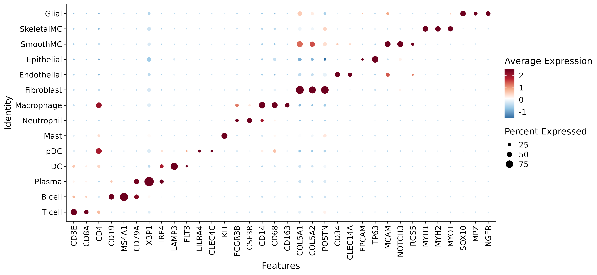{.align-center .lightbox width="900px" 
										fig_alt="dotplot of celltype markers" 
										fig-cap="Figure: dotplot of celltype markers"}
{.align-center .lightbox width="900px" 
										fig_alt="dotplot of Macrophage subtype markers" 
										fig-cap="Figure: dotplot of Macrophage subtype markers"}
{.align-center .lightbox width="900px" 
										fig_alt="dotplot of Epithelial subtype markers" 
										fig-cap="Figure: dotplot of Epithelial subtype markers"}
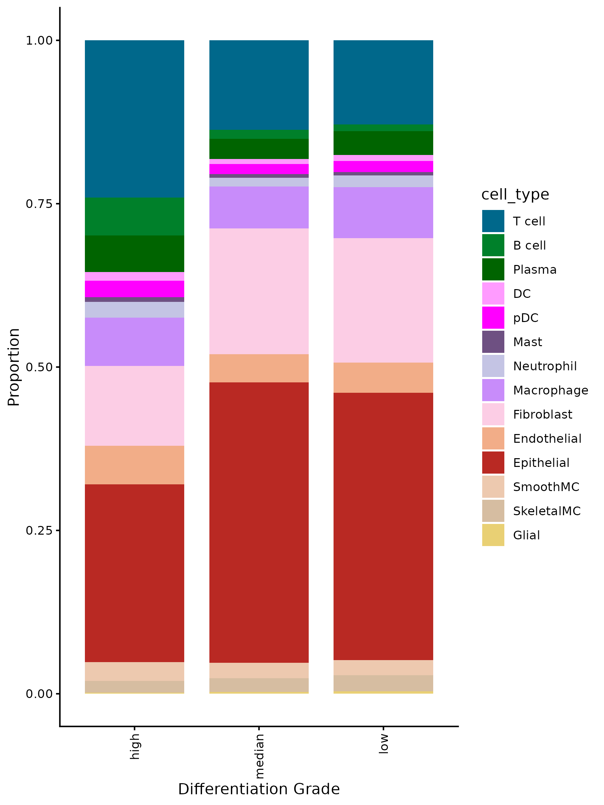{.align-center .lightbox width="900px" 
										fig_alt="barplot of celltype in tumor samples by diff_level" 
										fig-cap="Figure: barplot of celltype in tumor samples by diff_level"}
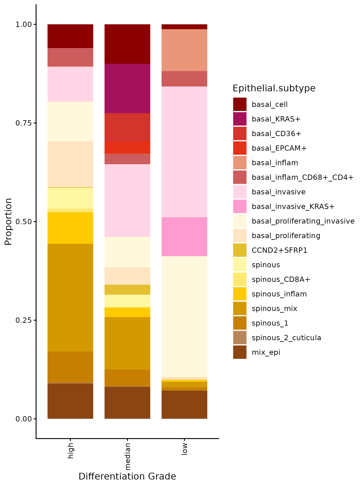{.align-center .lightbox width="900px" 
										fig_alt="barplot of Epithelial subtype in tumor samples by diff_level" 
										fig-cap="Figure: barplot of Epithelial subtype in tumor samples by diff_level"}
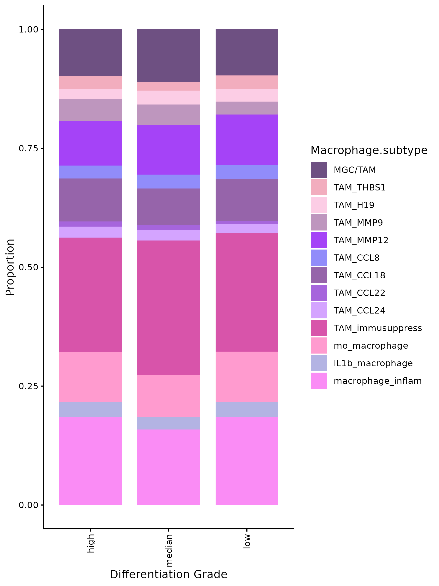{.align-center .lightbox width="900px" 
										fig_alt="barplot of Macrophage subtype in tumor samples by diff_level" 
										fig-cap="Figure: barplot of Macrophage subtype in tumor samples by diff_level"}
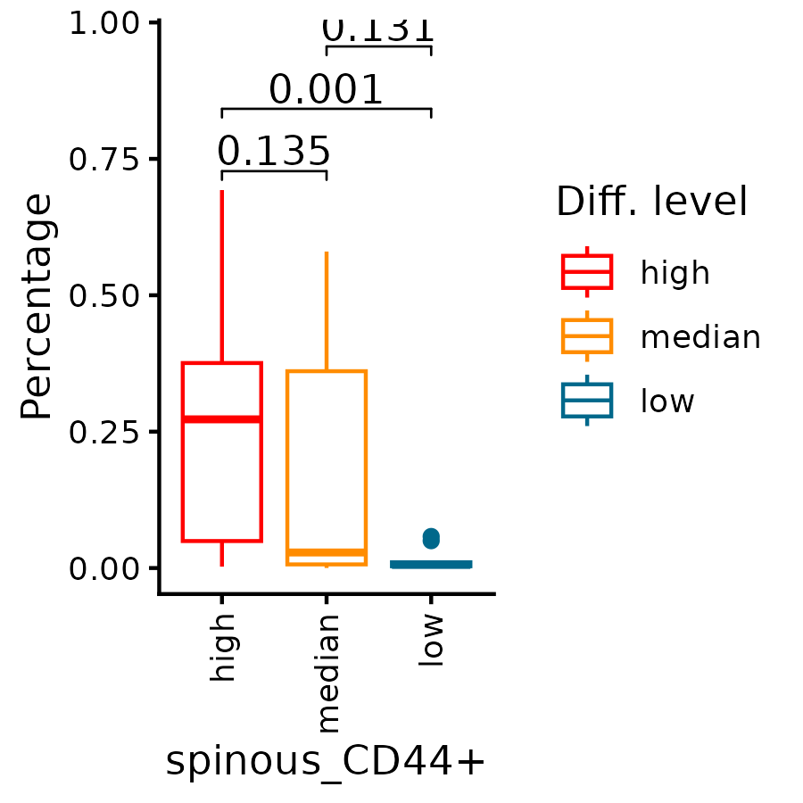{.align-center .lightbox width="900px" 
										fig_alt="boxplot of Epithelial subtype spinous_mix difference in diff_level" 
										fig-cap="Figure: boxplot of Epithelial subtype spinous_mix difference in diff_level"}


## xenium insitu celltype plot 
```{r echo=TRUE, eval=FALSE}
dt_anno <- readRDS(glue("{rds_dir}/celltype_anno.rds"))
dt_anno <- dt_anno %>% mutate(cell_id = sapply(strsplit(cell_id, "_"),function(X){return(X[1])}))


srat1 <- readRDS(glue("{rds_dir}/sv5_xenium_object_0066253.rds"))
sample_select1 <- unique(srat1$sample_id)
df_anno <- dt_anno %>% filter(slide == "slide1") %>% .[match(colnames(srat1), .$cell_id), ]
srat1$cell_type <- df_anno$cell_type
srat1$Macrophage.1.subtype <- df_anno$Macrophage.1.subtype
srat1$Epithelial.1.subtype <- df_anno$Epithelial.1.subtype
srat1$Macrophage.sub.supply <- df_anno$Macrophage.sub.supply
srat1$Epithelial.sub.supply <- df_anno$Epithelial.sub.supply

srat2 <- readRDS(glue("{rds_dir}/sv5_xenium_object_0066266.rds"))
sample_select2 <- unique(srat2$sample_id) %>% .[!. %in% c("F4-2", "F14")]
df_anno <- dt_anno %>% filter(slide == "slide2") %>% .[match(colnames(srat2), .$cell_id), ]
srat2$cell_type <- df_anno$cell_type
srat2$Macrophage.1.subtype <- df_anno$Macrophage.1.subtype
srat2$Epithelial.1.subtype <- df_anno$Epithelial.1.subtype
srat2$Macrophage.sub.supply <- df_anno$Macrophage.sub.supply
srat2$Epithelial.sub.supply <- df_anno$Epithelial.sub.supply

sample_srat_map <- c(
  setNames(lapply(sample_select1, function(x) srat1), sample_select1),
  setNames(lapply(sample_select2, function(x) srat2), sample_select2))
sample_select <- names(sample_srat_map)
sample_select <- c("F6", "R23R", "S48", "F15", "S67")

param <- BiocParallel::MulticoreParam(workers = 5, progressbar = TRUE)
results <- bplapply(sample_select, function(subsample){
  srat <- sample_srat_map[[subsample]]
  sub_srat <- subset(srat,subset = sample_id == subsample)
  sub_srat$cell_type <- factor(sub_srat$cell_type, levels = intersect(cell_type_order, unique(sub_srat$cell_type)))
  sub_srat$Macrophage.1.subtype <- factor(sub_srat$Macrophage.1.subtype, levels = intersect(cell_type_order, unique(sub_srat$Macrophage.1.subtype)))
  sub_srat$Epithelial.1.subtype <- factor(sub_srat$Epithelial.1.subtype, levels = intersect(cell_type_order, unique(sub_srat$Epithelial.1.subtype)))
  sub_srat$Macrophage.sub.supply <- factor(sub_srat$Macrophage.sub.supply, levels = intersect(cell_type_order, unique(sub_srat$Macrophage.sub.supply)))
  sub_srat$Epithelial.sub.supply <- factor(sub_srat$Epithelial.sub.supply, levels = intersect(cell_type_order, unique(sub_srat$Epithelial.sub.supply)))
  
  image1 <- ImageDimPlot(sub_srat,group.by = "cell_type", cols=config_list$cell_type, na.value="black",
                          boundaries = "segmentations",border.size = 0.01, dark.background = TRUE) + ggtitle(subsample) + 
            scale_y_continuous(trans = "reverse")
  image2 <- ImageDimPlot(sub_srat,group.by = "Macrophage.1.subtype", cols=config_list$cell_type, na.value="black",
                          boundaries = "segmentations",border.size = 0.01, dark.background = TRUE) + ggtitle(subsample) + 
            scale_y_continuous(trans = "reverse")
  image3 <- ImageDimPlot(sub_srat,group.by = "Epithelial.1.subtype", cols=config_list$cell_type, na.value="black",
                          boundaries = "segmentations",border.size = 0.01, dark.background = TRUE) + ggtitle(subsample) + 
            scale_y_continuous(trans = "reverse")
  image4 <- ImageDimPlot(sub_srat,group.by = "Macrophage.sub.supply", cols=config_list$cell_type, na.value="black",
                          boundaries = "segmentations",border.size = 0.01, dark.background = TRUE) + ggtitle(subsample) + 
            scale_y_continuous(trans = "reverse")
  image5 <- ImageDimPlot(sub_srat,group.by = "Epithelial.sub.supply", cols=config_list$cell_type, na.value="black",
                          boundaries = "segmentations",border.size = 0.01, dark.background = TRUE) + ggtitle(subsample) + 
            scale_y_continuous(trans = "reverse")

  img <- ImageFeaturePlot(sub_srat,fov = "fov",features = c("nCount_Xenium"), max.cutoff="q99", min.cutoff=0,
            boundaries = "segmentations", border.size = 0.01, dark.background = FALSE) +
            scale_y_continuous(trans = "reverse")

  image1[[1]]$data %<>%mutate(x = img[[1]]$data$x, y = img[[1]]$data$y)
  image2[[1]]$data %<>%mutate(x = img[[1]]$data$x, y = img[[1]]$data$y)
  image3[[1]]$data %<>%mutate(x = img[[1]]$data$x, y = img[[1]]$data$y)
  image4[[1]]$data %<>%mutate(x = img[[1]]$data$x, y = img[[1]]$data$y)
  image5[[1]]$data %<>%mutate(x = img[[1]]$data$x, y = img[[1]]$data$y)

  pdf(glue("{fig_dir}/insitu/xenium_image_insitu_{subsample}_celltype.pdf"), width = 8, height = 8)
  print(image1)
  dev.off()
  png(glue("{fig_dir}/insitu/xenium_image_insitu_{subsample}_celltype.png"), width = 8, height = 8, units = "in", res = 300)
  print(image1)
  dev.off()
  pdf(glue("{fig_dir}/insitu/xenium_image_insitu_{subsample}_macro.pdf"), width = 8, height = 8)
  print(image2)
  dev.off()
  png(glue("{fig_dir}/insitu/xenium_image_insitu_{subsample}_macro.png"), width = 8, height = 8, units = "in", res = 300)
  print(image2)
  dev.off()
  pdf(glue("{fig_dir}/insitu/xenium_image_insitu_{subsample}_epi.pdf"), width = 8, height = 8)
  print(image3)
  dev.off()
  png(glue("{fig_dir}/insitu/xenium_image_insitu_{subsample}_epi.png"), width = 8, height = 8, units = "in", res = 300)
  print(image3)
  dev.off()
  pdf(glue("{fig_dir}/insitu/xenium_image_insitu_{subsample}_macro_supply.pdf"), width = 8, height = 8)
  print(image4)
  dev.off()
  png(glue("{fig_dir}/insitu/xenium_image_insitu_{subsample}_macro_supply.png"), width = 8, height = 8, units = "in", res = 300)
  print(image4)
  dev.off()
  pdf(glue("{fig_dir}/insitu/xenium_image_insitu_{subsample}_epi_supply.pdf"), width = 8, height = 8)
  print(image5)
  dev.off()
  png(glue("{fig_dir}/insitu/xenium_image_insitu_{subsample}_epi_supply.png"), width = 8, height = 8, units = "in", res = 300)
  print(image5)
  dev.off()
}, BPPARAM = param)


```

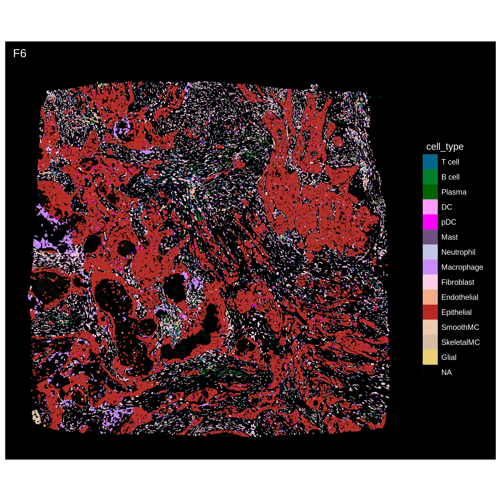{.align-center .lightbox width="900px" 
										fig_alt="in situ image plot of celltype" 
                    fig-cap="Figure: in situ image plot of celltype"}
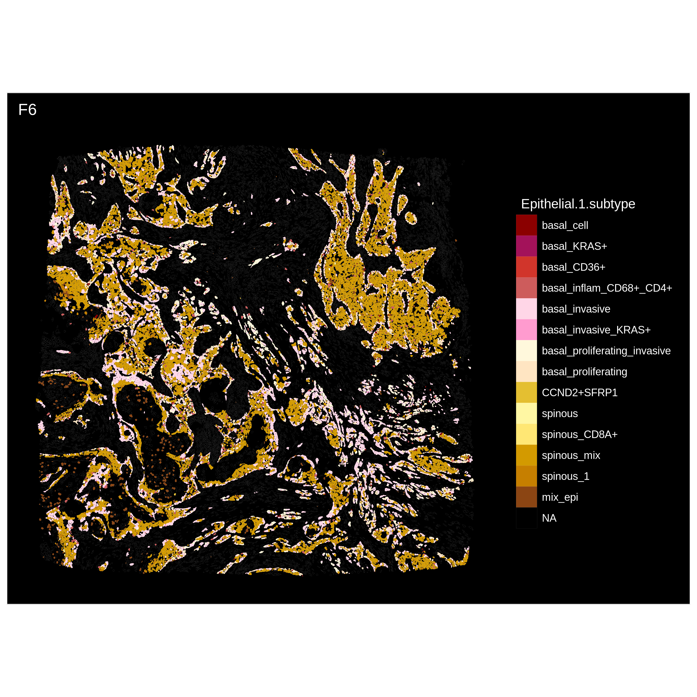{.align-center .lightbox width="900px" 
										fig_alt="in situ image plot of epithelial subtype" 
                    fig-cap="Figure: in situ image plot of epithelial subtype"}


## xenium celltype neiborhood 

```{r echo=TRUE, eval=FALSE}

neiborhood_list <- readRDS(glue("{rds_dir}/celltype_neiborhood.rds"))
mat <- neiborhood_list$mat
mat_scale <- scale(mat)

celltypes <- intersect(cell_type_order, unique(colnames(mat)))
mat_anno <- mat[, match(celltypes, colnames(mat))] %>% as.matrix()
bar_colors <- config_list$cell_type[celltypes]

ha <- rowAnnotation(CN = anno_barplot(mat_anno, 
                                      bar_width = 1, 
                                      gp = gpar(fill = bar_colors), 
                                      border = FALSE,
                                      axis = TRUE,
                                      axis_param = list(direction = "reverse"),
                                      width = unit(4, "cm")),
                    show_annotation_name = FALSE)
lgd_list <- list(Legend(labels = celltypes, title = "Cell type", 
                        legend_gp = gpar(fill = bar_colors)))
ht <- Heatmap(mat_scale, name = "Relative enrichment",
              col = circlize::colorRamp2(c(-3, -2, -1, 0, 1, 2, 3), config_list$scale_7),
              right_annotation = ha,
              cluster_rows = TRUE,
              cluster_columns = TRUE
              )
pdf(glue("{fig_dir}/xenium_heatmap_celltype_cn_composition.pdf"), width = 10, height = 6)
draw(ht, heatmap_legend_list = lgd_list)
dev.off()
png(glue("{fig_dir}/xenium_heatmap_celltype_cn_composition.png"), width = 10, height = 6, units = "in", res = 300)
draw(ht, heatmap_legend_list = lgd_list)
dev.off()

metadata <- neiborhood_list$metadata
pt <- metadata[, c("sample_id", "celltype_cn", "Diff. level")] %>%
        dplyr::count(sample_id, `Diff. level`, celltype_cn, name = "n") %>%
        group_by(sample_id) %>%
        mutate(freq = n / sum(n)) %>%
        ungroup() %>%
        mutate(`Diff. level` = factor(`Diff. level`, levels = c("high", "median", "low")))


p <- ggplot(pt, aes(celltype_cn, freq, color = `Diff. level`)) +
        geom_boxplot() +
        stat_compare_means(aes(label = after_stat(sprintf("%.2f", p))), method = "anova", size = 2) +
        scale_color_manual(values = config_list$diff_level)+
        theme(axis.text.x = element_text(angle = 0, hjust = 1)) +
        labs(x = "", y = "Percentage") +
        theme_classic() +
        scale_y_continuous(labels = scales::label_number(accuracy = 0.01))
ggsave(glue("{fig_dir}/xenium_boxplot_celltype_cn_pct_diff.pdf"), p, width = 8, height = 4)
ggsave(glue("{fig_dir}/xenium_boxplot_celltype_cn_pct_diff.png"), p, width = 8, height = 4)


select_cns <- c("CN1", "CN5", "CN6")
for (select_cn in select_cns){
  pt_s <- pt %>% filter(celltype_cn == select_cn) %>% mutate(`Diff. level` = factor(`Diff. level`, levels = c("high", "median", "low")), 
                                                              Diff.level = `Diff. level`)
  stat.test <- pt_s %>% pairwise_wilcox_test(freq ~ `Diff.level`, p.adjust.method = "BH", detailed = TRUE) %>%
    mutate(p.adj = ifelse(is.na(p.adj), 1, p.adj), 
          label = sprintf("%.3f", p), 
          y.position = max(pt_s$freq) * (1 + 0.05 * row_number()))
  p <- ggplot(pt_s, aes(`Diff. level`, freq, color = `Diff. level`)) +
        geom_boxplot() +
        stat_pvalue_manual(stat.test, label = "label", tip.length = 0.02, step.increase = 0.1, hide.ns = FALSE) +  
        scale_color_manual(values = config_list$diff_level) +
        theme_classic() +
        theme(axis.text.x = element_text(angle = 90, hjust = 1, vjust = 0.5)) +
        labs(x = select_cn, y = "Percentage") +
        scale_y_continuous(labels = scales::label_number(accuracy = 0.01))
ggsave(glue("{fig_dir}/xenium_boxplot_celltype_cn_pct_diff_{select_cn}.pdf"), p, width = 3, height = 3)
ggsave(glue("{fig_dir}/xenium_boxplot_celltype_cn_pct_diff_{select_cn}.png"), p, width = 3, height = 3)

}

```


{.align-center .lightbox width="900px" 
										fig_alt="heatmap of sample cluster by celltype CN" 
                    fig-cap="Figure: heatmap of sample cluster by celltype CN"}
{.align-center .lightbox width="900px" 
										fig_alt="boxplot of celltype CN in diff_level" 
										fig-cap="Figure: boxplot of celltype CN in diff_level"}
{.align-center .lightbox width="900px" 
										fig_alt="boxplot of celltype CN5 in diff_level" 
										fig-cap="Figure: boxplot of celltype CN5 in diff_level"}


## xenium co-localization

```{r echo=TRUE, eval=FALSE}

cor_lst <- readRDS(glue("{rds_dir}/xenium_sqe_cor.rds"))

cor_names <- names(cor_lst)[grep("matrix", names(cor_lst))]
purrr::walk(cor_names, function(cor_name){
    cor <- cor_lst[[cor_name]]
    ht <- Heatmap(cor, name = "Probability",
                col = circlize::colorRamp2(c(-1, -2/3, -1/3, 0, 1/3, 2/3, 1), config_list$scale_7),
                cluster_rows = TRUE,
                cluster_columns = TRUE)
    pdf(glue("{fig_dir}/xenium_colocal_heatmap_{cor_name}.pdf"), width = 7, height = 6)
    draw(ht)
    dev.off()
    png(glue("{fig_dir}/xenium_colocal_heatmap_{cor_name}.png"), width = 7, height = 6, units = "in", res = 300)
    draw(ht)
    dev.off()
})

dt_cor_s <- cor_lst[["cor_prob_sampleid_simplify"]]
df_diff <- sampleinfo$xenium
dt_m <- dt_cor_s %>%
  left_join(df_diff %>% select(sample_id, `Diff. level`), by = "sample_id") %>%
  mutate(`Diff. level` = factor(`Diff. level`, levels = c("high", "median", "low")))

pairs <- dt_cor_s[as.numeric(from) != as.numeric(to), .(from, to)] %>% unique
p_lst <- lapply(1:nrow(pairs), function(i){
  pt <- dt_m %>%
    filter(from == pairs[i, ] %>% pull(from) & to == pairs[i, ] %>% pull(to))
  p <- ggboxplot(pt, x = "Diff. level", y = "prob", color = "Diff. level") +
    stat_compare_means(aes(label = after_stat(sprintf("p=%.2f", p)))) +
    scale_color_manual(values = config_list$diff_level) +
    labs(title = paste0(pairs[i, ] %>% pull(from), " - ", pairs[i, ] %>% pull(to))) +
    scale_y_continuous(labels = scales::label_number(accuracy = 0.01))
  return(p)
})
pdf(glue("{fig_dir}/xenium_colocal_prob_boxplot_all_pairs.pdf"), width = 3, height = 5)
print(p_lst)
dev.off()
png(glue("{fig_dir}/xenium_colocal_prob_boxplot_all_pairs.png"), width = 3, height = 5, units = "in", res = 300)
print(p_lst)
dev.off()

```

{.align-center .lightbox width="900px" 
										fig_alt="heatmap of celltype colocalation" 
                    fig-cap="Figure: heatmap of celltype colocalation"}


## xenium immune mediated tumor erosion: region

```{r echo=TRUE, eval=FALSE}

srat <- readRDS(glue("{rds_dir}/srt_erosion_region.rds"))
pt_mpg <- srat[[]] %>% filter(cell_type == "Macrophage") %>% 
  mutate(subtype = factor(subtype, levels = intersect(config$cell_type_order, unique(.$subtype))))
pt_epi <- srat[[]] %>% filter(cell_type == "Epithelial") %>% 
  mutate(subtype = factor(subtype, levels = intersect(config$cell_type_order, unique(.$subtype))))
pt_celltype <- srat[[]] %>% filter(!is.na(cell_type)) %>% 
  mutate(cell_type = factor(cell_type, levels = intersect(config$cell_type_order, unique(.$cell_type))))

p1 <- ggplot(pt_mpg, aes(x = .data[["sample_id"]], fill = .data[["subtype"]])) +
  geom_bar(position = "fill", width = 0.7) +
  facet_grid(~ .data[["Region"]], scales = "free_x", space = "free_x") +
  scale_fill_manual(values = config_list$cell_type) +
  theme_classic() +
  labs(y = "Proportion", x = "samples", fill = "Macrophage.subtype") +
  scale_y_continuous(labels = scales::label_number(accuracy = 0.01)) + 
  theme(axis.text.x = element_text(angle = 90, hjust = 1, vjust = 0.5))
ggsave(glue("{fig_dir}/xenium_in_out_zone_macrophage_subtype_stack_bar_sampleid.pdf"), p1, width = 9, height = 4)
ggsave(glue("{fig_dir}/xenium_in_out_zone_macrophage_subtype_stack_bar_sampleid.png"), p1, width = 9, height = 4)
p2 <- ggplot(pt_mpg, aes(Region, fill = subtype)) +
  geom_bar(position = "fill", width = 0.7) + 
  scale_fill_manual(values = config_list$cell_type) + 
  theme_classic() +
  labs(y = "Proportion") +
  scale_y_continuous(labels = scales::label_number(accuracy = 0.01)) + 
  theme(axis.text.x = element_text(angle = 90, hjust = 1, vjust = 0.5))
ggsave(glue("{fig_dir}/xenium_in_out_zone_macrophage_subtype_stack_bar_region.pdf"), p2, width = 6, height = 8)
ggsave(glue("{fig_dir}/xenium_in_out_zone_macrophage_subtype_stack_bar_region.png"), p2, width = 6, height = 8)
p3 <- ggplot(pt_celltype, aes(x = .data[["sample_id"]], fill = .data[["cell_type"]])) +
  geom_bar(position = "fill", width = 0.7) +
  facet_grid(~ .data[["Region"]], scales = "free_x", space = "free_x") +
  scale_fill_manual(values = config_list$cell_type) +
  theme_classic() +
  labs(y = "Proportion", x = "samples", fill = "cell_type") +
  scale_y_continuous(labels = scales::label_number(accuracy = 0.01)) + 
  theme(axis.text.x = element_text(angle = 90, hjust = 1, vjust = 0.5))
ggsave(glue("{fig_dir}/xenium_in_out_zone_celltype_stack_bar_sampleid.pdf"), p3, width = 8, height = 4)
ggsave(glue("{fig_dir}/xenium_in_out_zone_celltype_stack_bar_sampleid.png"), p3, width = 8, height = 4)
p4 <- ggplot(pt_celltype, aes(Region, fill = cell_type)) +
  geom_bar(position = "fill", width = 0.7) +
  scale_fill_manual(values = config_list$cell_type) +
  theme_classic() +
  scale_y_continuous(labels = scales::label_number(accuracy = 0.01)) +
  labs(y = "Proportion") + 
  theme(axis.text.x = element_text(angle = 90, hjust = 1, vjust = 0.5))
ggsave(glue("{fig_dir}/xenium_in_out_zone_celltype_stack_bar_region.pdf"), p4, width = 5, height = 6)
ggsave(glue("{fig_dir}/xenium_in_out_zone_celltype_stack_bar_region.png"), p4, width = 5, height = 6)
p5 <- ggplot(pt_epi, aes(Region, fill = subtype)) +
  geom_bar(position = "fill", width = 0.7) +
  scale_fill_manual(values = config_list$cell_type) +
  theme_classic() +
  labs(y = "Proportion") +
  scale_y_continuous(labels = scales::label_number(accuracy = 0.01)) + 
  theme(axis.text.x = element_text(angle = 90, hjust = 1, vjust = 0.5))
ggsave(glue("{fig_dir}/xenium_in_out_zone_epithelial_subtype_stack_bar_region.pdf"), p5, width = 5, height = 6)
ggsave(glue("{fig_dir}/xenium_in_out_zone_epithelial_subtype_stack_bar_region.png"), p5, width = 5, height = 6)
p6 <- ggplot(pt_epi, aes(x = .data[["sample_id"]], fill = .data[["cell_type"]])) +
  geom_bar(position = "fill", width = 0.7) +
  facet_grid(~ .data[["Region"]], scales = "free_x", space = "free_x") +
  scale_fill_manual(values = config_list$cell_type) +
  theme_classic() +
  labs(y = "Proportion", x = "samples", fill = "cell_type") +
  scale_y_continuous(labels = scales::label_number(accuracy = 0.01)) + 
  theme(axis.text.x = element_text(angle = 90, hjust = 1, vjust = 0.5))
ggsave(glue("{fig_dir}/xenium_in_out_zone_Epithelial_subtype_stack_bar_sampleid.pdf"), p3, width = 8, height = 4)
ggsave(glue("{fig_dir}/xenium_in_out_zone_Epithelial_subtype_stack_bar_sampleid.png"), p3, width = 8, height = 4)


select_pathway <- c("hsa04145","hsa04979","hsa04142","hsa04066","hsa00010","hsa04610","hsa03320","hsa04810")
#results_kegg <- readRDS(glue("{rds_dir}/kegg_result.rds"))
results_kegg <- readRDS(glue("{rds_dir}/kegg_erosion_result_region_macrophage_up.rds"))
res <- results_kegg$region_Macrophage_res_up
result_filter <- res@result %>% filter(ID %in% select_pathway)
res_filter <- new("enrichResult", result = result_filter)
p1 <- barplot(res_filter, color = "p.adjust") + 
        scale_fill_gradientn(colors = rev(config_list$scale_7[c(1,3,4,5,6)]),
                             guide = guide_colorbar(reverse = TRUE)) +
        theme_classic()
ggsave(glue("{fig_dir}/xenium_in_out_zone_macrophage_kegg.pdf"), plot = p1,width = 6,height = 6)
ggsave(glue("{fig_dir}/xenium_in_out_zone_macrophage_kegg.png"), plot = p1,width = 6,height = 6)

```


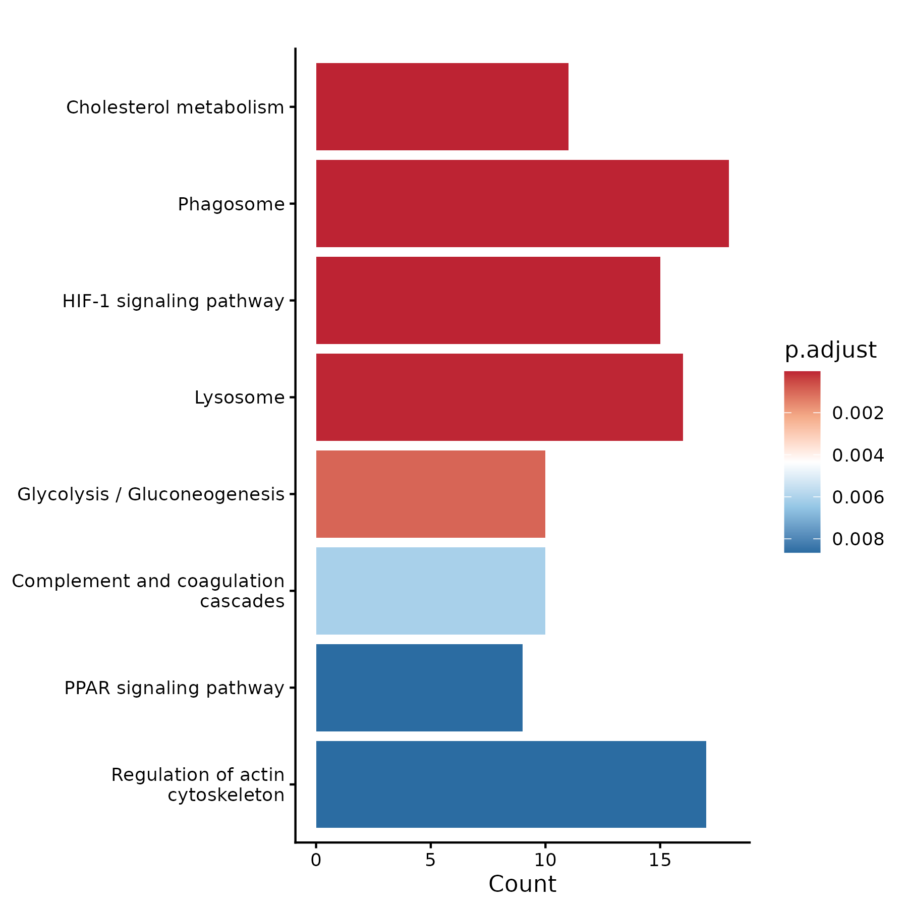{.align-center .lightbox width="900px" 
										fig_alt="kegg of macrophages in tumor erosion regions versus non-erosion regions" 
                    fig-cap="Figure: kegg of macrophages in tumor erosion regions versus non-erosion regions"}
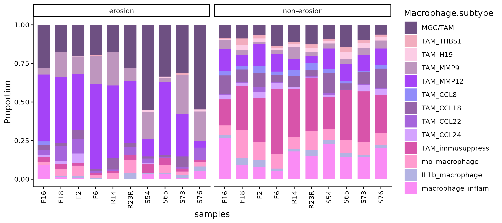{.align-center .lightbox width="900px" 
										fig_alt="Percentage of macrophages subtype in tumor erosion regions versus non-erosion regions by sampleid" 
                    fig-cap="Figure: Percentage of macrophages subtype in tumor erosion regions versus non-erosion regions by sampleid"}
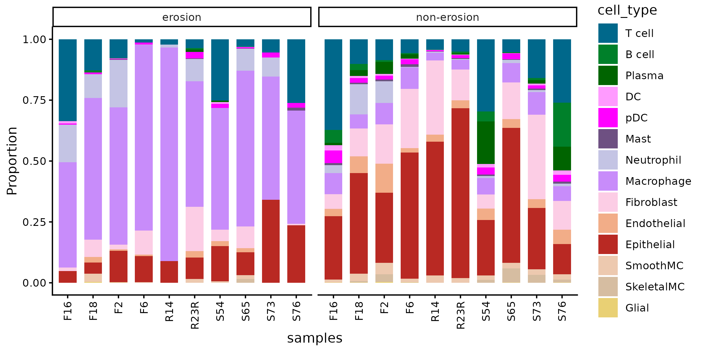{.align-center .lightbox width="900px" 
										fig_alt="Percentage of epithelial subtype in tumor by erosion regions versus non-erosion regions by sampleid" 
										fig-cap="Figure: Percentage of epithelial subtype in tumor erosion regions versus non-erosion regions by sampleid"}


## xenium umap message

```{r echo=TRUE, eval=FALSE}

umap_message <- readRDS(glue("{rds_dir}/umap_message.rds"))
umap_message[["umap_macro"]] <- umap_message[["umap_macro"]] %>%
  filter(!(UMAP_1 > 2 & Macrophage.1.subtype %notin% c("TAM_H19", "macrophage_inflam", "IL1b_macrophage", "mo_macrophage")), 
         !(UMAP_2 < -4 & Macrophage.1.subtype %notin% c("TAM_THBS1", "TAM_H19"))) %>% as.data.frame()
subumaps <- names(umap_message)
for (subumap in subumaps){
  df <- umap_message[[subumap]]
  df <- df %>% sample_n(size = min(100000, nrow(.)))
  colnames(df) <- c("UMAP1", "UMAP2", "cell_type")
  df <- df %>% mutate(cell_type = factor(cell_type, levels = intersect(config$cell_type_order, unique(.$cell_type))))


  label_data <- df %>% group_by(cell_type) %>% summarise(x = median(UMAP1), y = median(UMAP2))

  p <- ggplot(df, aes(x=UMAP1, y=UMAP2, color=cell_type)) +
          geom_point(size = 0.8, alpha = 0.7) +
          scale_color_manual(values = config_list$cell_type, name = "Cell Type") +
          #geom_text_repel(data = label_data, aes(x=x, y=y, label=cell_type), color = "black", size = 8, fontface = "bold", show.legend = FALSE) +
          theme_classic() +
          guides(color = guide_legend(override.aes = list(size = 5))) +
          coord_fixed(ratio = 1) +
          theme(legend.position = "right",
                legend.title = element_text(size = 12, face = "bold", color = "black"), 
                legend.text = element_text(size = 10), 
                legend.key.size = unit(0.5, "cm"))
  ggsave(glue("{fig_dir}/xenium_umap_{subumap}.pdf"), p, width = 12, height = 12)
  ggsave(glue("{fig_dir}/xenium_umap_{subumap}.png"), p, width = 12, height = 12)
}

```
{.align-center .lightbox width="900px" 
										fig_alt="giotto umap of xenium celltype" 
                    fig-cap="Figure: giotto umap of xenium celltype"}

 


## xenium erosion activated tfs and path: macrophage

```{r echo=TRUE, eval=FALSE}

srt_mac <- readRDS(glue("{rds_dir}/srt_decoupleR_Macrophage.rds"))
decoupleR_macro_messages <- readRDS(glue("{rds_dir}/decoupleR_message_Macrophage.rds"))


df_path_score_sample <- decoupleR_macro_messages$path_score_sam
p <- ggplot(df_path_score_sample, aes(x = pathway, y = mean, color = Region)) +
  geom_boxplot() +
  scale_color_manual(values = config_list$erosion_site) +
  theme_classic() +
  theme(plot.title = element_text(hjust = 0.5),
        axis.text.x = element_text(angle = 90, hjust = 1, vjust = 0.5)) +
  labs(title = "Pathway activity scores across regions (sample means)") +
  scale_y_continuous(labels = scales::label_number(accuracy = 0.01)) + 
  ggpubr::stat_compare_means(aes(group = Region, label = after_stat(sprintf("%.2f", p))),
                             method = "wilcox.test", size = 2)
ggsave(glue("{fig_dir}/xenium_erosion_decoupleR_boxplot_mac_pathway_region_samplemean.pdf"), p, width = 12, height = 6)
ggsave(glue("{fig_dir}/xenium_erosion_decoupleR_boxplot_mac_pathway_region_samplemean.png"), p, width = 12, height = 6)

```
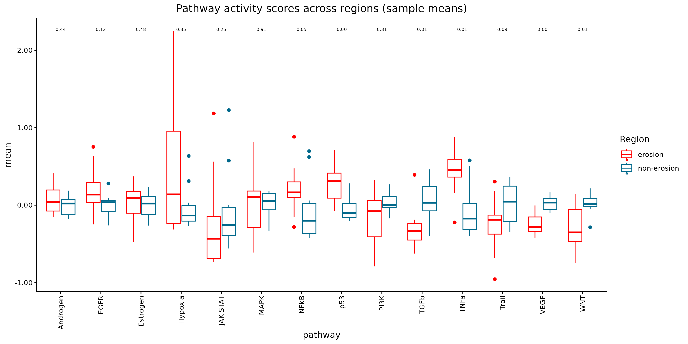{.align-center .lightbox width="900px" 
										fig_alt="boxplot of pathway samplemean of Macrophage in erosion region" 
										fig-cap="Figure: boxplot of pathway samplemean of Macrophage in erosion region"}


## xenium erosion activated tfs and path: Epithelial

```{r echo=TRUE, eval=FALSE}

srt_epi <- readRDS(glue("{rds_dir}/srt_decoupleR_Epithelial.rds"))
decoupleR_epi_messages <- readRDS(glue("{rds_dir}/decoupleR_message_Epithelial.rds"))


df_path_score_sample <- decoupleR_epi_messages$path_score_sam
p <- ggplot(df_path_score_sample, aes(x = pathway, y = mean, color = Region)) +
  geom_boxplot() +
  scale_color_manual(values = config_list$erosion_site) +
  theme_classic() +
  theme(plot.title = element_text(hjust = 0.5),
        axis.text.x = element_text(angle = 90, hjust = 1, vjust = 0.5)) +
  labs(title = "Pathway activity scores across regions (sample means)") +
  scale_y_continuous(labels = scales::label_number(accuracy = 0.01)) + 
  ggpubr::stat_compare_means(aes(group = Region, label = after_stat(sprintf("%.2f", p))),
                             method = "wilcox.test", size = 2)
ggsave(glue("{fig_dir}/xenium_erosion_decoupleR_boxplot_epi_pathway_region_samplemean.pdf"), p, width = 12, height = 6)
ggsave(glue("{fig_dir}/xenium_erosion_decoupleR_boxplot_epi_pathway_region_samplemean.png"), p, width = 12, height = 6)


```
{.align-center .lightbox width="900px" 
										fig_alt="boxplot of pathway samplemean of Epithelial in erosion region" 
										fig-cap="Figure: boxplot of pathway samplemean of Epithelial in erosion region"}


## xenium CCC of stemness and differentiation Epithelial

```{r echo=TRUE, eval=FALSE}

df_heat_cp_wide <- readRDS(glue("{rds_dir}/xenium_CCC_Epithelial_stem_diff_plot.rds"))

sender <- df_heat_cp_wide$s
receiver <- df_heat_cp_wide$r

p2 <- pheatmap(receiver, scale = "row", 
  color = config_list$scale_7, border_color = "white",
  cluster_rows = TRUE, cluster_cols = FALSE, cutree_rows = NA,, treeheight_row = 15, treeheight_col = 0,
  show_rownames = TRUE, show_colnames = TRUE,
  fontsize_row = 10, fontsize_col = 10, angle_col = "90", main = "CCC")

pdf(glue("{fig_dir}/xenium_ccc_heatmaps_cc_mean_target.pdf"), width = 8, height = 7)
print(p2)
dev.off()
png(glue("{fig_dir}/xenium_ccc_heatmaps_cc_mean_target.png"), width = 8, height = 7, units = "in", res = 300)
print(p2)
dev.off()

```
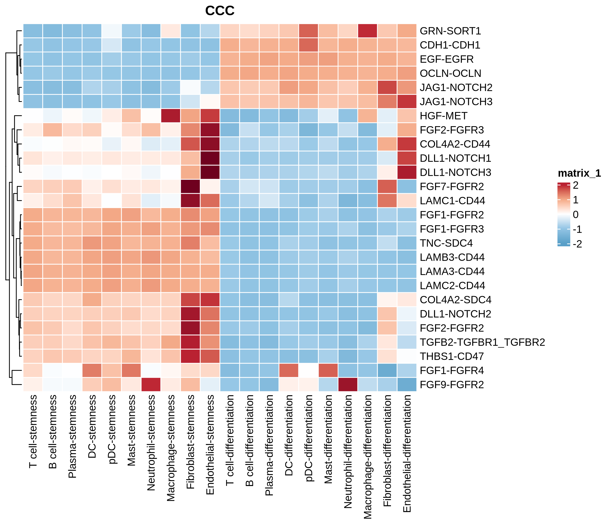{.align-center .lightbox width="900px" 
										fig_alt="heatmap of cell-cell communication of stemness or differentiation as target with other cell types" 
										fig-cap="Figure: heatmap of cell-cell communication of stemness or differentiation as target with other cell types"}


## xenium CCC of basal Epithelial

```{r echo=TRUE, eval=FALSE}

df_heat_cp_wide <- readRDS(glue("{rds_dir}/xenium_CCC_Epithelial_basal_plot.rds"))

sender <- df_heat_cp_wide$s
receiver <- df_heat_cp_wide$r

p2 <- pheatmap(receiver, scale = "row", 
  color = config_list$scale_7, border_color = "white",
  cluster_rows = TRUE, cluster_cols = FALSE, cutree_rows = NA,, treeheight_row = 15, treeheight_col = 0,
  show_rownames = TRUE, show_colnames = TRUE,
  fontsize_row = 10, fontsize_col = 10, angle_col = "90", main = "CCC")

pdf(glue("{fig_dir}/xenium_ccc_heatmaps_cc_mean_target_Epithelial_basal.pdf"), width = 12, height = 8)
print(p2)
dev.off()
png(glue("{fig_dir}/xenium_ccc_heatmaps_cc_mean_target_Epithelial_basal.png"), width = 12, height = 8, units = "in", res = 300)
print(p2)
dev.off()

```
{.align-center .lightbox width="900px" 
										fig_alt="heatmap of cell-cell communication of epithelial basal as target with other cell types" 
										fig-cap="Figure: heatmap of cell-cell communication of epithelial basal as target with other cell types"}


## xenium differentiation block samples

```{r echo=TRUE, eval=FALSE}

srat <- readRDS(glue("{rds_dir}/xenium_sketch_celltyped.rds"))

samples <- c("R18R", "F10", "R23R", "S65", "S48", "S68", "F9")
pt <- srat[[]] %>% filter(cell_type == "Epithelial") %>% filter(sample_id %in% samples) %>% 
    mutate(Epithelial.1.subtype = factor(Epithelial.1.subtype, levels = intersect(config$cell_type_order, unique(.$Epithelial.1.subtype)))) %>%
    mutate(`Diff. level` = factor(`Diff. level`, levels = c("median", "low"))) %>%
    mutate(sample_id = factor(sample_id, levels = samples))
p <- ggplot(pt, aes(x = .data[["sample_id"]], fill = .data[["Epithelial.1.subtype"]])) +
  geom_bar(position = "fill", width = 0.6) +
  scale_fill_manual(values = config_list$cell_type) +
  theme_classic() +
  labs(y = "Proportion", x = "samples", fill = "Epithelial.subtype") +
        theme(axis.text.x = element_text(angle = 90, hjust = 1, vjust = 0.5)) +
  scale_y_continuous(labels = scales::label_number(accuracy = 0.01))
ggsave(glue("{fig_dir}/xenium_barplot_diffblock_Epithelial_subtype_sampleid.pdf"), p, width = 7, height = 5)
ggsave(glue("{fig_dir}/xenium_barplot_diffblock_Epithelial_subtype_sampleid.png"), p, width = 7, height = 5)


high_samples <- c("S72", "F3", "S77", "S32", "F15", "F1", "F18", "S59", "F4", "S67", "S76", "S54", "F16")
pt <- srat[[]] %>% filter(cell_type == "Epithelial") %>% filter(sample_id %in% high_samples) %>% 
    mutate(Epithelial.1.subtype = factor(Epithelial.1.subtype, levels = intersect(config$cell_type_order, unique(.$Epithelial.1.subtype)))) %>%
    mutate(`Diff. level` = factor(`Diff. level`, levels = c("median", "low"))) %>%
    mutate(sample_id = factor(sample_id, levels = high_samples))
p <- ggplot(pt, aes(x = .data[["sample_id"]], fill = .data[["Epithelial.1.subtype"]])) +
  geom_bar(position = "fill", width = 0.6) +
  scale_fill_manual(values = config_list$cell_type) +
  theme_classic() +
  labs(y = "Proportion", x = "samples", fill = "Epithelial.subtype") +
        theme(axis.text.x = element_text(angle = 90, hjust = 1, vjust = 0.5)) +
  scale_y_continuous(labels = scales::label_number(accuracy = 0.01))
ggsave(glue("{fig_dir}/xenium_barplot_diffblock_highdiff_Epithelial_subtype_sampleid.pdf"), p, width = 9, height = 5)
ggsave(glue("{fig_dir}/xenium_barplot_diffblock_highdiff_Epithelial_subtype_sampleid.png"), p, width = 9, height = 5)


```
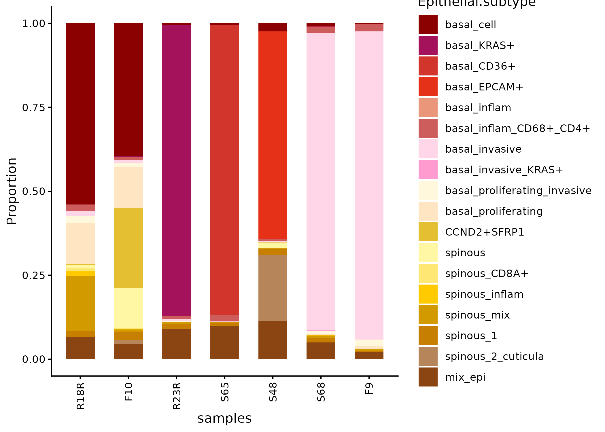{.align-center .lightbox width="900px" 
										fig_alt="barplot of Epithelial subtype in diff. block samples" 
										fig-cap="Figure: barplot of Epithelial subtype in diff. block samples"}


## xenium KEGG Epithelial subcluster vs basal_cell

```{r echo=TRUE, eval=FALSE}

ls_vs_basal_cell_select <- readRDS(glue("{rds_dir}/kegg_epithelial_cluster_marker_gene_vs_basal_cell_select.rds"))
df <- do.call(rbind, ls_vs_basal_cell_select$df)
cases <- names(ls_vs_basal_cell_select$df)

select10 <- c("hsa04010", "hsa04012", "hsa04151", "hsa04310", "hsa04340", 
              "hsa04350", "hsa04390", "hsa04510", "hsa04512", "hsa04330")

df <- df %>% filter(ID %in% select10) %>% 
  dplyr::select(case, Description, Count, p.adjust) %>% mutate(Description = str_replace(Description, " signaling pathway$", "")) %>%
  mutate(case = factor(case , levels = cases), Description = factor(Description, levels = unique(Description)))

p <- ggplot(df, aes(x = case, y = Description)) +
  geom_point(aes(fill = p.adjust, size = Count), shape=21) +
  theme_classic() +
  theme(axis.text.x = element_text(angle=90, hjust=1, vjust=0.5),
        axis.text = element_text(color = "black", size = 10)) +
  scale_fill_gradientn(colors = rev(config_list$scale_7),
                        guide = guide_colorbar(reverse = TRUE)) +
  labs(x=NULL, y=NULL)
ggsave(glue("{fig_dir}/xenium_kegg_Epithelial_subtype_vs_basal_call_dot.pdf"), p,  width = 8, height = 7)
ggsave(glue("{fig_dir}/xenium_kegg_Epithelial_subtype_vs_basal_call_dot.png"), p,  width = 8, height = 7)


```

{.align-center .lightbox width="900px" 
										fig_alt="kegg of Epithelial subtype versus basal_cell" 
                    fig-cap="Figure: kegg of Epithelial subtype versus basal_cell"}


# scretion 

```{r echo=TRUE, eval=FALSE}

dt <- readRDS(glue("{rds_dir}/erosion_in_out_zone_Macrophage_secretion.rds"))

p <- ggplot(dt,aes(avg_log2FC, -log10(p_val_adj))) +
  geom_hline(yintercept = -log10(0.05), linetype = "dashed", color = "black")+
  geom_vline(xintercept = c(-0.5,0.5), linetype = "dashed", color = "black")+
  geom_point(aes(size = pct.1, fill = type, shape = secretion), alpha = 1, stroke = 0)+
  geom_point(data = dplyr::filter(dt, secretion == "secretion"), aes(avg_log2FC, -log10(p_val_adj), size = pct.1), 
            shape = 23, alpha = 0.8, show.legend = FALSE) +
  scale_fill_manual(values = config_list$volcano_type)+
  scale_shape_manual(values = c("secretion" = 23, "non-secretion" = 21))+
  scale_size_continuous(range = c(0,5))+
  theme_classic(base_size = 12)+
  theme(panel.grid = element_blank(),legend.position = 'right',legend.justification = c(0,1))+
  geom_text_repel(data = dplyr::filter(dt, !is.na(label)), aes(label = label), size = 6, color = 'black',
                  segment.color = "black", segment.size = 0.5, min.segment.length = 0, vjust = 1, nudge_y = 2) +
  guides(fill = guide_legend(order = 1, override.aes = list(shape = 21)),
         size = guide_legend(order = 2, override.aes = list(shape = 21, fill = NA, color = "black", stroke = 0.5)),
         shape = guide_legend(order = 3, override.aes = list(fill = NA, color = "black", stroke = 0.5))) +
  xlab("log2FC")+
  ylab("-log10(p adjust)") 

ggsave(glue("{fig_dir}/xenium_volcano_erosion_region_macrophage.pdf"), p, width = 9, height = 9)
ggsave(glue("{fig_dir}/xenium_volcano_erosion_region_macrophage.png"), p, width = 9, height = 9)
```
{.align-center .lightbox width="900px" 
										fig_alt="volcano of Macrophage in erosion vs. non-erosion" 
                    fig-cap="Figure: volcano of Macrophage in erosion vs. non-erosion"}
